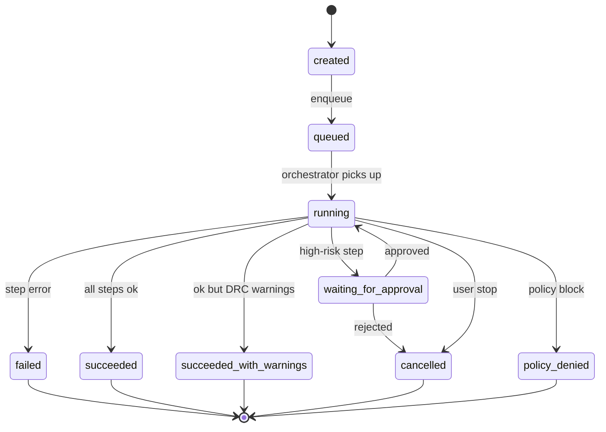

# Synthia Phase 4 开发手册：RunOrchestrator + 事件持久化

> **前置：** Phase 0/1/2 已完成（Phase 3 可并行）  
> **目标：** 形成稳定的 Run 状态机，所有 step 落库；事件 DB 持久化 + SSE 续订；Artifact 算 sha256  
> **预估工期：** 全职 18-22 天；vibe coding 4 周  
> **核心改动：** 新建 `runs/` 包；`execute_with_steps` 完全 try/finally；events 表 + seq；artifact_store 算 hash

---

## 目录

- [0. 准备](#0-准备)
- [1. 现状盘点](#1-现状盘点)
- [2. 目标架构](#2-目标架构)
- [3. 子任务 1：events 表与持久化](#3-子任务-1events-表与持久化)
- [4. 子任务 2：RunStateMachine](#4-子任务-2runstatemachine)
- [5. 子任务 3：RunOrchestrator](#5-子任务-3runorchestrator)
- [6. 子任务 4：execute_with_steps 增强](#6-子任务-4execute_with_steps-增强)
- [7. 子任务 5：artifact_store sha256](#7-子任务-5artifact_store-sha256)
- [8. 子任务 6：SSE 续订（last_event_id）](#8-子任务-6sse-续订last_event_id)
- [9. 子任务 7：run_full_flow 多 step 实现](#9-子任务-7run_full_flow-多-step-实现)
- [10. 子任务 8：rerun 与 stop 路径](#10-子任务-8rerun-与-stop-路径)
- [11. 子任务 9：前端 Run panel](#11-子任务-9前端-run-panel)
- [12. 收尾](#12-收尾)

---

## 0. 准备

```bash
cd E:/dev/edagent-vivado
git status
python -m pytest -k "not agent_smoke" -q --tb=no
```

记录基线指标：

```bash
python -c "
from edagent_vivado.repository.db import get_db
db = get_db()
# 查 runs 表 schema
cols = db.execute('PRAGMA table_info(runs)').fetchall()
print('runs columns:', [c['name'] for c in cols])
cols2 = db.execute('PRAGMA table_info(run_steps)').fetchall()
print('run_steps columns:', [c['name'] for c in cols2])
try:
    cols3 = db.execute('PRAGMA table_info(events)').fetchall()
    print('events columns:', [c['name'] for c in cols3])
except Exception as e:
    print('no events table yet:', e)
"
```

---

## 1. 现状盘点

### 1.1 已有

- `run_steps` 表 + `run_step_create` / `run_step_update`（`repository/store.py`）
- `event_create(session_id, event_type, payload, ...)` 已落库（`store.py:356`）
- `execute_with_steps`（`connectors/run_execution.py`）：会创建 step，调 connector，发 event
- SSE 通过 `_stream_queues` 内存 dict 推送

### 1.2 缺什么

1. **`events` 表 schema 不全**：缺 `seq` 单调递增、`last_event_id` 续订机制
2. **`execute_with_steps` 无 try/finally**：connector.execute 异常时 step 永远 running
3. **没有 RunOrchestrator 协调多 step**：当前 `run_full_flow` 在 connector 内部串行，没有独立 Run / RunStep 记录
4. **Run 状态机只有 created/running/done**：缺 `queued / waiting_for_approval / succeeded_with_warnings / cancelled / policy_denied`
5. **Artifact 不算 sha256**：下载时无法校验
6. **rerun 行为不一致**：现状是新建 run 但不复用输入

---

## 2. 目标架构

### 2.1 状态机



### 2.2 模块结构

```text
src/edagent_vivado/runs/
├── __init__.py
├── orchestrator.py        # ★ 新增：协调 Run → RunSteps
├── state_machine.py       # ★ 新增：状态转换合法性
├── events.py              # ★ 新增：事件持久化 + replay
├── scheduler.py           # ★ 新增：简单的 in-process 队列（v1.0）
├── flow_definitions.py    # ★ 新增：标准 12-step flow 定义
└── artifact_store.py      # 新增或更新：sha256 + 元数据
```

### 2.3 数据流

```text
POST /vivado/commands/flow
  ↓
api_vivado_flow (route)
  ↓
RunOrchestrator.create_run(flow_def="vivado_full_flow", inputs)
  ↓
RunOrchestrator.start(run_id)
  ├ 创建 12 个 RunStep（pending）
  ├ for each step:
  │   ↓ step.state=running
  │   ↓ execute_with_steps(req) — Phase 0+2 修过的
  │   ├ try:
  │   │   conn.execute(prepared)
  │   ├ except:
  │   │   step.state=failed, error=str(exc)
  │   │   raise to orchestrator
  │   ├ finally:
  │   │   step.finished_at = now
  │   │   event "run.step.completed/failed"
  │   ↓
  │ if step.requires_approval and not server_approved:
  │   run.state = waiting_for_approval
  │   return (orchestrator pauses, resumes on approve)
  ↓
  run.state = succeeded / failed / cancelled
  event "run.completed"
```

---

## 3. 子任务 1：events 表与持久化

### 3.1 检查现有表

```bash
python -c "
from edagent_vivado.repository.db import get_db
db = get_db()
rows = db.execute('SELECT name FROM sqlite_master WHERE type=\"table\" AND name LIKE \"%event%\"').fetchall()
print([r['name'] for r in rows])
"
```

如果已有 `events` 表，看 schema 是否包含 `seq`。如果没有，需要 migration。

### 3.2 增补 schema

打开 `src/edagent_vivado/repository/db.py`，找到建表 SQL（一般在 `_init_schema()` 或 `migrations/` 里）。

加（如果不存在）：

```sql
CREATE TABLE IF NOT EXISTS events (
    id TEXT PRIMARY KEY,
    seq INTEGER NOT NULL,
    session_id TEXT NOT NULL,
    task_id TEXT DEFAULT '',
    run_id TEXT DEFAULT '',
    event_type TEXT NOT NULL,
    payload_json TEXT NOT NULL,
    created_at INTEGER NOT NULL
);

CREATE INDEX IF NOT EXISTS idx_events_session_seq ON events(session_id, seq);
CREATE INDEX IF NOT EXISTS idx_events_run ON events(run_id);
CREATE INDEX IF NOT EXISTS idx_events_task ON events(task_id);

CREATE TABLE IF NOT EXISTS event_seq_counter (
    session_id TEXT PRIMARY KEY,
    next_seq INTEGER NOT NULL DEFAULT 1
);
```

如果已有但缺 `seq`：写一个 migration script `scripts/migrate_phase4_events.py`：

```python
"""Add seq column to events table if missing."""

from edagent_vivado.repository.db import get_db

db = get_db()
cols = [c["name"] for c in db.execute("PRAGMA table_info(events)").fetchall()]
if "seq" not in cols:
    print("Adding seq column…")
    db.execute("ALTER TABLE events ADD COLUMN seq INTEGER NOT NULL DEFAULT 0")
    # 回填：按 created_at 顺序赋 seq
    rows = db.execute("SELECT id, session_id FROM events ORDER BY created_at, id").fetchall()
    per_session: dict[str, int] = {}
    for r in rows:
        sid = r["session_id"]
        per_session[sid] = per_session.get(sid, 0) + 1
        db.execute("UPDATE events SET seq = ? WHERE id = ?", (per_session[sid], r["id"]))
    db.execute("CREATE INDEX IF NOT EXISTS idx_events_session_seq ON events(session_id, seq)")
    db.commit()
    print("Done. Counters initialized:", per_session)
else:
    print("seq column already exists.")
```

跑：

```bash
python scripts/migrate_phase4_events.py
```

### 3.3 重写 event_create

打开 `repository/store.py`，找到 `event_create`：

```python
def event_create(
    session_id: str,
    event_type: str,
    payload: dict,
    task_id: str = "",
    run_id: str = "",
) -> dict:
    ...
```

改成事务版：

```python
def event_create(
    session_id: str,
    event_type: str,
    payload: dict,
    task_id: str = "",
    run_id: str = "",
) -> dict:
    import json as _json
    import time as _time
    import uuid as _uuid
    
    db = get_db()
    event_id = str(_uuid.uuid4())
    now = int(_time.time() * 1000)
    
    # 原子地拿下一个 seq（SQLite 单进程没问题；多 worker 需要 UPSERT）
    with db:   # 事务
        row = db.execute(
            "SELECT next_seq FROM event_seq_counter WHERE session_id = ?",
            (session_id,),
        ).fetchone()
        if row:
            seq = row["next_seq"]
            db.execute(
                "UPDATE event_seq_counter SET next_seq = next_seq + 1 WHERE session_id = ?",
                (session_id,),
            )
        else:
            seq = 1
            db.execute(
                "INSERT INTO event_seq_counter (session_id, next_seq) VALUES (?, ?)",
                (session_id, 2),
            )
        
        db.execute(
            "INSERT INTO events (id, seq, session_id, task_id, run_id, event_type, payload_json, created_at) "
            "VALUES (?, ?, ?, ?, ?, ?, ?, ?)",
            (event_id, seq, session_id, task_id, run_id, event_type, _json.dumps(payload), now),
        )
    
    record = {
        "id": event_id,
        "seq": seq,
        "session_id": session_id,
        "task_id": task_id,
        "run_id": run_id,
        "event_type": event_type,
        "payload": payload,
        "created_at": now,
    }
    
    # 同时推到内存 queue（保留旧 SSE fan-out）
    try:
        from edagent_vivado.web.api_v1 import _stream_queues
        if session_id in _stream_queues:
            _stream_queues[session_id].put_nowait(record)
    except Exception:
        pass
    
    return record
```

### 3.4 新增查询接口

加到 `store.py`：

```python
def events_after_seq(session_id: str, after_seq: int = 0, limit: int = 500) -> list[dict]:
    import json as _json
    db = get_db()
    rows = db.execute(
        "SELECT id, seq, session_id, task_id, run_id, event_type, payload_json, created_at "
        "FROM events WHERE session_id = ? AND seq > ? "
        "ORDER BY seq ASC LIMIT ?",
        (session_id, after_seq, limit),
    ).fetchall()
    out = []
    for r in rows:
        out.append({
            "id": r["id"],
            "seq": r["seq"],
            "session_id": r["session_id"],
            "task_id": r["task_id"],
            "run_id": r["run_id"],
            "event_type": r["event_type"],
            "payload": _json.loads(r["payload_json"]),
            "created_at": r["created_at"],
        })
    return out


def events_for_run(run_id: str, limit: int = 1000) -> list[dict]:
    import json as _json
    db = get_db()
    rows = db.execute(
        "SELECT * FROM events WHERE run_id = ? ORDER BY seq ASC LIMIT ?",
        (run_id, limit),
    ).fetchall()
    return [_event_row_to_dict(r) for r in rows]


def _event_row_to_dict(r) -> dict:
    import json as _json
    return {
        "id": r["id"],
        "seq": r["seq"],
        "session_id": r["session_id"],
        "task_id": r["task_id"],
        "run_id": r["run_id"],
        "event_type": r["event_type"],
        "payload": _json.loads(r["payload_json"]),
        "created_at": r["created_at"],
    }
```

### 3.5 测试

**新建** `tests/test_events_persistence.py`：

```python
import pytest
from edagent_vivado.repository.store import event_create, events_after_seq


def test_event_seq_monotonic():
    sid = "test_session_phase4"
    # 先清空（如果有）
    from edagent_vivado.repository.db import get_db
    db = get_db()
    db.execute("DELETE FROM events WHERE session_id = ?", (sid,))
    db.execute("DELETE FROM event_seq_counter WHERE session_id = ?", (sid,))
    db.commit()

    e1 = event_create(sid, "test.a", {"v": 1})
    e2 = event_create(sid, "test.b", {"v": 2})
    e3 = event_create(sid, "test.c", {"v": 3})
    
    assert e1["seq"] == 1
    assert e2["seq"] == 2
    assert e3["seq"] == 3


def test_events_after_seq():
    sid = "test_session_phase4_after"
    from edagent_vivado.repository.db import get_db
    db = get_db()
    db.execute("DELETE FROM events WHERE session_id = ?", (sid,))
    db.execute("DELETE FROM event_seq_counter WHERE session_id = ?", (sid,))
    db.commit()

    for i in range(5):
        event_create(sid, f"test.{i}", {"i": i})
    
    rest = events_after_seq(sid, after_seq=2)
    assert len(rest) == 3
    assert [e["seq"] for e in rest] == [3, 4, 5]
```

```bash
python -m pytest tests/test_events_persistence.py -v
```

---

## 4. 子任务 2：RunStateMachine

### 4.1 新建状态机模块

**新建** `src/edagent_vivado/runs/state_machine.py`：

```python
"""Run state machine — validate transitions."""

from __future__ import annotations

from typing import Literal, Set


RunState = Literal[
    "created",
    "queued",
    "running",
    "waiting_for_approval",
    "succeeded",
    "succeeded_with_warnings",
    "failed",
    "cancelled",
    "policy_denied",
]


# 合法的状态转换图
_TRANSITIONS: dict[str, Set[str]] = {
    "created": {"queued", "cancelled", "policy_denied"},
    "queued": {"running", "cancelled"},
    "running": {
        "waiting_for_approval",
        "succeeded",
        "succeeded_with_warnings",
        "failed",
        "cancelled",
        "policy_denied",
    },
    "waiting_for_approval": {"running", "cancelled", "policy_denied", "failed"},
    # 终态
    "succeeded": set(),
    "succeeded_with_warnings": set(),
    "failed": set(),
    "cancelled": set(),
    "policy_denied": set(),
}


_TERMINAL: Set[str] = {"succeeded", "succeeded_with_warnings", "failed", "cancelled", "policy_denied"}


def is_terminal(state: str) -> bool:
    return state in _TERMINAL


def can_transition(from_state: str, to_state: str) -> bool:
    return to_state in _TRANSITIONS.get(from_state, set())


class InvalidTransition(ValueError):
    pass


def assert_transition(from_state: str, to_state: str) -> None:
    if not can_transition(from_state, to_state):
        raise InvalidTransition(f"{from_state} → {to_state} not allowed")
```

### 4.2 测试

**新建** `tests/test_run_state_machine.py`：

```python
import pytest
from edagent_vivado.runs.state_machine import can_transition, is_terminal, InvalidTransition, assert_transition


def test_basic_happy_path():
    assert can_transition("created", "queued")
    assert can_transition("queued", "running")
    assert can_transition("running", "succeeded")


def test_terminal_no_outgoing():
    for s in ("succeeded", "failed", "cancelled", "policy_denied"):
        assert is_terminal(s)
        assert not can_transition(s, "running")


def test_invalid_transition_raises():
    with pytest.raises(InvalidTransition):
        assert_transition("created", "succeeded")  # 跳过 queued/running
    with pytest.raises(InvalidTransition):
        assert_transition("succeeded", "running")  # 终态出不去


def test_approval_pause_and_resume():
    assert can_transition("running", "waiting_for_approval")
    assert can_transition("waiting_for_approval", "running")
    assert can_transition("waiting_for_approval", "cancelled")
```

---

## 5. 子任务 3：RunOrchestrator

### 5.1 flow_definitions

**新建** `src/edagent_vivado/runs/flow_definitions.py`：

```python
"""Standard flow step definitions."""

from __future__ import annotations

from dataclasses import dataclass


@dataclass(frozen=True)
class FlowStep:
    key: str                # 内部 key (unique within flow)
    capability_id: str      # 调哪个 connector capability
    display_name: str
    required: bool = True   # 失败是否中断 flow
    requires_approval: bool = False


VIVADO_FULL_FLOW: list[FlowStep] = [
    FlowStep("validate_project", "validate_project", "Validate Project", required=True),
    FlowStep("detect_env", "detect_environment", "Detect Vivado", required=True),
    FlowStep("synth", "run_synthesis", "Synthesis", required=True, requires_approval=True),
    FlowStep("parse_synth_timing", "report_timing_summary", "Parse Synth Timing", required=False),
    FlowStep("parse_synth_util", "report_utilization", "Parse Synth Utilization", required=False),
    FlowStep("impl", "run_implementation", "Implementation", required=True, requires_approval=True),
    FlowStep("parse_impl_timing", "report_timing_summary", "Parse Impl Timing", required=False),
    FlowStep("parse_drc", "report_drc", "DRC Report", required=False),
    FlowStep("parse_methodology", "report_methodology", "Methodology Report", required=False),
    FlowStep("bitstream", "generate_bitstream", "Generate Bitstream", required=True, requires_approval=True),
    FlowStep("collect_bitstream", "collect_bitstream", "Collect Bitstream Artifacts", required=False),
    FlowStep("classify_errors", "classify_vivado_error", "Classify Errors", required=False),
]


VIVADO_SYNTH_ONLY: list[FlowStep] = [
    FlowStep("validate_project", "validate_project", "Validate Project"),
    FlowStep("synth", "run_synthesis", "Synthesis", requires_approval=True),
    FlowStep("parse_synth_timing", "report_timing_summary", "Parse Synth Timing", required=False),
    FlowStep("parse_synth_util", "report_utilization", "Parse Synth Utilization", required=False),
]


FLOW_REGISTRY: dict[str, list[FlowStep]] = {
    "vivado_full_flow": VIVADO_FULL_FLOW,
    "vivado_synth_only": VIVADO_SYNTH_ONLY,
}


def get_flow(name: str) -> list[FlowStep]:
    flow = FLOW_REGISTRY.get(name)
    if not flow:
        raise KeyError(f"unknown flow: {name}")
    return flow
```

### 5.2 RunOrchestrator

**新建** `src/edagent_vivado/runs/orchestrator.py`：

```python
"""Run orchestration — create Run, drive RunSteps, emit events."""

from __future__ import annotations

import logging
import time
import uuid
from dataclasses import dataclass
from typing import Any

from edagent_vivado.runs.flow_definitions import FlowStep, get_flow
from edagent_vivado.runs.state_machine import assert_transition, InvalidTransition

logger = logging.getLogger(__name__)


@dataclass
class StartRunResult:
    run_id: str
    state: str
    final_step_states: list[dict[str, Any]]


def create_run(
    *,
    flow_name: str,
    project_id: str = "",
    session_id: str = "",
    task_id: str = "",
    connector_id: str = "vivado",
    inputs: dict[str, Any] | None = None,
) -> str:
    """Create a Run record in DB; return run_id."""
    from edagent_vivado.repository.store import run_create, event_create
    
    inputs = inputs or {}
    flow = get_flow(flow_name)
    
    run = run_create(
        project_id=project_id,
        session_id=session_id,
        task_id=task_id,
        connector_id=connector_id,
        run_type=flow_name,
        state="created",
        input_summary=str(inputs)[:500],
    )
    run_id = run["id"]
    
    if session_id:
        event_create(session_id, "run.created", {
            "run_id": run_id,
            "flow_name": flow_name,
            "step_count": len(flow),
        }, task_id=task_id, run_id=run_id)
    
    return run_id


def start_run(
    run_id: str,
    *,
    flow_name: str,
    inputs: dict[str, Any],
    session_id: str = "",
    task_id: str = "",
) -> StartRunResult:
    """Synchronously execute every step of a flow.
    
    For v1.0, this blocks the caller. v1.1 will move to async worker.
    """
    from edagent_vivado.repository.store import (
        run_update, event_create,
    )
    from edagent_vivado.connectors.run_execution import execute_with_steps
    from edagent_vivado.connectors.base.types import ToolRunRequest
    from edagent_vivado.runs.state_machine import is_terminal
    
    flow = get_flow(flow_name)
    
    # created → queued
    run_update(run_id, state="queued")
    if session_id:
        event_create(session_id, "run.queued", {"run_id": run_id}, task_id=task_id, run_id=run_id)
    
    # queued → running
    run_update(run_id, state="running", started_at=int(time.time()))
    if session_id:
        event_create(session_id, "run.started", {"run_id": run_id}, task_id=task_id, run_id=run_id)
    
    step_states: list[dict[str, Any]] = []
    overall_state = "succeeded"
    error_msg = ""
    
    for step in flow:
        req = ToolRunRequest(
            request_id=str(uuid.uuid4()),
            run_id=run_id,
            step_id="",
            connector_id="vivado",
            capability_id=step.capability_id,
            inputs={**inputs, "session_id": session_id, "task_id": task_id, "run_id": run_id},
            manifest_path=str(inputs.get("manifest_path") or "") or None,
            auto_approved=False,    # execute_with_steps 内部会决定
        )
        
        # 检查是否要审批
        if step.requires_approval:
            # 查 server-side state
            from edagent_vivado.harness.execution_approval import is_vivado_execution_approved
            if not is_vivado_execution_approved():
                # 暂停 run，等待审批
                run_update(run_id, state="waiting_for_approval")
                if session_id:
                    event_create(session_id, "run.waiting_for_approval", {
                        "run_id": run_id,
                        "step_key": step.key,
                        "capability_id": step.capability_id,
                    }, task_id=task_id, run_id=run_id)
                # v1.0 同步阻塞：这里抛特殊错误让上层 catch
                # v1.1 改为真正的暂停 + 恢复
                return StartRunResult(
                    run_id=run_id,
                    state="waiting_for_approval",
                    final_step_states=step_states,
                )
        
        # 执行
        try:
            result = execute_with_steps(req, event_sink=event_create)
        except Exception as exc:
            logger.exception("step %s crashed", step.key)
            result = None
            overall_state = "failed"
            error_msg = f"step {step.key} crashed: {exc}"
            step_states.append({"key": step.key, "state": "failed", "error": str(exc)})
            if step.required:
                break
            continue
        
        step_states.append({
            "key": step.key,
            "state": "succeeded" if result.success else "failed",
            "error": result.error or "",
            "artifacts": len(result.artifacts),
        })
        
        if not result.success and step.required:
            overall_state = "failed"
            error_msg = result.error or "step failed"
            break
    
    # finalize
    final_state = overall_state
    if final_state == "succeeded":
        # 看 step_states 中是否有 warning（DRC、methodology）
        has_warnings = any(
            s.get("state") == "failed" and not _is_required_step(s["key"], flow)
            for s in step_states
        )
        if has_warnings:
            final_state = "succeeded_with_warnings"
    
    try:
        assert_transition("running", final_state)
    except InvalidTransition:
        # 罕见情况，强制写
        pass
    
    run_update(
        run_id,
        state=final_state,
        finished_at=int(time.time()),
        output_summary=f"{len(step_states)} steps, state={final_state}",
        error=error_msg or None,
    )
    if session_id:
        evt = "run.succeeded" if "succeeded" in final_state else "run.failed"
        event_create(session_id, evt, {
            "run_id": run_id,
            "final_state": final_state,
            "step_count": len(step_states),
        }, task_id=task_id, run_id=run_id)
    
    return StartRunResult(run_id=run_id, state=final_state, final_step_states=step_states)


def _is_required_step(key: str, flow: list[FlowStep]) -> bool:
    for s in flow:
        if s.key == key:
            return s.required
    return True
```

### 5.3 cancel_run / resume_run

继续在 `orchestrator.py` 加：

```python
def cancel_run(run_id: str, *, reason: str = "user requested") -> bool:
    """Cancel a running or queued run."""
    from edagent_vivado.repository.store import run_get, run_update, event_create
    
    run = run_get(run_id)
    if not run:
        return False
    
    state = run.get("state", "")
    if is_terminal(state):
        return False
    
    try:
        assert_transition(state, "cancelled")
    except InvalidTransition:
        logger.warning("cannot cancel run in state %s", state)
        return False
    
    run_update(run_id, state="cancelled", finished_at=int(time.time()), error=f"cancelled: {reason}")
    if run.get("session_id"):
        event_create(run["session_id"], "run.cancelled", {
            "run_id": run_id,
            "reason": reason,
        }, run_id=run_id)
    return True


def resume_run(run_id: str) -> StartRunResult:
    """Resume a run that was waiting_for_approval."""
    from edagent_vivado.repository.store import run_get
    
    run = run_get(run_id)
    if not run:
        raise ValueError(f"run not found: {run_id}")
    if run["state"] != "waiting_for_approval":
        raise ValueError(f"run not waiting: state={run['state']}")
    
    # 重新执行（v1.0 简化：从头跑；v1.1 精细到 step 续跑）
    flow_name = run.get("run_type", "vivado_full_flow")
    return start_run(
        run_id,
        flow_name=flow_name,
        inputs={},   # TODO: 持久化 inputs 到 run.input_summary
        session_id=run.get("session_id", ""),
        task_id=run.get("task_id", ""),
    )
```

### 5.4 测试

**新建** `tests/test_run_orchestrator.py`：

```python
import pytest
from edagent_vivado.runs.orchestrator import create_run, start_run


def test_create_run_returns_id():
    run_id = create_run(
        flow_name="vivado_synth_only",
        project_id="test_proj",
        session_id="test_sess",
        inputs={"manifest_path": "examples/uart_demo/eda.yaml"},
    )
    assert isinstance(run_id, str)
    assert len(run_id) > 0


def test_create_run_unknown_flow():
    with pytest.raises(KeyError):
        create_run(flow_name="not_a_flow")
```

---

## 6. 子任务 4：execute_with_steps 增强

### 6.1 加 try/finally

打开 `src/edagent_vivado/connectors/run_execution.py`，把 `execute_with_steps` 主体改成：

```python
def execute_with_steps(
    request: ToolRunRequest,
    *,
    event_sink: EventSink = None,
) -> ToolRunResult:
    conn = get_connector(request.connector_id)
    if not conn:
        return ToolRunResult(
            request_id=request.request_id,
            success=False,
            exit_code=1,
            error=f"connector not found: {request.connector_id}",
            edagent_outcome="execution_failed",
        )

    # ... 找 capability、创建 step（保留原逻辑）...

    step_id = step["id"]
    session_id = str(request.inputs.get("session_id") or "")
    task_id = str(request.inputs.get("task_id") or "")
    
    started = int(time.time())
    run_step_update(step_id, state="running")
    
    if event_sink and session_id:
        event_sink(session_id, "run.step.started", {
            "step_id": step_id, "run_id": request.run_id,
            "connector_id": request.connector_id, "capability_id": request.capability_id,
            "stage": stage,
        }, task_id=task_id or None, run_id=request.run_id)
    
    result: ToolRunResult | None = None
    try:
        prepared = conn.prepare_run(request)
        
        # tool_run_request_create — 仍可失败，单独 try
        try:
            from edagent_vivado.connectors.base.execution import command_request_from_prepared
            from edagent_vivado.repository.store import tool_run_request_create
            cmd = command_request_from_prepared(prepared)
            tool_run_request_create(
                request.run_id, request.connector_id, request.capability_id,
                step_id=step_id, command_id=cmd.command_id,
                executable=cmd.executable, args=cmd.args, cwd=cmd.cwd,
                env_profile=cmd.env_profile, allowed_paths=cmd.allowed_paths,
                timeout_sec=cmd.timeout_sec, state="running",
            )
        except Exception:
            logger.exception("tool_run_request_create failed (non-fatal)")
        
        result = conn.execute(prepared)
    except Exception as exc:
        logger.exception("connector.execute crashed: %s", exc)
        result = ToolRunResult(
            request_id=request.request_id,
            success=False,
            exit_code=1,
            error=f"execute crashed: {exc}",
            edagent_outcome="execution_failed",
        )
    finally:
        finished = int(time.time())
        elapsed_ms = (finished - started) * 1000
        success = result.success if result else False
        run_step_update(
            step_id,
            state="completed" if success else "failed",
            finished_at=finished,
            elapsed_ms=elapsed_ms,
            error=(result.error if result else "unknown error") or None,
        )
        if event_sink and session_id:
            evt = "run.step.completed" if success else "run.step.failed"
            event_sink(session_id, evt, {
                "step_id": step_id, "run_id": request.run_id,
                "success": success, "elapsed_ms": elapsed_ms,
                "error": result.error if result and not success else "",
            }, task_id=task_id or None, run_id=request.run_id)
    
    return result
```

### 6.2 验证

写新测试 `tests/test_execute_with_steps_finally.py`：

```python
from unittest.mock import patch, MagicMock
import pytest

from edagent_vivado.connectors.base.types import ToolRunRequest
from edagent_vivado.connectors.run_execution import execute_with_steps


def test_step_finally_marks_failed_on_crash():
    req = ToolRunRequest(
        request_id="test_req",
        run_id="test_run_for_finally",
        step_id="",
        connector_id="vivado",
        capability_id="run_synthesis",
        inputs={"session_id": "", "task_id": ""},
    )
    
    # mock connector.execute 抛异常
    with patch("edagent_vivado.connectors.base.registry.get_connector") as gc:
        conn = MagicMock()
        conn.list_capabilities.return_value = []
        conn.prepare_run.return_value = MagicMock()
        conn.execute.side_effect = RuntimeError("boom")
        gc.return_value = conn
        
        result = execute_with_steps(req)
        assert result.success is False
        assert "boom" in (result.error or "")
```

---

## 7. 子任务 5：artifact_store sha256

### 7.1 现状

```bash
grep -n "sha256\|artifact_store\|artifact_create" src/edagent_vivado/harness/artifact_store.py src/edagent_vivado/repository/store.py 2>/dev/null | head -20
```

### 7.2 改 artifact 写入流程

打开 `src/edagent_vivado/harness/artifact_store.py`（如果不存在，新建）。

确保 `register_artifact` 接受文件路径并算 sha256：

```python
"""Artifact registration with sha256."""

from __future__ import annotations

import hashlib
import time
import uuid
from pathlib import Path
from typing import Optional


def _sha256_file(path: Path) -> str:
    h = hashlib.sha256()
    with open(path, "rb") as f:
        for chunk in iter(lambda: f.read(65536), b""):
            h.update(chunk)
    return h.hexdigest()


def register_artifact(
    *,
    run_id: str,
    artifact_type: str,
    path: str,
    project_id: str = "",
    session_id: str = "",
    task_id: str = "",
    mime_type: str = "",
    summary: str = "",
) -> dict:
    """Register an artifact in DB, computing sha256."""
    from edagent_vivado.repository.store import artifact_create
    
    p = Path(path)
    if not p.exists():
        raise FileNotFoundError(f"artifact path not found: {path}")
    
    sha = _sha256_file(p)
    size = p.stat().st_size
    
    return artifact_create(
        id=str(uuid.uuid4()),
        run_id=run_id,
        project_id=project_id,
        session_id=session_id,
        task_id=task_id,
        artifact_type=artifact_type,
        path=str(p).replace("\\", "/"),
        mime_type=mime_type,
        size_bytes=size,
        sha256=sha,
        summary=summary,
        created_at=int(time.time()),
    )
```

### 7.3 在 connector artifact 收集时调用

打开 `connectors/vivado/connector.py`，找到 artifact 收集（在 `_capability_collect_bitstream` 等地方）。

替换原本直接构造 Artifact 的代码：

```python
# 原来
artifacts.append(Artifact(
    artifact_id=f"bit_{sha[:12]}", artifact_type="bitstream",
    path=str(bp), ...
))

# 改成
from edagent_vivado.harness.artifact_store import register_artifact
rec = register_artifact(
    run_id=run_id,
    artifact_type="bitstream",
    path=str(bp),
    project_id=str(req.inputs.get("project_id") or ""),
    session_id=str(req.inputs.get("session_id") or ""),
    task_id=str(req.inputs.get("task_id") or ""),
    mime_type="application/octet-stream",
)
artifacts.append(Artifact(
    artifact_id=rec["id"],
    artifact_type="bitstream",
    path=rec["path"],
    sha256=rec["sha256"],
    size_bytes=rec["size_bytes"],
    mime_type="application/octet-stream",
))
```

### 7.4 下载端点加 sha256 header

打开 `web/routes/artifacts.py`（如果还没有，从 `dashboard.py` 提取 `download_artifact` 函数）。

```python
@router.get("/artifacts/{artifact_id}/download")
async def api_artifact_download(artifact_id: str):
    from edagent_vivado.repository.store import artifact_get
    from fastapi.responses import FileResponse
    
    art = artifact_get(artifact_id)
    if not art:
        raise HTTPException(404, "artifact not found")
    
    headers = {}
    if art.get("sha256"):
        headers["X-Artifact-SHA256"] = art["sha256"]
    
    return FileResponse(
        art["path"],
        media_type=art.get("mime_type") or "application/octet-stream",
        filename=Path(art["path"]).name,
        headers=headers,
    )
```

---

## 8. 子任务 6：SSE 续订（last_event_id）

### 8.1 重写 stream endpoint

打开 `web/routes/streams.py`。把 `api_stream` 改成：

```python
@router.get("/sessions/{session_id}/stream")
async def api_stream(session_id: str, after_seq: int = 0, request: Request = None):
    """SSE stream with replay-from-seq support.
    
    Client sends: GET /sessions/{id}/stream?after_seq=42
    Server first replays events seq>42 from DB, then streams live.
    """
    from edagent_vivado.repository.store import events_after_seq
    from fastapi.responses import StreamingResponse
    import asyncio
    import json as _json
    
    # 优先从 header 拿 Last-Event-ID
    if request is not None:
        last_id = request.headers.get("Last-Event-ID")
        if last_id and last_id.isdigit():
            after_seq = max(after_seq, int(last_id))
    
    async def event_gen():
        # 1. Replay from DB
        replayed = events_after_seq(session_id, after_seq=after_seq, limit=500)
        for evt in replayed:
            yield f"id: {evt['seq']}\nevent: {evt['event_type']}\ndata: {_json.dumps(evt)}\n\n"
        
        last_seq = replayed[-1]["seq"] if replayed else after_seq
        
        # 2. Live stream
        queue = _ensure_queue(session_id)
        while True:
            try:
                evt = await asyncio.wait_for(queue.get(), timeout=15.0)
            except asyncio.TimeoutError:
                # keepalive
                yield ": keepalive\n\n"
                continue
            
            if evt["seq"] <= last_seq:
                continue   # 跳过重复
            last_seq = evt["seq"]
            yield f"id: {evt['seq']}\nevent: {evt['event_type']}\ndata: {_json.dumps(evt)}\n\n"
    
    return StreamingResponse(event_gen(), media_type="text/event-stream")


def _ensure_queue(session_id: str):
    import asyncio
    from edagent_vivado.web.api_v1 import _stream_queues
    if session_id not in _stream_queues:
        _stream_queues[session_id] = asyncio.Queue()
    return _stream_queues[session_id]
```

### 8.2 前端续订

在 `frontend/src/api/` 加一个 SSE client：

**新建** `frontend/src/api/eventStream.ts`：

```typescript
export interface SessionEvent {
  id: string
  seq: number
  session_id: string
  task_id: string
  run_id: string
  event_type: string
  payload: any
  created_at: number
}

export class EventStream {
  private es: EventSource | null = null
  private lastSeq = 0
  private listeners: ((e: SessionEvent) => void)[] = []
  
  constructor(private sessionId: string) {}
  
  start(fromSeq: number = 0) {
    this.lastSeq = fromSeq
    this.connect()
  }
  
  private connect() {
    const url = `/api/v1/sessions/${this.sessionId}/stream?after_seq=${this.lastSeq}`
    const token = (import.meta.env as any).VITE_EDAGENT_API_TOKEN
      || localStorage.getItem('edagent_api_token')
    // EventSource 不支持自定义 header；token 必须在 query 或 cookie
    // 这里采用 query token（fallback）
    const fullUrl = token ? `${url}&token=${encodeURIComponent(token)}` : url
    
    this.es = new EventSource(fullUrl)
    this.es.onmessage = (msg) => this.handle(msg)
    this.es.onerror = () => {
      // 自动重连（EventSource 内置），但显式标记 lastSeq
      // 浏览器会通过 Last-Event-ID 自动续订
    }
  }
  
  private handle(msg: MessageEvent) {
    try {
      const evt: SessionEvent = JSON.parse(msg.data)
      if (evt.seq > this.lastSeq) this.lastSeq = evt.seq
      this.listeners.forEach(l => l(evt))
    } catch (exc) {
      console.warn('parse event failed', exc)
    }
  }
  
  on(fn: (e: SessionEvent) => void) {
    this.listeners.push(fn)
  }
  
  stop() {
    this.es?.close()
    this.es = null
  }
}
```

> **注意：** EventSource 不支持 Authorization header。两种方案：
> 1. 接受 `?token=` query string（不太安全，但本地 dev 可用）
> 2. 后端在 auth middleware 也接受 `?token=` 作为备用
>
> 后端 `web/auth.py` 加：
> ```python
> if not auth.startswith("Bearer "):
>     # fallback: ?token= query
>     supplied = request.query_params.get("token", "")
>     if supplied != token:
>         return JSONResponse({"error":"missing bearer token"}, status_code=401)
>     return await call_next(request)
> ```

---

## 9. 子任务 7：run_full_flow 多 step 实现

### 9.1 改 vivado.py 路由

打开 `web/routes/vivado.py`，`api_vivado_flow` 改成走 orchestrator：

```python
@router.post("/vivado/commands/flow")
async def api_vivado_flow(req: VivadoFlowReq):
    from edagent_vivado.runs.orchestrator import create_run, start_run
    
    # 1. 决定 flow
    if "bitstream" in req.stages:
        flow_name = "vivado_full_flow"
    else:
        flow_name = "vivado_synth_only"
    
    # 2. 创建 run
    run_id = create_run(
        flow_name=flow_name,
        session_id=req.session_id,
        inputs={"manifest_path": req.manifest_path, "stages": req.stages, "strategy": req.strategy},
    )
    
    # 3. 同步执行（v1.0；v1.1 改 background task）
    result = start_run(
        run_id,
        flow_name=flow_name,
        inputs={"manifest_path": req.manifest_path, "stages": req.stages},
        session_id=req.session_id,
    )
    
    return {
        "run_id": result.run_id,
        "state": result.state,
        "steps": result.final_step_states,
    }
```

### 9.2 把 connector 里的 _capability_run_full_flow 改成 deprecated stub

Phase 2 的 `_capability_run_full_flow` 现在被 orchestrator 取代。改成：

```python
def _capability_run_full_flow(self, req: ToolRunRequest) -> ToolRunResult:
    return ToolRunResult(
        request_id=req.request_id,
        success=False,
        exit_code=1,
        error="run_full_flow capability is deprecated — use RunOrchestrator via /vivado/commands/flow",
        edagent_outcome="execution_failed",
    )
```

---

## 10. 子任务 8：rerun 与 stop 路径

### 10.1 改 rerun endpoint

打开 `web/routes/runs.py`：

```python
@router.post("/runs/{run_id}/rerun")
async def api_run_rerun(run_id: str, auto_start: bool = True):
    from edagent_vivado.repository.store import run_get
    from edagent_vivado.runs.orchestrator import create_run, start_run
    import json
    
    src = run_get(run_id)
    if not src:
        raise HTTPException(404, "source run not found")
    
    # 解析 input_summary 拿 inputs（简化：v1.0 input_summary 是 repr 字符串）
    # v1.1 改为 input_json 字段
    inputs = {"manifest_path": ""}   # 占位
    try:
        inputs = eval(src.get("input_summary") or "{}", {"__builtins__": {}})
    except Exception:
        pass
    
    flow_name = src.get("run_type") or "vivado_full_flow"
    new_id = create_run(
        flow_name=flow_name,
        project_id=src.get("project_id", ""),
        session_id=src.get("session_id", ""),
        inputs=inputs,
    )
    
    if auto_start:
        result = start_run(
            new_id, flow_name=flow_name, inputs=inputs,
            session_id=src.get("session_id", ""),
        )
        return {"run_id": new_id, "state": result.state}
    return {"run_id": new_id, "state": "created"}
```

### 10.2 stop endpoint

```python
@router.post("/runs/{run_id}/stop")
async def api_run_stop(run_id: str):
    from edagent_vivado.runs.orchestrator import cancel_run
    ok = cancel_run(run_id, reason="user requested via API")
    if not ok:
        raise HTTPException(400, "cannot cancel — run not active")
    return {"run_id": run_id, "state": "cancelled"}
```

---

## 11. 子任务 9：前端 Run panel

### 11.1 实时显示 step 状态

`frontend/src/components/runs/RunStepTimeline.tsx`：

```tsx
import { useEffect, useState } from 'react'
import { apiFetch } from '../../api/client'
import { EventStream } from '../../api/eventStream'
import { StatusPill, type StatusKind } from '../common/StatusPill'

export function RunStepTimeline({ runId, sessionId }: { runId: string; sessionId: string }) {
  const [steps, setSteps] = useState<any[]>([])
  
  useEffect(() => {
    apiFetch(`/api/v1/runs/${runId}/steps`)
      .then(r => r.json())
      .then(setSteps)
    
    if (!sessionId) return
    const es = new EventStream(sessionId)
    es.on((evt) => {
      if (evt.run_id !== runId) return
      if (evt.event_type === 'run.step.started' || evt.event_type === 'run.step.completed' || evt.event_type === 'run.step.failed') {
        apiFetch(`/api/v1/runs/${runId}/steps`).then(r => r.json()).then(setSteps)
      }
    })
    es.start()
    return () => es.stop()
  }, [runId, sessionId])
  
  return (
    <div className="syn-step-timeline">
      {steps.map((s) => (
        <div key={s.id} className="syn-step-row">
          <StatusPill kind={mapStepState(s.state)} />
          <span className="syn-step-name">{s.name || s.capability_id}</span>
          <span className="syn-step-elapsed mono">{s.elapsed_ms ? `${(s.elapsed_ms / 1000).toFixed(1)}s` : '—'}</span>
        </div>
      ))}
    </div>
  )
}

function mapStepState(state: string): StatusKind {
  if (state === 'completed' || state === 'succeeded') return 'succeeded'
  if (state === 'failed') return 'failed'
  if (state === 'running') return 'running'
  if (state === 'waiting_for_approval') return 'needs_approval'
  return 'queued'
}
```

CSS：

```css
.syn-step-timeline {
  display: flex;
  flex-direction: column;
  gap: 4px;
  font-family: var(--font-mono);
  font-size: var(--fs-13);
}

.syn-step-row {
  display: flex;
  align-items: center;
  gap: var(--sp-2);
  padding: var(--sp-2) var(--sp-3);
  border: 1px solid var(--border);
  border-radius: var(--r-md);
  background: var(--bg-1);
}

.syn-step-name { flex: 1; color: var(--text-1); }
.syn-step-elapsed { color: var(--text-3); }
```

---

## 12. 收尾

### 12.1 完整测试

```bash
python -m pytest -k "not agent_smoke" -q --tb=line
```

### 12.2 集成 smoke

```bash
edagent web --port 8484 &

# 1. 启 mock 综合
curl -X POST -H "Authorization: Bearer test123" -H "Content-Type: application/json" \
  -d '{"manifest_path":"examples/uart_demo/eda.yaml","stages":["synth"],"session_id":"s1"}' \
  http://127.0.0.1:8484/api/v1/vivado/commands/flow

# 2. 看 events
curl -H "Authorization: Bearer test123" \
  "http://127.0.0.1:8484/api/v1/sessions/s1/events?after_seq=0&limit=50" | python -m json.tool

# 3. SSE 续订（用 curl 简单测）
curl -N -H "Authorization: Bearer test123" \
  "http://127.0.0.1:8484/api/v1/sessions/s1/stream?after_seq=0"
```

### 12.3 commit

```bash
git commit -am "Phase 4: RunOrchestrator + event persistence + SSE replay

- runs/state_machine.py: explicit RunState transitions
- runs/orchestrator.py: create_run/start_run/cancel/resume
- runs/flow_definitions.py: vivado_full_flow (12 steps) + synth_only
- events table with seq + event_seq_counter
- execute_with_steps: full try/finally; step state guaranteed
- SSE stream supports Last-Event-ID / after_seq replay
- artifact_store: register_artifact computes sha256
- /vivado/commands/flow now routes through orchestrator
- Frontend RunStepTimeline with live updates
"
```

### 12.4 完成标志

- [ ] `events` 表有 `seq` 列且单调递增
- [ ] `execute_with_steps` 包 try/finally；测试可证明异常时 step=failed
- [ ] SSE 断线后用 `?after_seq=` 能续订
- [ ] Artifact sha256 在 DB 与 download header 中可见
- [ ] `/vivado/commands/flow` 创建独立 RunSteps
- [ ] 前端 Run panel 实时更新

---

## 附录 A：耗时估算

| 子任务 | 估时 |
|--------|------|
| 1. events 持久化 | 2d |
| 2. state_machine | 0.5d |
| 3. orchestrator | 3d |
| 4. execute_with_steps try/finally | 0.5d |
| 5. artifact sha256 | 1d |
| 6. SSE replay | 2d |
| 7. run_full_flow 多 step | 1d |
| 8. rerun/stop | 0.5d |
| 9. 前端 Run panel | 2d |
| 10. 测试 + 文档 | 2d |

**总计：** 全职 14-16 天；vibe coding 4 周。

---

## 附录 B：与 Phase 5 衔接

Phase 4 落地后，每个 Run 都有完整的 step 记录与事件流。Phase 5 在此基础上把 DRC / Methodology parser 接入到对应的 step（`parse_drc`、`parse_methodology`），并实现报告面板。
