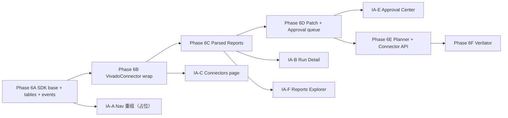

# SPEC Δ → Composer 2.5 开发指南

> 目标：把 `SPEC.md` 工作区未提交的新章节（§0、§9B、§12.29–12.39、Phase 6）拆成可直接交给 Composer 2.5 执行的细颗粒任务。
>
> 适用范围：`cursor/phase-4-monitor` 分支当前 HEAD。
>
> 阅读顺序：① §1 总览 → ② §2 实现 vs SPEC 对照矩阵 → ③ §3 Phase 6A–6F 分阶段任务（推荐按顺序交付）→ ④ §4 给 Composer 2.5 的操作约定。

---

## 1. SPEC 新内容总览

`git diff HEAD -- SPEC.md` 新增 996 行，落在 4 个区块：

| 区块 | 关键产物 | 摘要 |
|---|---|---|
| §0 平台定位 | 命名、分层、边界 | 重新定位为 **Synthia Industrial Tool Agent Platform**，Vivado 只是首个 connector |
| §9B Connector SDK | 18 小节 | `ToolConnector` 协议 / `ToolCapability` / `ToolManifest` / `PreparedRun` / `ToolRunResult` / `ParsedReportBundle` / `ToolErrorSummary` / Controlled Execution 合同 / Run Workspace Layout / API 扩展 / Phase 6A–6F |
| §12.29–12.39 前端 IA | 11 小节 | 一级导航重排：Projects / Sessions / Runs / Reports / Approvals / Connectors / Knowledge / Monitor / Settings，含路由迁移计划与各页面字段细则 |
| §17 Phase 6 | 1 小节 | 后端实施分期 6A→6F，与 §9B.18 对齐 |

核心架构口号（出自 §0.3）：

```text
LLM + Agent Harness + Industrial Tool Connector + Controlled Execution
    + Structured Reports + Human Approval + Knowledge / Monitor / Audit
```

不变约束（出自 §0.2 与 §1.2）：

- 不推倒重写；既有 Vivado Runtime Adapter、Tcl Policy、Remote Executor、ObservedToolRunner、ProblemCollector、SSE Timeline、Approval Engine、Memory Pipeline、Context Builder、Semantic KB、Evolution Overlays 全部复用。
- 不引入 WebSocket 作为主通道；实时仍走 SSE。
- 单 worker；DB 仍是 SQLite。

---

## 2. 实现 vs SPEC 对照矩阵

> **2026-05-26 更新**：Phase 6A–6F 主路径已落地；下表部分 ❌ 为原始快照，见各 Phase ✅ 小节为准。
> **指南主路径（2026-05-26 结项）**：Phase 6A–6F + IA-A–F 已落地；§2 矩阵已同步。
> **wave-6**：`vivado_capability_shims`（graph 默认走 connector）；`test_phase6_acceptance` 五条验收；`test_vivado_golden_path`。
> **后续深化（非阻塞）**：远程 Vivado 全矩阵 E2E、Jinja2 Tcl、Project Detail 页、ASIC connector。

> ✅ 已实现可复用 / ⚠ 已实现但需要包装/对齐 / ❌ 缺失 / 🔁 需要重构

### 2.1 后端能力对照

| SPEC 条目 | 现状 | 关键文件 | 缺口 |
|---|---|---|---|
| §9B.3 `ToolConnector` 协议 | ✅ | `connectors/base/connector.py`, `types.py` | — |
| §9B.4 `ToolCapability` 模型 | ✅ | `connectors/base/types.py`, `registry.py` | — |
| §9B.5 `ToolManifest` | ⚠ | `connectors/base/manifest.py` + `harness/manifest.py` | ASIC 通用 manifest 未做 |
| §9B.6 Vivado capability 矩阵 | ⚠ | `connectors/vivado/capabilities.py`（11 项） | 缺 elaborate/opt/place/route 分级；agent 经 shim 走 connector |
| §9B.7 Tcl 模板与策略 | ⚠ | `tcl_templates.py`, `tcl_policy.py` | 未 Jinja2；策略字段未完全对齐 SPEC |
| §9B.8 Controlled Execution 合同 | ⚠ | `tool_run_requests`, `run_execution.py`, `observed_tool.py` | 全路径未 100% 经合同；legacy tcl/script 仍直连 adapter |
| §9B.9 Run Workspace 布局 | ✅ | `harness/run_workspace.py` | 旧 `workspace.py` 时间戳目录仍用于部分 synth 输出 |
| §9B.10 `ParsedReportBundle` | ⚠ | `parsed_reports` 表 + vivado parsers | 缺 Power/Simulation；部分 report cap 需 workspace 路径 |
| §9B.11 Agent Harness capability plan | ✅ | `agent/planner.py`, `graph.py` shims | LLM planner 可选；`EDAGENT_LEGACY_VIVADO_TOOLS` 可恢复旧 tool |
| §9B.12 Context Builder connector blocks | ✅ | `agent/context.py` | `artifact_index` 为简要列表 |
| §9B.13 `/api/v1/connectors*` API | ✅ | `web/api_v1.py` | — |
| §9B.17 PatchProposal | ⚠ | `patch_proposals`, `approvals`, `patch_proposal.py` | 跨 run compare UI 弱 |
| §9B.18 第二 connector 样板 | ✅ | `connectors/verilator/` | mock/lint 级样板 |
| Phase 6 验收 5 条 | ✅ | `tests/test_phase6_acceptance.py` | 远程真机需人工/CI 带 Vivado |

### 2.2 数据库 schema 对照

`src/edagent_vivado/repository/db.py` 现有表（节选）：`projects, sessions, tasks, runs, tool_calls, llm_usage, artifacts, vivado_targets, vivado_commands, file_sync_records, path_mappings, problems, kb_cases, kb_candidates, memory_*, evolution_*` 等。

SPEC §9B 需要新增的表（最小集合）：

| 表 | 用途 | SPEC 出处 |
|---|---|---|
| `connectors` | 已注册的 connector + 版本 + health | §9B.13 |
| `connector_capabilities` | capability 声明（schema/risk/outputs） | §9B.4 |
| `run_steps` | run 内 stage：validate→elaborate→synth→opt→place→route→bitstream→report→diagnose→patch_proposal | §9B.6, §12.32 |
| `parsed_reports` | Timing/Utilization/DRC/Methodology/Power 结构化数据 | §9B.10 |
| `patch_proposals` | RTL/XDC/Tcl proposal（risk/diff/status/approval） | §9B.17 |
| `approvals` | 统一审批队列（patch / tcl / high-risk exec / kb / evolution） | §12.34 |
| `tool_run_requests` | Controlled Execution 合同（command_id / allowed_paths / env_profile） | §9B.8 |

> 建议：先把 `run_steps` 与 `parsed_reports` 落库（最小可观测增量），其它表跟随对应 Phase 增量加入。

### 2.3 前端能力对照

`frontend/src/app/router.tsx` 现有路由：

```text
/                       ProjectsPage
/projects/:projectId    ProjectExpandRedirect
/term                   TerminalPage
/monitor                MonitorPage
/monitor/runs/:runId    RunDetailPage
/vivado                 VivadoPage
/kb, /knowledge         KnowledgeBasePage
/evolution              EvolutionPage
/settings               SettingsPage
```

SPEC §12.38 长期目标路由（缺失/重命名）：

| 长期路由 | 现状 | 处理 |
|---|---|---|
| `/projects/:id` | ⚠（redirect） | 真 Project Detail 待做 |
| `/sessions` `/sessions/:id` | ✅ | `/term?session=` alias |
| `/runs` `/runs/:id` | ✅ | `/monitor/runs/:id` redirect |
| `/reports` `/reports/:id` | ✅ | WNS 趋势 + 详情 |
| `/approvals` `/approvals/:id` | ⚠ | 列表+详情同页；diff viewer 简化 |
| `/connectors` `/connectors/vivado` | ✅ | `/vivado` redirect |
| `/knowledge/candidates` `/knowledge/retrieval` | ✅ | KnowledgeShell tabs |
| `/monitor` | ✅ | connector health 面板 |

---

## 3. Phase 6A–6F 分阶段开发任务

> 每个阶段独立可交付。建议 PR 粒度：一个 Phase = 一个 PR；如 PR 过大可按"后端骨架 → API → 前端"再切。
>
> 每个任务模板：**目的 / 新建文件 / 编辑文件 / 关键代码骨架 / API & Event & DB / 验收测试**。

### Phase 6A — Connector SDK 基础边界 ✅

**目的**：建立 connector 抽象层、registry、capability schema、ToolRunRequest/Result/ParsedReport 类型；这是后面所有阶段的依赖。

#### 6A.1 新建包：`src/edagent_vivado/connectors/base/`

```text
src/edagent_vivado/connectors/
  __init__.py
  base/
    __init__.py          # re-export 所有公共类型
    types.py             # ToolEnvironment / ToolCapability / ToolManifest / PreparedRun / ToolRunRequest / ToolRunResult / ParsedReport / ParsedReportBundle / ToolErrorSummary / Artifact / ValidationResult
    connector.py         # ToolConnector Protocol + BaseConnector
    capability.py        # CapabilityDescriptor + CapabilityRegistry
    manifest.py          # ToolManifest 通用解析 + 扩展点
    request.py           # ToolRunRequest 构造 / 序列化
    execution.py         # ControlledExecutor (薄封装现有 RemoteExecutor + ObservedToolRunner)
    artifact.py          # Artifact 标准化 (复用 store.artifact_create)
    parser.py            # ReportParser Protocol + register_parser
    policy.py            # PolicyResult (扩展现有 tcl_policy.PolicyResult)
    registry.py          # connector_registry + connector_for(tool_name)
```

**`base/types.py` 关键骨架**：

```python
from __future__ import annotations
from dataclasses import dataclass, field
from typing import Any, Literal, Protocol

RiskLevel = Literal["low", "medium", "high", "critical"]
PolicyVerdict = Literal["allowed", "needs_approval", "denied"]

@dataclass
class ToolEnvironment:
    connector_id: str
    tool_name: str
    version: str = ""
    executable_path: str = ""
    target_id: str = ""
    target_type: Literal["local", "remote_ssh", "mock"] = "mock"
    reachable: bool = False
    license_ok: bool = True
    remote_workdir: str = ""
    extra: dict[str, Any] = field(default_factory=dict)

@dataclass
class ToolCapability:
    connector_id: str
    capability_id: str
    display_name: str
    stage: str
    input_schema: dict[str, Any]
    outputs: list[str]
    risk_level: RiskLevel = "low"
    requires_approval: bool = False
    supports_stop: bool = True
    supports_mock: bool = True
    produces_reports: bool = False
    produces_patch: bool = False

@dataclass
class ToolManifest:
    project: dict[str, Any]        # name / root / type
    tool: dict[str, Any]           # connector / version / mode
    source: dict[str, Any]
    design: dict[str, Any]
    flow: dict[str, Any]
    raw: dict[str, Any]            # 完整原始 dict（含 vivado: 扩展段）
    extensions: dict[str, Any]     # {"vivado": {...}, "design_compiler": {...}}

@dataclass
class ToolRunRequest:
    request_id: str
    run_id: str
    step_id: str
    connector_id: str
    capability_id: str
    inputs: dict[str, Any]
    manifest_path: str = ""
    target_id: str = ""
    auto_approved: bool = False

@dataclass
class PreparedRun:
    request: ToolRunRequest
    workspace_root: str
    generated_scripts: list[str]
    command: list[str]              # argv，而不是 shell 字符串
    env_profile: str = ""
    allowed_paths: list[str] = field(default_factory=list)
    timeout_sec: int = 3600
    policy: "PolicyResult" = None  # type: ignore

@dataclass
class PolicyResult:                 # 与 §9B.7 输出对齐
    verdict: PolicyVerdict
    risk_level: RiskLevel
    reasons: list[str] = field(default_factory=list)
    blocked_tokens: list[str] = field(default_factory=list)

@dataclass
class ToolRunResult:
    request_id: str
    success: bool
    exit_code: int
    stdout_path: str = ""
    stderr_path: str = ""
    log_paths: list[str] = field(default_factory=list)
    artifacts: list["Artifact"] = field(default_factory=list)
    elapsed_ms: int = 0
    target_id: str = ""
    edagent_outcome: Literal[
        "execution_succeeded", "execution_failed", "user_rejected",
        "policy_denied", "needs_approval"
    ] = "execution_succeeded"
    error: str = ""

@dataclass
class ParsedReport:
    type: Literal[
        "timing_summary", "utilization", "drc",
        "methodology", "power", "simulation", "log_summary"
    ]
    tool: str
    stage: str
    data: dict[str, Any]
    source_artifact_id: str = ""

@dataclass
class ParsedReportBundle:
    reports: list[ParsedReport] = field(default_factory=list)

@dataclass
class ToolErrorSummary:
    signature: str
    severity: Literal["info", "warning", "error", "critical"]
    stage: str
    message: str
    likely_causes: list[str] = field(default_factory=list)
    suggested_actions: list[str] = field(default_factory=list)
    related_artifacts: list[str] = field(default_factory=list)

@dataclass
class Artifact:
    artifact_id: str
    artifact_type: str
    path: str
    mime_type: str = ""
    size_bytes: int = 0
    sha256: str = ""

@dataclass
class ValidationResult:
    ok: bool
    errors: list[str] = field(default_factory=list)
    warnings: list[str] = field(default_factory=list)

class ToolConnector(Protocol):
    connector_id: str
    tool_name: str
    supported_versions: list[str]

    def detect_environment(self) -> ToolEnvironment: ...
    def list_capabilities(self) -> list[ToolCapability]: ...
    def validate_manifest(self, manifest: ToolManifest) -> ValidationResult: ...
    def prepare_run(self, request: ToolRunRequest) -> PreparedRun: ...
    def execute(self, prepared: PreparedRun) -> ToolRunResult: ...
    def collect_artifacts(self, result: ToolRunResult) -> list[Artifact]: ...
    def parse_artifacts(self, result: ToolRunResult) -> ParsedReportBundle: ...
    def classify_error(self, result: ToolRunResult) -> ToolErrorSummary | None: ...
```

**`base/registry.py` 关键骨架**：

```python
_REGISTRY: dict[str, ToolConnector] = {}

def register_connector(connector: ToolConnector) -> None:
    if connector.connector_id in _REGISTRY:
        raise ValueError(f"duplicate connector id: {connector.connector_id}")
    _REGISTRY[connector.connector_id] = connector

def get_connector(connector_id: str) -> ToolConnector | None:
    return _REGISTRY.get(connector_id)

def list_connectors() -> list[ToolConnector]:
    return list(_REGISTRY.values())

def find_capability(connector_id: str, capability_id: str) -> ToolCapability | None:
    c = get_connector(connector_id)
    if not c:
        return None
    for cap in c.list_capabilities():
        if cap.capability_id == capability_id:
            return cap
    return None
```

#### 6A.2 数据库表新增

**编辑 `src/edagent_vivado/repository/db.py`**，在 `_SCHEMA_SQL` 末尾追加（保持 `CREATE TABLE IF NOT EXISTS`，让既有库自动迁移）：

```sql
CREATE TABLE IF NOT EXISTS connectors (
    id TEXT PRIMARY KEY,
    connector_id TEXT NOT NULL UNIQUE,
    tool_name TEXT NOT NULL,
    version TEXT,
    supported_versions_json TEXT,
    status TEXT NOT NULL DEFAULT 'unknown',
    last_health_at INTEGER,
    last_health_json TEXT,
    created_at INTEGER NOT NULL,
    updated_at INTEGER NOT NULL,
    metadata_json TEXT
);

CREATE TABLE IF NOT EXISTS connector_capabilities (
    id TEXT PRIMARY KEY,
    connector_id TEXT NOT NULL,
    capability_id TEXT NOT NULL,
    display_name TEXT,
    stage TEXT,
    risk_level TEXT NOT NULL DEFAULT 'low',
    requires_approval INTEGER NOT NULL DEFAULT 0,
    supports_stop INTEGER NOT NULL DEFAULT 1,
    supports_mock INTEGER NOT NULL DEFAULT 1,
    input_schema_json TEXT,
    outputs_json TEXT,
    UNIQUE(connector_id, capability_id)
);

CREATE TABLE IF NOT EXISTS run_steps (
    id TEXT PRIMARY KEY,
    run_id TEXT NOT NULL,
    session_id TEXT,
    task_id TEXT,
    connector_id TEXT,
    capability_id TEXT,
    stage TEXT NOT NULL,
    name TEXT NOT NULL,
    state TEXT NOT NULL DEFAULT 'pending',
    started_at INTEGER,
    finished_at INTEGER,
    elapsed_ms INTEGER,
    command_text TEXT,
    request_artifact_id TEXT,
    log_artifact_id TEXT,
    error TEXT,
    metadata_json TEXT
);

CREATE TABLE IF NOT EXISTS parsed_reports (
    id TEXT PRIMARY KEY,
    run_id TEXT NOT NULL,
    step_id TEXT,
    connector_id TEXT NOT NULL,
    report_type TEXT NOT NULL,
    stage TEXT NOT NULL,
    source_artifact_id TEXT,
    data_json TEXT NOT NULL,
    created_at INTEGER NOT NULL,
    metadata_json TEXT
);
```

**编辑 `src/edagent_vivado/repository/store.py`**，增加 CRUD helper：

```python
def connector_upsert(connector_id, tool_name, version="", supported_versions=None,
                     status="ready", metadata=None) -> dict: ...
def connector_get(connector_id) -> dict | None: ...
def connector_list() -> list[dict]: ...

def capability_upsert(connector_id, capability_id, *, display_name, stage,
                      risk_level, requires_approval, input_schema, outputs,
                      supports_stop=True, supports_mock=True) -> dict: ...
def capability_list(connector_id=None) -> list[dict]: ...

def run_step_create(run_id, *, session_id, task_id, connector_id, capability_id,
                    stage, name, command_text="") -> dict: ...
def run_step_update(step_id, **fields) -> dict: ...
def run_step_list(run_id) -> list[dict]: ...

def parsed_report_create(run_id, step_id, connector_id, report_type, stage,
                         data, source_artifact_id="") -> dict: ...
def parsed_report_list(run_id=None, step_id=None) -> list[dict]: ...
```

#### 6A.3 事件目录扩展

**编辑 `src/edagent_vivado/events/catalog.py`**，新增（命名与 §6.5 现有 `tool.*`、`run.*` 风格一致）：

```python
"run.step.started",
"run.step.completed",
"run.step.failed",
"connector.health.checked",
"connector.capability.invoked",
"report.parsed.created",
"approval.requested",          # 统一队列（与现有 interaction.requested 共存或对齐）
"approval.decided",
"patch.proposal.created",
"patch.proposal.applied",
"patch.proposal.rejected",
```

并在 `frontend/src/lib/events/catalog.ts` 同步新增（用于前端事件 reducer 与 ContextDebug）。

#### 6A.4 验收

- `pytest tests/connectors/test_base_types.py`：所有 dataclass round-trip 序列化、`ToolConnector` Protocol 静态检查。
- `pytest tests/connectors/test_registry.py`：重复注册抛 `ValueError`、`find_capability` 命中/未命中。
- 数据库迁移：删除测试 DB → `edagent web --port 8484 --serve-static false` 启动 → 检查 5 张新表建出来。

---

### Phase 6B — Vivado Connector 包装现有 Runtime Adapter ✅

**目的**：把现有 `tools/vivado_tools.py` 5 个 LangChain tool + `harness/vivado_adapter.py` 包装成符合 §9B.6 的 `VivadoConnector`，**不破坏现有 Agent 调用路径**（双轨：旧 tool 名 → 新 connector capability）。

#### 6B.1 新建 `src/edagent_vivado/connectors/vivado/`

```text
connectors/vivado/
  __init__.py
  connector.py             # VivadoConnector(ToolConnector)
  manifest.py              # adapt harness/manifest.py → ToolManifest
  environment.py           # 复用 vivado_adapter.health_check
  capabilities.py          # 第一/二/三等级 capability 声明
  runner_adapter.py        # PreparedRun → VivadoRuntimeAdapter.run_*
  tcl_renderer.py          # 包装 harness/tcl_templates.py（后续替换为 Jinja2）
  artifact_collector.py    # 扫描 workspace 收集 log/rpt/dcp/bit
  parsers/
    __init__.py
    timing_summary.py      # 包装 parsers/timing_parser.py
    utilization.py         # 包装 parsers/utilization_parser.py
    vivado_log.py          # 包装 parsers/vivado_log_parser.py
    drc.py                 # ❌ 新建
    methodology.py         # ❌ 新建
  templates/               # Jinja2 模板（Phase 6B 内可以保持现状，Phase 6C 再迁）
    synth.tcl.j2
    impl.tcl.j2
    report_only.tcl.j2
  error_rules/
    synth_errors.yaml      # 从 src/edagent_vivado/kb/error_cases.yaml 抽 Vivado 子集
```

#### 6B.2 `VivadoConnector` 关键骨架

```python
from edagent_vivado.connectors.base import (
    ToolConnector, ToolEnvironment, ToolCapability, ToolManifest,
    PreparedRun, ToolRunRequest, ToolRunResult, ParsedReportBundle,
    ToolErrorSummary, Artifact, ValidationResult, PolicyResult,
)
from edagent_vivado.harness.vivado_adapter import VivadoRuntimeAdapter, get_default_target
from edagent_vivado.harness.tcl_policy import check_tcl_policy, check_tcl_script

class VivadoConnector:
    connector_id = "vivado"
    tool_name = "vivado"
    supported_versions = ["2020.2", "2022.1", "2023.2", "2024.1"]

    def __init__(self) -> None:
        self._adapter = VivadoRuntimeAdapter()

    def detect_environment(self) -> ToolEnvironment:
        h = self._adapter.health_check()
        t = self._adapter.target
        return ToolEnvironment(
            connector_id=self.connector_id, tool_name=self.tool_name,
            version=str(h.get("version") or ""),
            executable_path=getattr(t, "vivado_path", ""),
            target_id=getattr(t, "id", ""),
            target_type=getattr(t, "target_type", "mock"),
            reachable=bool(h.get("reachable")),
            remote_workdir=getattr(t, "remote_work_root", ""),
            extra={"raw_health": h},
        )

    def list_capabilities(self) -> list[ToolCapability]:
        from .capabilities import VIVADO_CAPABILITIES
        return list(VIVADO_CAPABILITIES)

    def validate_manifest(self, manifest: ToolManifest) -> ValidationResult: ...
    def prepare_run(self, request: ToolRunRequest) -> PreparedRun: ...
    def execute(self, prepared: PreparedRun) -> ToolRunResult: ...
    def collect_artifacts(self, result: ToolRunResult) -> list[Artifact]: ...
    def parse_artifacts(self, result: ToolRunResult) -> ParsedReportBundle: ...
    def classify_error(self, result: ToolRunResult) -> ToolErrorSummary | None: ...

def register() -> None:
    from edagent_vivado.connectors.base.registry import register_connector
    register_connector(VivadoConnector())
```

`prepare_run` / `execute` 内部直接委托：

| capability_id | 委托给 |
|---|---|
| `validate_project` | `harness/manifest.py::Manifest.load` + `projects/validate.py` |
| `run_synthesis` | `VivadoRuntimeAdapter.run_synthesis` |
| `run_implementation` | `VivadoRuntimeAdapter.run_implementation` |
| `run_simulation` | 新增（xsim 路径，暂可 mock） |
| `report_timing_summary` | `parsers/timing_parser.py` |
| `report_utilization` | `parsers/utilization_parser.py` |
| `report_drc` | 新建 `parsers/vivado/drc.py` |
| `report_methodology` | 新建 `parsers/vivado/methodology.py` |
| `parse_vivado_log` | `parsers/vivado_log_parser.py` |
| `classify_vivado_error` | `harness/problem_collector.py` + KB regex |

#### 6B.3 `capabilities.py` 数据

按 §9B.6 三个等级写满。第一等级最少 11 项，risk_level / requires_approval 与现有 `harness/vivado_agent_registry.py` 对齐：

```python
VIVADO_CAPABILITIES = [
    ToolCapability(
        connector_id="vivado", capability_id="run_synthesis",
        display_name="Vivado Synthesis", stage="synth",
        input_schema={"manifest_path": "string", "strategy": "string?"},
        outputs=["vivado_log", "timing_summary", "utilization", "drc", "post_synth_dcp"],
        risk_level="medium", requires_approval=True,
        supports_stop=True, supports_mock=True,
        produces_reports=True, produces_patch=False,
    ),
    # ... 其余 capabilities，第二/三等级按 §9B.6 列全 ...
]
```

#### 6B.4 启动注册

**编辑 `src/edagent_vivado/__init__.py`** 或新建 `src/edagent_vivado/connectors/__init__.py`，在 import 时调用：

```python
def _register_builtin_connectors() -> None:
    try:
        from edagent_vivado.connectors.vivado.connector import register as _v
        _v()
    except Exception as exc:
        import logging
        logging.getLogger(__name__).warning("Vivado connector register failed: %s", exc)
```

#### 6B.5 双轨：保持现有 LangChain tool

`tools/vivado_tools.py` **不要立刻删**。在 Phase 6E（Planner 改造）之前，旧 tool 内部转调新 connector：

```python
@tool
def run_vivado_synth_tool(manifest_path: str, approval_request: str = "") -> str:
    from edagent_vivado.connectors.base.registry import get_connector
    conn = get_connector("vivado")
    if conn is None:
        return _legacy_path(manifest_path, approval_request)
    # 构造 ToolRunRequest，复用现有 gate + observed runner 包装
    ...
```

这样可以保证 Phase 6B 上线后既有会话不中断。

#### 6B.6 验收

- `pytest tests/connectors/test_vivado_connector.py`：
  - `detect_environment` 在 mock 环境返回 `reachable=False / target_type="mock"`。
  - `list_capabilities()` 至少 11 项第一等级。
  - `prepare_run(capability="run_synthesis")` 生成 PreparedRun，`command[0]=="vivado"`，`allowed_paths` 包含 manifest 根。
  - `execute` 在 mock 环境返回 `edagent_outcome=="execution_succeeded"`。
- 既有测试不回归：`pytest -k "vivado and not agent_smoke"` 通过。

---

### Phase 6C — Structured Report Pipeline ✅

**目的**：让 Vivado synth/impl 结束后自动产出 `ParsedReportBundle` → 落 `parsed_reports` 表 → 触发 `report.parsed.created` 事件 → 前端 Run Detail Reports tab 可读。

#### 6C.1 新增 DRC / Methodology parser

**`src/edagent_vivado/connectors/vivado/parsers/drc.py`**：

```python
import re
from edagent_vivado.connectors.base.types import ParsedReport

PAT_RULE = re.compile(
    r"^\s*(?P<sev>CRITICAL WARNING|WARNING|ERROR):\s*\[(?P<rule>[A-Z]+-\d+)\]\s+(?P<msg>.+?)$",
    re.MULTILINE,
)

def parse_drc_report(text: str, *, stage: str = "impl") -> ParsedReport:
    errors, warnings = [], []
    for m in PAT_RULE.finditer(text):
        item = {
            "rule": m.group("rule"),
            "severity": m.group("sev").lower(),
            "message": m.group("msg").strip(),
            "objects": [],          # 后续可扩展抽取
            "suggested_action": "",
        }
        (errors if "error" in item["severity"] else warnings).append(item)
    return ParsedReport(
        type="drc", tool="vivado", stage=stage,
        data={"errors": errors, "warnings": warnings},
    )
```

`methodology.py` 同构。

#### 6C.2 在 connector 内组装 bundle

**`connectors/vivado/connector.py::parse_artifacts`**：

```python
def parse_artifacts(self, result: ToolRunResult) -> ParsedReportBundle:
    from edagent_vivado.parsers.timing_parser import parse_timing_summary
    from edagent_vivado.parsers.utilization_parser import parse_utilization
    from .parsers.drc import parse_drc_report
    from .parsers.methodology import parse_methodology_report
    from .parsers.vivado_log import parse_log_summary  # 包装现有 parser
    reports: list[ParsedReport] = []
    for art in result.artifacts:
        if art.path.endswith("_timing_summary.rpt"):
            t = parse_timing_summary(_read(art.path))
            if t: reports.append(ParsedReport(
                type="timing_summary", tool="vivado",
                stage=_stage_of(art.path),
                data={"wns": t.wns, "tns": t.tns, "whs": t.whs, "ths": t.ths},
                source_artifact_id=art.artifact_id))
        elif art.path.endswith("_utilization.rpt"):
            ...
        elif art.path.endswith("_drc.rpt"):
            reports.append(parse_drc_report(_read(art.path)))
        elif art.path.endswith("_methodology.rpt"):
            reports.append(parse_methodology_report(_read(art.path)))
        elif art.path.endswith(".log"):
            reports.append(parse_log_summary(_read(art.path)))
    return ParsedReportBundle(reports=reports)
```

#### 6C.3 落库 + 发事件

**编辑 `src/edagent_vivado/web/api_v1.py`** 在 tool 完成 hook（`on_tool_end` 或 connector capability 执行后）调用：

```python
from edagent_vivado.connectors.base.registry import get_connector
from edagent_vivado.repository.store import parsed_report_create

conn = get_connector("vivado")
bundle = conn.parse_artifacts(tool_run_result)
for r in bundle.reports:
    row = parsed_report_create(
        run_id=run_id, step_id=step_id, connector_id="vivado",
        report_type=r.type, stage=r.stage,
        data=r.data, source_artifact_id=r.source_artifact_id,
    )
    event_create(session_id, "report.parsed.created", {
        "parsed_report_id": row["id"], "type": r.type, "stage": r.stage,
        "run_id": run_id, "step_id": step_id,
    }, task_id=task_id, run_id=run_id)
```

#### 6C.4 API

**`src/edagent_vivado/web/api_v1.py`** 新增：

```python
@router.get("/runs/{run_id}/reports")
async def api_run_reports(run_id: str, type: str | None = None):
    rows = parsed_report_list(run_id=run_id)
    if type: rows = [r for r in rows if r["report_type"] == type]
    return {"run_id": run_id, "reports": rows}

@router.get("/runs/{run_id}/reports/{report_id}")
async def api_run_report_detail(run_id: str, report_id: str): ...
```

#### 6C.5 前端

**新建** `frontend/src/pages/ReportsPage.tsx`、`frontend/src/components/reports/{TimingCard,UtilizationCard,DrcCard,MethodologyCard}.tsx`，按 §12.33 字段渲染。在 `RunDetailPage.tsx` 新增 "Structured Reports" Panel，调用 `/runs/:id/reports`。

#### 6C.6 验收

- 喂入 `examples/uart_demo/logs/sample_vivado_error.log` + 一份合成 `post_synth_timing_summary.rpt`，跑 `run_vivado_synth_tool`（mock 模式），DB `parsed_reports` 至少 2 行；前端 Run Detail 出现 Timing/Utilization 卡片。
- 事件流：`run.step.completed`（Phase 6D 后） + `report.parsed.created` 通过 SSE 推到 timeline。
- Context Builder 单测：`build_agent_context()` 注入 `parsed_report_context` 块（见 6D.4）。

---

### Phase 6D — PatchProposal 与 Connector Policy 统一 ✅

**目的**：把现有 `tools/patch_tools.py` 的 propose/apply 行为升级为 §9B.17 PatchProposal 模型：含 `risk_level`、`diff`、跨 run before/after compare，进 `approvals` 队列。

#### 6D.1 表

```sql
CREATE TABLE IF NOT EXISTS patch_proposals (
    id TEXT PRIMARY KEY,
    run_id TEXT,
    step_id TEXT,
    session_id TEXT,
    task_id TEXT,
    problem_id TEXT,
    connector_id TEXT NOT NULL,
    capability_id TEXT,
    target_file TEXT NOT NULL,
    patch_type TEXT NOT NULL,        -- rtl_patch / xdc_patch / tcl_param / file_create
    risk_level TEXT NOT NULL,
    reason TEXT,
    diff_artifact_id TEXT,
    status TEXT NOT NULL DEFAULT 'pending',  -- pending/approved/rejected/applied/superseded
    approval_id TEXT,
    applied_at INTEGER,
    superseded_by TEXT,
    created_at INTEGER NOT NULL,
    metadata_json TEXT
);

CREATE TABLE IF NOT EXISTS approvals (
    id TEXT PRIMARY KEY,
    session_id TEXT, task_id TEXT, run_id TEXT, step_id TEXT,
    connector_id TEXT, capability_id TEXT,
    approval_type TEXT NOT NULL,     -- patch / tcl / high_risk_exec / kb / evolution
    risk_level TEXT NOT NULL,
    payload_json TEXT NOT NULL,
    status TEXT NOT NULL DEFAULT 'pending',
    decided_at INTEGER,
    decided_by TEXT,
    interaction_id TEXT,             -- 关联现有 interaction 表（双轨）
    created_at INTEGER NOT NULL,
    metadata_json TEXT
);
```

#### 6D.2 API（§9B.13 子集）

```python
@router.get("/approvals")
async def api_approvals_list(status: str = "pending", project_id: str = "",
                              connector_id: str = "", limit: int = 100): ...
@router.get("/approvals/{approval_id}")
async def api_approval_get(approval_id: str): ...
@router.post("/approvals/{approval_id}/approve")
async def api_approval_approve(approval_id: str, body: dict): ...
@router.post("/approvals/{approval_id}/reject")
async def api_approval_reject(approval_id: str, body: dict): ...

@router.get("/runs/{run_id}/patches")
async def api_run_patches(run_id: str): ...
@router.post("/patches/{patch_id}/apply")
async def api_patch_apply(patch_id: str): ...
```

⚠ 既有 `interactions` 表 + `/interactions/:id/respond` 不能下线（Timeline 已用）。新 `approvals` 通过 `interaction_id` 关联现有 interaction，前端可以同时通过 `PendingApprovalDock` 和 `/approvals` 队列读到。

#### 6D.3 Context Builder 注入

**编辑 `src/edagent_vivado/agent/context.py`**，新增 ContextItem 类型：

```python
# 在 build() 内：
parsed = parsed_report_list(run_id=run_id) if run_id else []
if parsed:
    summary = _summarize_reports(parsed)   # 限 600 字
    items.append(ContextItem(
        "parsed_report_context", "Latest Run Parsed Reports",
        summary, priority=4,
        source_type="parsed_report", trust_score=0.9,
    ))

env = get_connector("vivado").detect_environment()
items.append(ContextItem(
    "connector_environment_context", "Tool Environment",
    f"{env.tool_name} {env.version} via {env.target_type} ({env.target_id})",
    priority=2, trust_score=0.9,
))

err = classify_last_run_error(run_id)  # 取最后一个 step 的 ToolErrorSummary
if err:
    items.append(ContextItem(
        "tool_error_summary_context", "Tool Error Summary",
        f"[{err.severity}] {err.stage}: {err.signature}\n"
        f"likely_causes: {', '.join(err.likely_causes[:3])}\n"
        f"suggested_actions: {', '.join(err.suggested_actions[:3])}",
        priority=1, trust_score=0.9,
    ))
```

#### 6D.4 前端 Approval Center

**新建** `frontend/src/pages/ApprovalsPage.tsx`，list + detail（diff viewer 用现成 `react-diff-viewer-continued` 或简化版 `<pre>` 二栏）。路由 `/approvals`、`/approvals/:id`。

#### 6D.5 验收

- 在 mock 综合失败 + propose patch 流程下：DB `patch_proposals` 出现 pending 行，`approvals` 有对应 pending；`/approvals` 列表能查到；批准后 `patch.proposal.applied` 事件被发，文件写盘。
- Context Builder 在 build 后 token_counts 出现 `parsed_report_context` 与 `tool_error_summary_context`。

---

### Phase 6E — Connector API、Planner 升级、WorkBuddy ✅

**目的**：暴露完整 connector API；让 Planner 输出 capability plan 而不是直接挂 tool。

#### 6E.1 Connector API（§9B.13 全集）

```python
@router.get("/connectors")
async def api_connectors_list(): ...
@router.get("/connectors/{connector_id}")
async def api_connector_get(connector_id: str): ...
@router.get("/connectors/{connector_id}/capabilities")
async def api_connector_capabilities(connector_id: str): ...
@router.post("/connectors/{connector_id}/health-check")
async def api_connector_health(connector_id: str): ...

@router.get("/runs")
async def api_runs_list(project_id: str = "", connector_id: str = "",
                         status: str = "", limit: int = 50): ...
@router.get("/runs/{run_id}/steps")
async def api_run_steps(run_id: str): ...
@router.post("/runs/{run_id}/rerun")
async def api_run_rerun(run_id: str): ...
@router.get("/runs/{run_id}/artifacts")
async def api_run_artifacts(run_id: str): ...

@router.get("/tasks/{task_id}/plan")
async def api_task_plan(task_id: str): ...   # 返回 capability plan
```

#### 6E.2 Capability Plan

新建 `src/edagent_vivado/agent/planner.py`：

```python
@dataclass
class PlanStep:
    step: str
    connector: str
    capability: str
    inputs: dict
    requires_approval: bool

def plan_task(question: str, project_id: str, session_id: str) -> list[PlanStep]:
    """Heuristic + LLM-assisted planner.

    Phase 6E：先做规则版（关键词命中→capability），后续可接 LLM。
    """
    ...
```

在 `web/api_v1.py::_run_agent` 启动前先 `plan = plan_task(...)`，落库到 `tasks.metadata_json`，并发 `task.plan.generated` 事件。

LangGraph 主流程暂时仍然走 `agent.astream_events`，但工具集逐步用 `connector capability` 包装：把 `tools/vivado_tools.py` 5 个 tool 注册为 `connector_capability_tool` 工厂生成，函数名稳定，内部参数走 capability inputs。

#### 6E.3 WorkBuddy Skill 接入约定（占位，§9B.15）

仅提供 HTTP 接口契约，不需要 Phase 6E 真正写 skill 代码：

```text
synthia-run-synth     → POST /api/v1/projects/{pid}/tasks  body: {"capability":"run_synthesis", ...}
synthia-debug-timing  → POST /api/v1/projects/{pid}/tasks  body: {"capability":"diagnose_timing"}
synthia-review-patch  → GET  /api/v1/approvals?type=patch
synthia-export-report → GET  /api/v1/runs/{rid}/reports
```

#### 6E.4 验收

- `curl /api/v1/connectors` 返回 `[{connector_id: "vivado", ...}]`。
- 同 session 启动一个 task：DB `tasks.metadata_json.plan` 含 PlanStep；前端通过 `/tasks/:id/plan` 可读。
- 既有 chat 路径不破坏。

---

### Phase 6F — 第二 Connector 样板（推荐 Verilator） ✅

**目的**：用最小可用 connector 证明 Agent Core 不依赖 Vivado。

#### 6F.1 新建 `src/edagent_vivado/connectors/verilator/`

```text
connectors/verilator/
  connector.py             # VerilatorConnector(ToolConnector)
  capabilities.py          # compile / simulate / lint
  templates/
    compile.mk.j2
  parsers/
    verilator_log.py       # 解析 %Error / %Warning
```

最少 3 个 capability：

| capability_id | stage | risk |
|---|---|---|
| `lint_design` | lint | low |
| `compile_sim` | sim_build | low |
| `run_simulation` | sim_run | low |

`execute` 直接调用本地 `verilator` 命令（或检测不到则 mock）。

#### 6F.2 注册

```python
# connectors/__init__.py
def _register_builtin_connectors():
    ...
    try:
        from .verilator.connector import register as _vl
        _vl()
    except Exception: ...
```

#### 6F.3 验收

- `/api/v1/connectors` 同时返回 vivado + verilator。
- 在没有 Vivado 的机器上：触发 verilator `lint_design` task → 全流程 PASS（plan→step→artifact→parsed_report→done）。
- 删除 `connectors/vivado/` 文件夹时，verilator 流程仍可走通（证明无硬依赖）。

---

## 4. 前端 IA 实施（与后端 Phase 错峰）

> 与 §12.39 的 Frontend IA Phase A–F 对齐。可与后端并行，但 Phase B/C/E 强依赖后端 6C/6D 的 API 与表。

### IA-A 导航重组（无后端依赖） ✅

**编辑文件**：

- `frontend/src/app/router.tsx`：新增空壳路由 `/sessions` `/runs` `/reports` `/approvals` `/connectors`。
- `frontend/src/components/layout/AppNav.tsx`（或同等组件）：新增导航项。
- `frontend/src/locales/{en,zh}.json`：新增 `nav.sessions / nav.runs / nav.reports / nav.approvals / nav.connectors`。

新页面初版直接渲染 "Coming in Phase 6X" 占位，**保留** `/term` `/vivado` `/kb` 兼容路径。

### IA-B Run Detail 强化（依赖 6C） ✅

`frontend/src/pages/RunDetailPage.tsx` 加入：

- `<StepTimeline run_id={runId} />` → 调 `/runs/:id/steps`
- `<StructuredReports run_id={runId} />` → 调 `/runs/:id/reports`
- `<RunProblems />` 已有；改为按 step 分组
- `<RunPatches />` → 调 `/runs/:id/patches`

### IA-C VivadoPage → `/connectors/vivado` ✅

把 `frontend/src/pages/VivadoPage.tsx` 移动到 `frontend/src/pages/connectors/VivadoConnectorPage.tsx`，路由 `/connectors/vivado`；`/vivado` 用 `<Navigate to="/connectors/vivado" replace />`。

新建 `frontend/src/pages/connectors/ConnectorsListPage.tsx`：调 `/api/v1/connectors`，列表 + Health 按钮（调 `/connectors/:id/health-check`）。

### IA-D Knowledge Console 重组 ✅

新建 `frontend/src/pages/knowledge/{KnowledgeShell,KbTab,SemanticTab,CandidatesTab,RetrievalAuditTab,EvolutionTab}.tsx`，统一路由 `/knowledge/*`。`/kb` `/evolution` 保留 redirect。

### IA-E Approval Center ✅

新建 `frontend/src/pages/ApprovalsPage.tsx`（已在 6D.4 描述）。

### IA-F Report Explorer & History Compare ✅

`frontend/src/pages/ReportsPage.tsx`：跨 run 查询 + Timing/Utilization 趋势线（用现有 `BarChart` 组件 + 新加 `<TrendLine />`）。`/reports/:id` 单报告详情，按 type 分模板。

---

## 5. 依赖关系与推荐顺序



**最小 PR 序列建议**：

1. PR1（6A）：SDK base 包 + 5 张新表 + events + 单测（不动现有调用路径）
2. PR2（6B）：VivadoConnector + 双轨注册（旧 tool 内部转调，对外行为不变）
3. PR3（6C + IA-B）：Parsed Reports 落库/事件/API + Run Detail UI
4. PR4（6D + IA-E）：PatchProposal + Approval queue + 前端 Approval Center
5. PR5（6E + IA-A + IA-C + IA-D + IA-F）：API 全集 + Planner + 前端导航/Reports/Connectors 全面重组
6. PR6（6F）：Verilator connector + 端到端非 Vivado 任务验收

---

## 6. 给 Composer 2.5 的操作约定

### 6.1 启动 prompt 模板

```text
你正在执行 "SPEC Δ Phase 6{X}" 任务。

工作区：E:/dev/edagent-vivado（branch cursor/phase-4-monitor）

必读：
- SPEC.md §0、§9B、§12.29–12.39、§17 Phase 6
- docs/SPEC_DELTA_DEV_GUIDE.md §3 Phase 6{X}
- AGENTS.md（环境约束、mock 模式、测试命令）

约束：
1. 不修改已有 5 个 Vivado tool 的对外签名与返回 JSON（agent prompt 强依赖）。
2. 新数据表只能用 CREATE TABLE IF NOT EXISTS；不允许 ALTER 既有列。
3. 新事件类型必须同时加到 src/edagent_vivado/events/catalog.py 和
   frontend/src/lib/events/catalog.ts。
4. 新 API 必须挂在 /api/v1/ 下，遵循现有 router 风格。
5. 不引入新依赖；jinja2 可用（已在 langchain 依赖里）。
6. 所有变更要可在 mock 模式（无 Vivado / 无 SSH）下跑通。

完成标准：
- pytest -k "not agent_smoke" 通过
- cd frontend && npx tsc -b --noEmit 通过
- 手动验收清单（见指南 §3 Phase 6{X} 末尾）全部 ✅
```

### 6.2 推荐工具调用顺序

1. `Read SPEC.md` 对应章节
2. `Read docs/SPEC_DELTA_DEV_GUIDE.md` 对应 Phase
3. `Grep` 现有同名/相邻实现，避免重写
4. 用 `Write` 新建文件 + `StrReplace` 编辑既有文件
5. 跑 `pytest tests/connectors/test_*` 和 `pytest -k "not agent_smoke"`
6. 跑 `cd frontend && npm run build` 确保 tsc + vite 通过

### 6.3 易踩坑清单

| 坑 | 防御 |
|---|---|
| `.env` 自动加载会带上 `VIVADO_REMOTE_HOST` | 测试代码用 `monkeypatch.delenv("VIVADO_REMOTE_HOST", raising=False)` 或 `VivadoRunner(force_mock=True)` |
| 删/改既有 LangChain tool 名 | 不要做；agent system prompt 与 evolution overlay 都写死了 |
| 直接 import `langgraph.checkpoint.sqlite` 失败 | `agent/graph.py::_default_checkpointer` 已有 try/except，新增 connector 不要重复 import |
| 新事件没在 frontend catalog 注册 | reducer 会 warn 但不渲染；务必同步两侧 |
| Parsed report `data` 字段直接写大文本 | `data` 只放结构化数值；原文走 `artifact_id` 引用 |
| Approval 双轨混淆 | 新 `approvals` 表通过 `interaction_id` 反查老 interaction；前端两边都能消费 |
| 前端拆路由破坏既有书签 | `/term` `/vivado` `/kb` `/monitor/runs/:id` 永久保留 redirect |
| 工作区有 7 张 `eda.yaml`、多个 example 目录 | manifest 抽象不要假设单一 manifest；通过 `project.root_path + manifest_path` 定位 |

### 6.4 验收脚本（每个 Phase 末尾必跑）

```bash
# 后端
cd E:/dev/edagent-vivado
python -m pytest -k "not agent_smoke" -q
python -m mypy src/edagent_vivado --ignore-missing-imports
EDAGENT_DB_PATH=/tmp/test_phase6.db edagent web --port 8489 &  # 干净 DB 启动
sleep 3
curl -s http://localhost:8489/api/v1/connectors | python -m json.tool
curl -s http://localhost:8489/api/v1/runs?limit=5 | python -m json.tool

# 前端
cd frontend && npx tsc -b --noEmit && npm run build
```

---

## 7. 不在本指南内的内容（明确排除）

- §9B.5 ASIC 工具 manifest（Design Compiler / PrimeTime）：Phase 6F 之后再做。
- §9B.11 多步 LLM planner 编排执行：已有 `plan_task_llm` + 任务 metadata，未自动按 plan 逐步执行。
- §12.29 Settings page 改造：与 connector 无强耦合，沿用现有 SettingsPage。
- WorkBuddy / VS Code 客户端实现：仅约定 API 契约。
- 多 worker 部署：SPEC §19.5 仍保持单 worker。
- 鉴权 / 多租户：本轮不涉及。

---

## 8. 变更追踪

| 章节 | 来源 | 影响范围 |
|---|---|---|
| §3 Phase 6A | SPEC §9B.1–9B.4, §9B.18 | 新增 `connectors/base` 包、5 张表、10 个事件 |
| §3 Phase 6B | SPEC §9B.6, §9B.7, §9B.8 | 新增 `connectors/vivado` 包、capability registry |
| §3 Phase 6C | SPEC §9B.10, §12.33 | `parsed_reports` 表、`report.parsed.created` 事件、Run Detail Reports |
| §3 Phase 6D | SPEC §9B.17, §12.34 | `patch_proposals` + `approvals` 表、Approval Center |
| §3 Phase 6E | SPEC §9B.11, §9B.13, §9B.15 | Planner、`/api/v1/connectors*` 全集、WorkBuddy 契约 |
| §3 Phase 6F | SPEC §9B.18 | Verilator connector 样板 |
| §4 IA-A–F | SPEC §12.29–12.39 | 前端路由/页面全面重组 |

> 本指南是工作文档，每完成一个 Phase 即在对应小节末尾打勾 ✅ 或追加 PR 链接。
