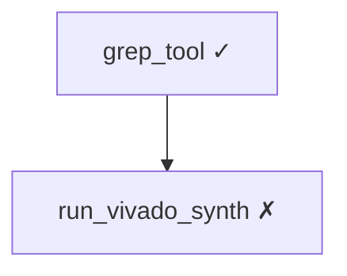

# Synthia Memory System — Design & Implementation Plan

> **Status:** Phase A ✅ · Phase B ✅ · Phase C ✅ · Phase D ✅ · Phase E ✅  
> **Inspired by:** [TencentDB Agent Memory](https://github.com/Tencent/TencentDB-Agent-Memory)  
> **Author:** Claude Opus 4.7 (plan) · maintained in-repo for Composer 2.5 execution

---

## 1. Design Principles

| Concept | Scope | Rationale |
|---------|-------|-----------|
| **Task Canvas** (Mermaid) | **Task / Session** | Short-lived reasoning state; one debug+synth cycle |
| **L1 Atoms** | **Project** (primary) | Facts like part, clock, RTL paths are project-bound |
| **L2 Scenarios** | **Project + Global** | Project-specific failure patterns; global EDA patterns reuse `kb_cases` |
| **L3 Persona** | **Project + User** | Project Persona = SOP + Evolution winners; User Persona = language/approval prefs |

**One-liner:** Canvas is a task-level snapshot; memory is a project-level asset.

---

## 2. UI:「记忆图谱」Tab

Add a third tab beside **对话 / 时间线** on the Terminal page.

| Tab | Content | Data source |
|-----|---------|-------------|
| 对话 | Unchanged | `timeline.entries` |
| 时间线 | Unchanged | `timeline.auditLog` |
| **记忆图谱** | Active task Mermaid canvas; last 3 archived canvases; Project Persona card | New memory APIs |

### 2.1 Frontend changes

| File | Change |
|------|--------|
| `frontend/src/stores/terminalStore.ts` | `TerminalView = 'chat' \| 'timeline' \| 'memory'` |
| `frontend/src/locales/zh.json` / `en.json` | `terminal.memoryTab`: 记忆图谱 / Memory |
| `frontend/src/pages/TerminalPage.tsx` | Third tab button; render `MemoryGraphView` when `view === 'memory'` |
| `frontend/src/components/terminal/MemoryGraphView.tsx` | **New** — canvas + history + persona card |
| `frontend/src/components/common/MermaidGraph.tsx` | **New** — wrap `mermaid` render + node click |
| `frontend/src/api/memory.ts` | **New** — typed API client |
| `frontend/src/styles/terminal.css` | `.memory-graph-view`, `.memory-canvas-active`, `.memory-persona-card` |

### 2.2 MemoryGraphView layout

```
<MemoryGraphView>
  <section className="memory-canvas-active">
    <MermaidGraph source={activeCanvas.mermaid} onNodeClick={openRef} />
  </section>
  <section className="memory-canvas-history">
    {historyCanvases.map(c => (
      <CollapsibleSection key={c.id}>
        <MermaidGraph ... />
      </CollapsibleSection>
    ))}
  </section>
  <aside className="memory-persona-card">
    <PersonaSummary projectId={projectId} />
  </aside>
</MemoryGraphView>
```

### 2.3 Node click → drill-down

`onNodeClick(nodeId)` → `GET /api/memory/refs/{node_id}` → open right panel artifacts tab or inline drawer.

### 2.4 Dependency

```bash
cd frontend && npm install mermaid
```

---

## 3. Database Schema

Append to `src/edagent_vivado/repository/db.py` `SCHEMA` string.

```sql
-- ============== L1 / L2 / L3 long-term memory ==============
CREATE TABLE IF NOT EXISTS memory_atoms (
    id TEXT PRIMARY KEY,
    scope TEXT NOT NULL DEFAULT 'project',     -- 'project' | 'global'
    project_id TEXT,
    atom_type TEXT NOT NULL,                    -- 'fact' | 'preference' | 'event' | 'config'
    subject TEXT NOT NULL,
    predicate TEXT,
    object TEXT NOT NULL,
    confidence REAL NOT NULL DEFAULT 0.7,
    source_session_id TEXT,
    source_message_id TEXT,
    source_run_id TEXT,
    evidence_artifact_id TEXT,
    superseded_by TEXT,
    created_at INTEGER NOT NULL,
    updated_at INTEGER NOT NULL,
    metadata_json TEXT
);

CREATE TABLE IF NOT EXISTS memory_scenarios (
    id TEXT PRIMARY KEY,
    scope TEXT NOT NULL DEFAULT 'project',
    project_id TEXT,
    title TEXT NOT NULL,
    summary_md_path TEXT NOT NULL,
    atom_ids_json TEXT NOT NULL,
    trigger_pattern TEXT,
    occurrence_count INTEGER NOT NULL DEFAULT 1,
    last_seen_at INTEGER,
    created_at INTEGER NOT NULL,
    updated_at INTEGER NOT NULL,
    metadata_json TEXT
);

CREATE TABLE IF NOT EXISTS memory_personas (
    id TEXT PRIMARY KEY,
    scope TEXT NOT NULL,                        -- 'project' | 'user'
    project_id TEXT,
    persona_md_path TEXT NOT NULL,
    version INTEGER NOT NULL DEFAULT 1,
    atom_count_at_build INTEGER,
    scenario_count_at_build INTEGER,
    built_at INTEGER NOT NULL,
    superseded_by TEXT,
    metadata_json TEXT,
    UNIQUE(scope, project_id, version)
);

-- Task canvas (short-term memory)
CREATE TABLE IF NOT EXISTS task_canvases (
    id TEXT PRIMARY KEY,
    task_id TEXT NOT NULL,
    session_id TEXT NOT NULL,
    mermaid_artifact_id TEXT NOT NULL,
    node_count INTEGER NOT NULL DEFAULT 0,
    token_count INTEGER,
    version INTEGER NOT NULL DEFAULT 1,
    state TEXT NOT NULL DEFAULT 'active',         -- 'active' | 'archived'
    created_at INTEGER NOT NULL,
    updated_at INTEGER NOT NULL,
    metadata_json TEXT
);

CREATE TABLE IF NOT EXISTS canvas_node_refs (
    id TEXT PRIMARY KEY,
    canvas_id TEXT NOT NULL,
    node_id TEXT NOT NULL,
    ref_type TEXT NOT NULL,                       -- 'tool_call' | 'artifact' | 'message'
    ref_id TEXT NOT NULL,
    label TEXT,
    created_at INTEGER NOT NULL,
    UNIQUE(canvas_id, node_id)
);

CREATE INDEX IF NOT EXISTS idx_atoms_project ON memory_atoms(project_id, atom_type);
CREATE INDEX IF NOT EXISTS idx_scenarios_project ON memory_scenarios(project_id);
CREATE INDEX IF NOT EXISTS idx_canvas_task ON task_canvases(task_id, state);
```

---

## 4. Filesystem Layout

```
.edagent/
├── projects/
│   └── {project_id}/
│       ├── memory/
│       │   ├── persona.md
│       │   ├── scenarios/
│       │   │   └── sc_{id}.md
│       │   └── canvases/
│       │       └── task_{task_id}_v{n}.mmd
│       └── refs/
│           └── {node_id}.md
└── user/
    └── persona.md
```

Reuse existing `artifacts` table for large blobs; paths above are human-readable mirrors.

---

## 5. Backend Module Structure

```
src/edagent_vivado/memory/
├── __init__.py
├── atoms.py            # L1 extractor
├── scenarios.py        # L2 aggregator
├── personas.py         # L3 builder
├── canvas.py           # Task canvas generate/update
├── refs.py             # node_id ↔ artifact mapping
└── pipeline.py         # Async trigger scheduler
```

### 5.1 `canvas.py`

```python
def update_task_canvas(task_id: str, *, event: str, payload: dict) -> TaskCanvas:
    """On tool_call_completed:
    1. Generate short node_id (8 chars)
    2. Append node to Mermaid graph
    3. Insert canvas_node_refs row
    4. Write tool result to refs/{node_id}.md
    5. Persist Mermaid to artifacts + task_canvases
    """

def build_canvas_for_prompt(task_id: str, max_tokens: int = 800) -> str:
    """Compact Mermaid for AgentContext injection."""
```

### 5.2 `atoms.py`

```python
def extract_atoms_from_session(
    session_id: str,
    project_id: str,
    *,
    since_seq: int | None = None,
) -> list[MemoryAtom]:
    """Extract ≤20 atomic facts from messages + tool_calls.
    Targets: manifest changes, synth/impl outcomes, user prefs, trial configs.
    """
```

LLM output schema: `[{subject, predicate, object, atom_type, confidence}]`

### 5.3 `scenarios.py`

```python
def aggregate_scenarios(
    project_id: str,
    *,
    min_atoms: int = 3,
    min_interval_seconds: int = 900,
) -> list[MemoryScenario]:
    """Cluster atoms by subject → write scenarios/sc_{id}.md"""
```

### 5.4 `personas.py`

```python
def build_project_persona(
    project_id: str,
    *,
    force: bool = False,
    trigger_every_n_atoms: int = 50,
) -> MemoryPersona:
    """Synthesize persona.md from L2 scenarios + Evolution task_arms winners."""
```

Persona template sections:
- 工程指纹 (part, top, clocks)
- 常见失败模式
- 优胜配置 (from Evolution)
- 用户偏好

### 5.5 `pipeline.py`

TencentDB-style triggers:

| Trigger | Default | Action |
|---------|---------|--------|
| `everyNConversations` | 5 | L1 extract |
| `enableWarmup` | true | 1→2→4→8 turn doubling |
| `l1IdleTimeoutSeconds` | 600 | L1 on idle |
| `l2MinIntervalSeconds` | 900 | L2 aggregate |
| `personaTriggerEveryN` | 50 new atoms | L3 rebuild |

---

## 6. Integration Points

### 6.1 Agent context (`agent/context.py`)

After `_semantic_kb_context`, inject:

```python
persona_block = _load_project_persona(project_id)
canvas_block = _load_active_canvas(task_id)
# priority: canvas=1, persona=2 (higher than memory snapshot=4)
```

### 6.2 Tool call hook

Where tool calls are persisted (web task runner / event emitter), call:

```python
memory.canvas.update_task_canvas(task_id, event="tool_call_completed", payload={...})
```

Search codebase for `toolcall_create` or equivalent persistence site.

### 6.3 Message event listener

After each user/assistant message:

```python
await memory_pipeline.on_message(session_id, project_id)
```

---

## 7. HTTP API

Add routes in `src/edagent_vivado/web/api_v1.py` (or new `memory_api.py` router).

| Method | Path | Response |
|--------|------|----------|
| GET | `/api/memory/canvas/active?task_id=` | `{mermaid, version, node_count, nodes[]}` |
| GET | `/api/memory/canvas/history?session_id=&limit=3` | `[canvas_meta, ...]` |
| GET | `/api/memory/canvas/{canvas_id}` | Full canvas + node refs |
| GET | `/api/memory/refs/{node_id}` | Raw artifact / ref content |
| GET | `/api/memory/persona?project_id=` | `{md, version, built_at, atom_count}` |
| GET | `/api/memory/atoms?project_id=&type=&limit=50` | Atom list |
| GET | `/api/memory/scenarios?project_id=` | Scenario list |
| POST | `/api/memory/rebuild?project_id=&level=persona` | Manual L2/L3 rebuild |

---

## 8. Implementation Phases

Each phase is an independent PR. Do **not** merge all at once.

### Phase A — Task Canvas (short-term) ~600 LOC

**Goal:** Mermaid canvas updates on every tool call;「记忆图谱」tab renders it.

| Step | Task | Files |
|------|------|-------|
| A1 | DB: `task_canvases`, `canvas_node_refs` | `repository/db.py`, `repository/store.py` |
| A2 | `memory/canvas.py`, `memory/refs.py` | new module |
| A3 | Hook tool_call completion | find `toolcall_*` persist site in web/agent |
| A4 | API: canvas/active, refs/{node_id} | `web/api_v1.py` |
| A5 | Frontend: mermaid, MemoryGraphView, tab | see §2.1 |
| A6 | Tests | `tests/test_memory_canvas.py` |

**Acceptance:**
- Run one Vivado synth task → canvas has ≥1 node
- Click node in「记忆图谱」→ shows tool output
- `pytest tests/test_memory_canvas.py` passes
- `cd frontend && npm run build` passes

### Phase B — L1 Atoms ~400 LOC

| Step | Task |
|------|------|
| B1 | DB: `memory_atoms` |
| B2 | `memory/atoms.py` + heuristic/LLM extractor |
| B3 | `memory/pipeline.py` N-turn + idle triggers |
| B4 | Event listener on new messages |
| B5 | API: GET `/api/memory/atoms` |
| B6 | Tests: 5-turn conversation → atoms created |

### Phase C — L2 Scenarios + L3 Persona ~500 LOC

| Step | Task |
|------|------|
| C1 | DB: `memory_scenarios`, `memory_personas` |
| C2 | `memory/scenarios.py`, `memory/personas.py` |
| C3 | Inject persona into `AgentContextBuilder` |
| C4 | API: persona, rebuild |
| C5 | Frontend: `PersonaSummary` in MemoryGraphView |
| C6 | Tests: 50 messages → `persona.md` exists and appears in context |

### Phase D — Evolution linkage ~200 LOC

| Step | Task |
|------|------|
| D1 | Winning `task_arms` → `memory_atoms` (`atom_type=config`) |
| D2 | Persona template「优胜配置」section |
| D3 | New session loads latest project persona on start |

### Phase E — Retrieval polish (optional, quick win)

| Step | Task |
|------|------|
| E1 | Replace weighted sum in `knowledge/retrieval.py` with RRF |
| E2 | Context offload ratios (0.5 mild / 0.85 aggressive) in `AgentContextBuilder` |

---

## 9. Mermaid Canvas Format (draft)



Node IDs in graph match `canvas_node_refs.node_id`. Labels show tool name + status icon.

Prompt injection uses the same graph without styling; capped at ~800 tokens via `build_canvas_for_prompt`.

---

## 10. Mapping from TencentDB Agent Memory

| TencentDB | Synthia adoption |
|-----------|------------------|
| Mermaid canvas + refs/*.md | **Phase A** — direct |
| L0→L3 pyramid | **Phase B/C** — adapted to project scope |
| RRF hybrid retrieval | **Phase E** — drop-in for `retrieval.py` |
| OpenClaw plugin shell | **Skip** — use native FastAPI + React |
| TCVDB cloud backend | **Skip** — keep SQLite + sqlite-json vectors |
| N-turn / idle / warmup triggers | **Phase B** — `pipeline.py` |

---

## 11. Composer 2.5 Handoff Template

Use one prompt per phase:

```
Implement Phase A (Task Canvas) per docs/memory-system.md §8.

Constraints:
- Append schema to repository/db.py SCHEMA (no separate migration file unless needed)
- New code under src/edagent_vivado/memory/
- Do not refactor unrelated terminal UI
- pytest tests/test_memory_canvas.py must pass
- frontend npm run build must pass
- Return: changed files list + how to manually verify on /term
```

---

## 12. Open Questions

- [ ] Exact hook site for `update_task_canvas` — locate in web task runner
- [ ] LLM for L1 extraction: reuse `SummaryModel` or dedicated cheap model env var
- [ ] Canvas archival: on `task.state = finished` or on next task start?
- [ ] Mobile「记忆图谱」: horizontal scroll for wide Mermaid or zoom controls?

---

*Last updated: 2026-05-26*
