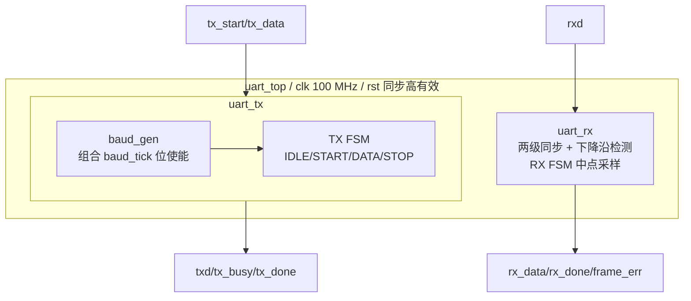

# UART 收发器可编程逻辑器件软件设计说明（PLDSDD）

## 封面

| 属性 | 内容 |
|---|---|
| 文档标识及版本 | UART-DOC-003 / v2.0 candidate |
| 数据分类 | 待项目责任人确定；当前按非公开工程资料处理 |
| 编制/修订日期 | 2026-08-26 |
| 文档名称 | UART 收发器可编程逻辑器件软件设计说明 |
| 编制单位 | Synthia Golden 候选项目（待授权单位确认） |
| 编写 | Agent 辅助拟制，待授权角色署名 |
| 审核 | 待 PLDS 设计、验证角色审核 |
| 批准 | 未批准；待设计负责人决定 |

## 修改页

| 版本 | 日期 | 修改内容 | 修改人 |
|---|---|---|---|
| v2.0 candidate | 2026-08-26 | 依据 GJB 9764-2020 附录 D 合并原结构设计和详细设计，补齐验证设计与模块追踪 | Agent 辅助拟制，待授权角色确认 |

## 目录

1. 范围
2. 引用文档
3. 概要设计
4. 详细设计
5. 验证设计
6. 可追踪性

## 1 范围

### 1.1 标识

设计对象为 GOLDEN-UART 项目的 UART 收发器 PLDS，顶层 `uart_top`，候选器件 `xc7k70tfbv676-1`，设计版本 v2.0 candidate，无发布号或批准基线。

### 1.2 系统概述

设计在 100 MHz 单时钟域中实现参数化 9600 8N1 全双工 UART，包含顶层装配、发送状态机及位使能、接收同步与中点采样逻辑。串行输入是唯一已识别的异步输入。

### 1.3 文档概述

本文覆盖概要、详细和验证设计，并说明原 `结构设计说明` 与 `详细设计说明` 的合并关系。该合并以本 PLDSDD 为主文档，保留两者全部设计要素。数据分类尚待授权角色确定。

## 2 引用文档

| 文档标识 | 标题/版本 | 状态 |
|---|---|---|
| GJB 9764-2020 | 军用可编程逻辑器件软件文档编制规范 | 仓库权威扫描件 |
| UART-DOC-001 | PLDS 研制任务书 v2.0 | candidate |
| UART-DOC-002 | PLDS 需求规格说明 v2.0 | candidate |

## 3 概要设计

### 3.1 总体结构原理

TX 和 RX 共享 `clk/rst`，数据通路独立。全部为 Verilog-2001 可综合 RTL，无 IP 核、黑盒、BRAM、DSP 或派生时钟。`baud_tick` 仅是同拍时钟使能。

### 3.2 功能模块设计

| 唯一标识 | 模块/文件 | 用途与 I/O | 方法、时钟域和候选资源 |
|---|---|---|---|
| UART-DES-MOD-001 | `uart_top` / `rtl/uart_top.v` | 装配 TX/RX 并暴露全部顶层端口 | 自研 RTL；`clk` 域；仅连线 |
| UART-DES-MOD-002 | `uart_tx` / `rtl/uart_tx.v` | 并行字节→8N1，输出 busy/done | 自研 FSM；`clk` 域；寄存器+计数器 |
| UART-DES-MOD-003 | `uart_rx` / `rtl/uart_rx.v` | `rxd` 同步、采样、帧错丢弃和恢复 | 自研 FSM；异步输入进入 `clk` 域；寄存器+计数器 |
| UART-DES-MOD-004 | `baud_gen` / `rtl/baud_gen.v` | TX 位时使能 | 自研计数器；`clk` 域；无派生时钟 |

可靠性：RX 两级同步、FSM 保留非法编码并完整 default 恢复、全部输出有确定复位值。可维护性：参数和模块职责分离，需求/模块标识稳定。可测试性：环回、层级状态注入和外部串行激励。安全/保密：没有系统输入可形成完整安全/保密设计，缺口保持开放。

## 4 详细设计

### 4.1 顶层模块 `uart_top`（UART-DES-MOD-001）

#### 4.1.1 模块标识和用途

`uart_top` 例化 `uart_tx` 和 `uart_rx`，仅共享 `clk/rst`，不在两通道之间添加数据依赖。

#### 4.1.2 模块设计及约束

| 端口 | 方向 | 位宽 | 复位/空闲 | 说明 |
|---|---|---:|---|---|
| `clk`/`rst` | 输入 | 1/1 | —/高有效 | 单一时钟、同步复位 |
| `tx_start`/`tx_data` | 输入 | 1/8 | 0/— | TX 空闲沿锁存 |
| `txd`/`tx_busy`/`tx_done` | 输出 | 1/1/1 | 1/0/0 | 串行输出、忙、完成单拍 |
| `rxd` | 输入 | 1 | 外部空闲高 | 唯一异步输入 |
| `rx_data`/`rx_done`/`frame_err` | 输出 | 8/1/1 | 0/0/0 | 合法数据、完成/错误互斥单拍 |

### 4.2 发送模块 `uart_tx`（UART-DES-MOD-002）

#### 4.2.1 模块标识和用途

模块在空闲沿锁存字节，按 START、8×DATA、STOP 顺序输出，并生成 busy/done。

#### 4.2.2 模块设计及约束

状态编码为 3 bit：IDLE=`3'd0`、START=`3'd1`、DATA=`3'd2`、STOP=`3'd3`，4～7 保留非法；属性 `fsm_encoding="none"` 要求保持编码。

| 状态 | 每拍行为 | 转移/输出 |
|---|---|---|
| IDLE | `txd=1`；若 `tx_start`，锁存 `tx_data` | →START，`tx_busy=1` |
| START | `txd=0` | `baud_tick`→DATA |
| DATA | `txd=data_reg[bit_idx]` | 每个 tick 递增；bit7 后→STOP |
| STOP | `txd=1` | tick→IDLE，`tx_done=1` 单拍，busy 清零 |
| default | 清状态、索引、数据，输出安全值 | 下一拍 IDLE |

内部 `baud_gen` 在 `ce=tx_busy` 且 `counter=CLKS_PER_BIT-1` 时组合产生 `baud_tick`，FSM 在同一上升沿消费；`ce=0` 或 tick 时计数器清零。

### 4.3 接收模块 `uart_rx`（UART-DES-MOD-003）

#### 4.3.1 模块标识和用途

模块把异步 `rxd` 两级同步，检测同步后下降沿，在位中点采样数据和停止位，区分有效完成与错误帧。

#### 4.3.2 模块设计及约束

同步链为 `rxd → rxd_meta → rxd_sync`，两级带 `ASYNC_REG=TRUE`；功能逻辑不得读取 `rxd/rxd_meta`。`rxd_sync_d` 仅保存同步后历史以检测 `1→0`，不属于同步级。

RX 使用与 TX 相同的 3 bit 状态编码和保留非法码：

| 状态 | 每拍行为 | 转移/输出 |
|---|---|---|
| IDLE | 清位内计数和索引，仅检测 `rxd_sync_d=1 && rxd_sync=0` | 下降沿→START；持续低保持 IDLE |
| START | 计至 `(CLKS_PER_BIT-1)/2=5207` | 中点低→DATA；高→IDLE（假起始） |
| DATA | 每 10416 拍在中点采样 `data_reg[bit_idx]` | bit0～7，完成后→STOP |
| STOP | 中点校验 | 高：更新 `rx_data`、单拍 `rx_done`；低：保持数据、单拍 `frame_err`；均→IDLE |
| default | 清内部状态与错误/完成指示 | 下一拍 IDLE |

坏停止位持续低时，回 IDLE 后没有新下降沿，所以不得重触发；线路恢复高后下一个下降沿可启动正常帧。

### 4.4 位时基准模块 `baud_gen`（UART-DES-MOD-004）

#### 4.4.1 模块标识和用途

提供发送位边界的组合时钟使能，不驱动任何寄存器时钟端。

#### 4.4.2 模块设计及约束

`CLKS_PER_BIT=CLK_FREQ/BAUD_RATE`；默认 10416。计数器位宽由 `$clog2` 推导，复位和 `ce=0` 清零。需补充非默认参数回归，且参数必须满足计数器表达式的有效范围。

### 4.5 参数、寄存器和时间预算

| 参数/派生量 | 默认值 | 说明 |
|---|---:|---|
| `CLK_FREQ` | 100,000,000 | Hz |
| `BAUD_RATE` | 9,600 | bit/s |
| `CLKS_PER_BIT` | 10,416 | 整数向下取整 |
| 位时间 | 104.16 µs | 实际约 9600.6144 bit/s |
| 最坏 9.5 位 ±2% 累积偏差 | 0.19 位 | 小于 0.5 位边界，未含板级抖动预算 |

| 寄存器 | 位宽 | 复位 | 用途 |
|---|---:|---|---|
| TX/RX `state` | 3 | IDLE | FSM，4～7 非法 |
| TX/RX `bit_idx` | 3 | 0 | 数据位索引 |
| TX/RX `data_reg` | 8 | 0 | 发送锁存/接收拼装 |
| `counter`/`clk_cnt` | 参数化 | 0 | TX 位使能/RX 中点采样 |
| `rxd_meta/rxd_sync/rxd_sync_d` | 各 1 | 1 | 同步链与边沿历史 |

本设计无地址映射、存储空间或 IP 核。正式管脚、I/O 时序与电气约束缺失；`xdc/uart.xdc` 因而只含 100 MHz 时钟并保持 DRC fail-closed。

### 4.6 异常处理

| 异常 | 检测 | 处理与恢复 |
|---|---|---|
| 假起始 | START 中点为高 | 静默回 IDLE |
| 坏停止位 | STOP 中点为低 | 仅 `frame_err` 单拍，保持数据；持续低不重触发 |
| 忙期请求 | TX 非 IDLE | 忽略，不改变当前帧 |
| FSM 非法码 | default | 下一拍 IDLE，输出安全值 |
| 中途复位 | 同步 `rst` | 下一沿中止帧并回复位值 |

## 5 验证设计

| 验证对象 | 方法 | 证据/状态 |
|---|---|---|
| 功能、接口、异常、容差、吞吐 | XSim 行为仿真 + Icarus 交叉检查 | 10 个内部用例、9 个外部用例 exploratory 通过 |
| 端口和语法 | Vivado validate_sources | exploratory 通过 |
| 资源 | Vivado 综合 | 63 LUT/70 FF，BRAM/DSP=0 |
| 内部 100 MHz 时序 | Vivado 实现阶段 STA | Setup WNS 6.699 ns，Hold WHS 0.114 ns；正式 I/O 未闭合 |
| 正式 XDC fail-closed | 实现/DRC 负向验证 | NSTD-1/UCIO-1 阻止 bitstream |
| CDC/RDC | 结构审查 + 静态工具 | 结构已实现；批准报告缺失 |
| 覆盖率、门级/SDF | 待完整性等级/策略决定 | 未执行，不得虚构 |
| 板级确认 | PLDSVTP/VTD/VTR | 缺板级事实和仪器，阻塞 |

测试计划、用例和报告分别见 UART-DOC-004、005、006。覆盖率门槛未获批准，不能用用例通过率替代代码/功能覆盖率。

## 6 可追踪性

| 序号 | 需求标识号 | 需求名称 | 模块标识号 | 模块名称 |
|---:|---|---|---|---|
| 1 | UART-SRS-FUN-001～003、TIM-002 | 发送与吞吐 | UART-DES-MOD-002/004 | uart_tx/baud_gen |
| 2 | UART-SRS-FUN-004～007、TIM-003、REL-002 | 接收、帧错和容差 | UART-DES-MOD-003 | uart_rx |
| 3 | UART-SRS-FUN-008、IF-001 | 全双工与顶层 | UART-DES-MOD-001 | uart_top |
| 4 | UART-SRS-CKR-003 | 异步输入同步 | UART-DES-MOD-003 | uart_rx 同步链 |
| 5 | UART-SRS-CKR-002、REL-001/003 | 复位和非法状态恢复 | UART-DES-MOD-002/003/004 | TX/RX/位使能 |
| 6 | UART-SRS-TST-001/002 | 环回与参数化 | UART-DES-MOD-001～004 | 全设计 |

逐条设计—RTL—测试关系见 UART-DOC-007。

## 注释

本文合并了原 UART-DOC-003《结构设计说明》和 UART-DOC-004《详细设计说明》，以满足 GJB 9764-2020 §4.4；合并后文档保留范围、引用、概要、详细、验证和追踪全部要素。
