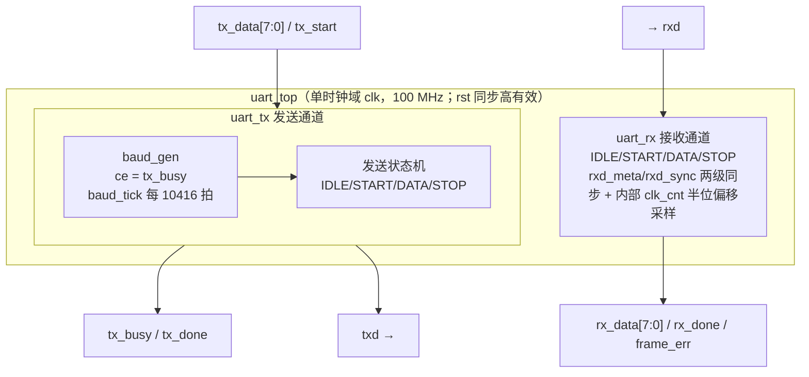

# UART 收发器 结构设计说明

| 属性 | 内容 |
|---|---|
| 文档编号 | UART-DOC-003 |
| 制品类型 | ARCHITECTURE_DESIGN（见 ARTIFACT-CONTRACTS §4.3） |
| 版本/状态 | v1.1 / candidate（未经人工批准） |
| 候选拟制 | Agent 辅助生成，已进行技术整改 |
| 待审核 | 验证、结构设计角色 |
| 待批准 | 设计负责人 |
| 修订日期 | 2026-08-26 |
| 上游 | UART-DOC-002《PLDS 需求规格说明》v1.1 candidate |
| 下游 | UART-DOC-004《详细设计说明》、RTL 源码集（golden/uart/rtl/） |

## 1. 范围

### 1.1 标识

- 设计对象：UART 收发器 PLDS（顶层模块 uart_top）
- 项目标识：GOLDEN-UART
- 目标器件：xc7k70tfbv676-1
- 本文档对应黄金流程 G3 阶段（GOLDEN-FLOW-SPEC §5.4）

### 1.2 设计概述

设计采用单时钟域、四模块结构：`uart_top` 为顶层装配，例化 `uart_tx` 与 `uart_rx` 两个独立通道；`uart_tx` 内部例化波特率节拍发生器 `baud_gen`，提供发送位时基准；`uart_rx` 因需半位偏移中点采样，使用内部计数器自定时，不复用 `baud_gen`。发送与接收通道共享同一时钟和同步复位，数据通路相互独立。全部逻辑为纯 RTL（Verilog-2001 可综合子集），无 IP 核、无硬核资源。

### 1.3 设计原则

1. 单一时钟域，避免不必要的 CDC；
2. 状态机采用单 always 时序块（状态、计数、输出同块寄存器化），含 default 自恢复分支；
3. 异步输入 rxd 先经寄存器同步后使用；
4. 位时基准常数 `CLKS_PER_BIT` 由参数表达式 `CLK_FREQ / BAUD_RATE` 自动生成，禁止手写魔法数；
5. 需求到设计单元全部分配，无无来源设计（TRACEABILITY-DATA-MODEL §5.2）。

## 2. 引用文件

同 UART-DOC-001 §2；设计输入为 UART-DOC-002 v1.0。

## 3. 设计单元划分

### 3.1 单元划分表

| Module | Kind | 时钟/复位 | 职责 | 输入 | 输出 |
|---|---|---|---|---|---|
| `uart_top` | top | `clk/rst` | 顶层装配：例化 uart_tx、uart_rx，连接收发通道与端口 | `clk, rst, tx_start, tx_data[7:0], rxd` | `txd, tx_busy, tx_done, rx_data[7:0], rx_done, frame_err` |
| `uart_tx` | leaf | `clk/rst` | 发送状态机：锁存字节，按 8N1 帧格式经 baud_tick 节拍逐位输出；内含 baud_gen | `clk, rst, tx_start, tx_data[7:0]` | `txd, tx_busy, tx_done` |
| `uart_rx` | leaf | `clk/rst` | 接收状态机：rxd 两级同步、起始位检测、半位偏移中点采样、帧错误检测 | `clk, rst, rxd` | `rx_data[7:0], rx_done, frame_err` |
| `baud_gen` | leaf（被 uart_tx 例化） | `clk/rst` | ce 有效期间每 CLKS_PER_BIT(10416) 拍产生同拍组合使能 baud_tick | `clk, rst, ce` | `baud_tick` |

### 3.2 结构图

说明：发送通道的位时基准由 `baud_gen` 提供（仅发送期间计数，ce=tx_busy，帧起点自动对齐）；接收通道以内部 `clk_cnt` 从检测到的起始位前沿起计数，半位后确认起始位、随后每隔整位在中点采样。两通道节拍源相互独立，满足全双工独立工作要求（UART-SRS-FUN-008）。

### 3.3 黑盒/外部项

| Block | 来源 | 接口约定 | 集成风险 |
|---|---|---|---|
| 无 | — | 不使用任何 IP 核或黑盒模块 | — |

## 4. 接口设计

### 4.1 顶层端口（外部接口契约）

| 端口 | 方向 | 位宽 | 角色 | 说明 |
|---|---|---|---|---|
| `clk` | input | 1 | clock | 100 MHz 系统时钟，唯一时钟域 |
| `rst` | input | 1 | reset | 同步复位，高有效，clk 上升沿采样 |
| `tx_start` | input | 1 | control | 发送启动，单时钟周期高脉冲；仅在 IDLE 被采样，发送期间被忽略 |
| `tx_data` | input | 8 | data | 待发送并行字节，tx_start 接受时被锁存 |
| `txd` | output | 1 | serial | 串行发送输出，空闲/复位为高电平 |
| `tx_busy` | output | 1 | status | 发送进行中指示（接受发送请求到停止位完成期间为高） |
| `tx_done` | output | 1 | status | 发送完成，单时钟周期脉冲（停止位结束当拍） |
| `rxd` | input | 1 | serial | 串行接收输入，异步信号，内部两级寄存器同步 |
| `rx_data` | output | 8 | data | 接收并行字节，rx_done 脉冲时更新 |
| `rx_done` | output | 1 | status | 帧接收完成，单时钟周期脉冲（停止位中点当拍） |
| `frame_err` | output | 1 | status | 帧错误指示，单时钟周期脉冲（停止位中点采样为低），不锁存 |

注：环回应用中 rx_done（停止位中点）先于 tx_done（停止位结束）约半位时间产生，外部逻辑不应对二者假设固定先后以外的任何时序关系。

### 4.2 内部接口

| 接口 | 生产者 | 消费者 | 语义 |
|---|---|---|---|
| `baud_tick` | `baud_gen`（uart_tx 内部） | `uart_tx` 状态机 | 位节拍组合使能：ce=tx_busy 且 counter=10415 时有效，由状态机在同一时钟沿消费；ce 无效时计数器清零 |
| `rxd_meta` | `uart_rx` 第一级同步寄存器 | `rxd_sync` | 只承接异步 rxd，不得被功能逻辑使用；复位值为 1 |
| `rxd_sync` | `uart_rx` 第二级同步寄存器 | `uart_rx` 状态机 | 功能逻辑唯一允许使用的同步后信号；复位值为 1 |

## 5. 数据流与控制流

### 5.1 时钟与复位方案

| 项目 | 方案 |
|---|---|
| 时钟域 | 单一 `clk`（100 MHz），全部时序逻辑上升沿触发 |
| 复位 | `rst` 同步、高有效；复位覆盖全部状态寄存器、计数器与输出寄存器（复位值见 UART-DOC-002 §3.3 CKR-002） |
| CDC | 唯一异步输入 `rxd`，经 `rxd_meta`、`rxd_sync` 两级寄存器同步后使用（CDC-001），两级均标记 ASYNC_REG；`tx_start/tx_data` 约定为同步输入 |
| CDC 验证 | 结构审查 + 真实工具静态 CDC 检查；当前尚无批准 CDC 报告，不能把结构审查等同于 CDC 闭合 |

### 5.2 发送数据流

外部字节 `tx_data` →（IDLE 状态采样 tx_start 时锁存入 data_reg）→ 发送状态机逐位驱动 `txd`：START 输出 0、DATA 输出 data_reg[bit_idx]（LSB 先发）、STOP 输出 1；位时由 `baud_gen`（ce=tx_busy）的同拍 baud_tick 控制，每位 10416 个 clk。停止位完成当拍 tx_done 脉冲、tx_busy 拉低、回到 IDLE。

### 5.3 接收数据流

`rxd` → 两级寄存器同步（rxd_meta → rxd_sync）→ IDLE 检测低电平 → START 计数到 `(CLKS_PER_BIT−1)/2 = 5207` 后确认起始位 → DATA 每隔 10416 拍在中点采样 8 位入 data_reg（LSB 先收）→ STOP 中点采样停止位：当拍输出 rx_data、rx_done 脉冲，frame_err = 停止位采样的反相 → 回 IDLE。

### 5.4 需求分配

| 设计元素 | 分配的需求 |
|---|---|
| `uart_top`（UART-DES-MOD-001） | UART-SRS-IF-001、UART-SRS-CKR-001、UART-SRS-FUN-008 |
| `uart_tx`（UART-DES-MOD-002） | UART-SRS-FUN-001、FUN-002、FUN-003、FUN-009、TIM-002 |
| `uart_rx`（UART-DES-MOD-003） | UART-SRS-FUN-004、FUN-005、FUN-006、FUN-007、FUN-009、REL-002、TIM-003 |
| `baud_gen`（UART-DES-MOD-004） | UART-SRS-TIM-001、TIM-002、TST-002 |
| rxd 同步（UART-DES-CDC-001） | UART-SRS-CKR-003、UART-SRS-REL-001 |
| 复位结构（UART-DES-RST-001） | UART-SRS-CKR-002、UART-SRS-REL-003 |
| TX 状态机（UART-DES-FSM-001） | UART-SRS-FUN-002、REL-001 |
| RX 状态机（UART-DES-FSM-002） | UART-SRS-FUN-004～007、REL-001 |
| 接口契约（§4.1/§4.2） | UART-SRS-IF-002、IF-003 |
| 时序与容差分析（UART-DOC-004 §7） | UART-SRS-TIM-004 |
| 资源预算（UART-DOC-002 §3.5，综合核对留待 G5） | UART-SRS-RES-001 |
| 可测试性设计（UART-DOC-004 §9） | UART-SRS-TST-001 |

需求—设计双向追踪的完整矩阵见 UART-DOC-006 §3；本表与接口契约、分析章节共同保证每条 PLDS 需求至少分配到一个设计元素，每个设计元素均有需求来源。

## 6. 设计约束摘要

约束设计要点（两个 XDC 的用途不可互换）：

| 约束 | 内容 | 依据 |
|---|---|---|
| 时钟 | `create_clock -name sys_clk -period 10.000 [get_ports clk]`（100 MHz） | UART-SRS-CKR-001、TIM-004 |
| 正式候选 | `xdc/uart.xdc` 只含有依据的 100 MHz 时钟；不降低 NSTD-1/UCIO-1，缺引脚/电平/配置电压/I/O delay 时实现必须失败 | UART-OQ-001、DRQ-ENV-003 |
| 探索专用 | `xdc/uart_exploratory.xdc` 显式把 NSTD-1/UCIO-1 降为 Warning，仅用于资源/STA/DRC 诊断，不得进入门禁、基线或交付 | ARTIFACT-CONTRACTS §6 |
| 时序例外 | 当前无多周期/伪路径例外；顶层异步 rxd 的同步结构不等于 I/O delay 已有依据 | UART-SRS-CKR-001、CKR-003 |

## 7. 风险与未决项

| 编号 | 项 | 影响 | 措施 |
|---|---|---|---|
| UART-RISK-001 | 板级引脚、电平及接口时序未决 | 阻断正式实现/码流/板测，不影响行为级候选验证 | 正式 XDC fail-closed；板级事实齐备后补约束并重走 G4～G8 |
| UART-RISK-002 | rx_done/frame_err 单拍脉冲，外部若采样不及时可能丢失指示 | 外部逻辑需在脉冲当拍捕获 | 接口契约 §4.1 已注明脉冲语义；环回 TB 已按当拍捕获验证 |
| UART-RISK-003 | 两级同步只能降低亚稳态传播概率，尚无目标器件 MTBF/CDC 工具批准证据 | 完整性等级提高或时钟/器件变化时需重新分析 | 保留 ASYNC_REG 结构；G4 执行 CDC 检查，系统责任人按等级决定是否需要定量分析 |

## 8. 注释

本文档是 candidate 设计说明；覆盖关系仍是候选关系，不能因“25/25 已分配”自动视为设计正确或已批准。
