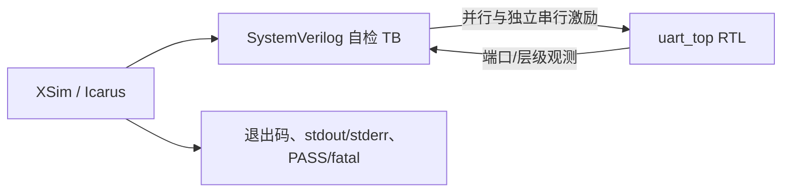

# UART 收发器可编程逻辑器件软件仿真测试计划（PLDSSTP）

## 封面

| 属性 | 内容 |
|---|---|
| 文档标识及版本 | UART-DOC-004 / v2.0 candidate |
| 数据分类 | 待项目责任人确定；当前按非公开工程资料处理 |
| 编制/修订日期 | 2026-08-26 |
| 文档名称 | UART 收发器可编程逻辑器件软件仿真测试计划 |
| 编制单位 | Synthia Golden 候选项目（待授权单位确认） |
| 编写 | Agent 辅助拟制，待验证角色署名 |
| 审核 | 待独立验证、质量角色审核 |
| 批准 | 未批准；待验证负责人决定 |

## 修改页

| 版本 | 日期 | 修改内容 | 修改人 |
|---|---|---|---|
| v2.0 candidate | 2026-08-26 | 从原合并测试文档中拆分 PLDSSTP，并按 GJB 9764-2020 附录 E 补齐环境、策略、进度和追踪 | Agent 辅助拟制，待授权角色确认 |

## 目录

1. 范围
2. 引用文档
3. 测试要求与测试策略
4. 仿真测试环境
5. 测试内容
6. 测试进度
7. 可追踪性

## 1 范围

### 1.1 标识

被测项目为 GOLDEN-UART，PLDS 顶层 `uart_top`，候选目标器件 `xc7k70tfbv676-1`，被测文档/RTL 版本为 v2.0 candidate；精确文件身份以每次 ToolRun 输入哈希和 `manifest.sha256` 为准。

### 1.2 系统概述

被测 PLDS 为 100 MHz、9600 bit/s、8N1 全双工 UART。

#### 1.2.1 可编程逻辑器件软件概述

RTL 为四个 Verilog-2001 模块：`uart_top`、`uart_tx`、`uart_rx`、`baud_gen`；TB 为 SystemVerilog。无原理图、IP、BRAM 或 DSP。候选综合规模为 63 LUT/70 FF，但计划不把探索结果当成入口批准。

#### 1.2.2 运行环境

目标 PLD 候选为 `xc7k70tfbv676-1`，工作时钟 100 MHz。配置芯片、板卡、外部接口芯片和电气连接未知；因此本计划只覆盖仿真与可用的静态分析，不覆盖实物确认。

#### 1.2.3 开发环境

主工具为 Vivado/XSim 2021.1 build 3247384，IP build 3246043；Icarus Verilog 只作本机交叉检查。正式运行必须记录精确工具 profile、命令、参数和输入哈希。

### 1.3 文档概述

本文定义仿真测试级别、策略、环境、测试项和进度。具体可复现用例见 UART-DOC-005，实际结果见 UART-DOC-006。数据分类尚待授权角色确定。

## 2 引用文档

| 文档标识 | 标题/版本 | 状态 |
|---|---|---|
| GJB 9764-2020 | 军用可编程逻辑器件软件文档编制规范 | 仓库权威扫描件 |
| UART-DOC-002 | PLDSRS v2.0 | candidate |
| UART-DOC-003 | PLDSDD v2.0 | candidate |

## 3 测试要求与测试策略

### 3.1 测试总体要求

测试级别为 PLDS 单元/配置项的仿真测试候选。覆盖类型包括接口、功能、性能、边界、异常恢复、时钟复位、可靠性结构和资源/内部时序；板级电气、安全性确认、长稳和实物余量属于确认测试，当前阻塞。

入口准则：RTL/TB 可编译；被测版本、参数和缺口已记录。候选出口准则：计划内动态用例无 `$fatal` 且打印最终 PASS，静态/分析项保存原始证据，失败与未执行项未隐藏。正式门禁另要求批准输入、冻结快照、独立角色和授权批准。

### 3.2 测试策略和方法

| 方法 | 用途 | 边界 |
|---|---|---|
| XSim 行为仿真 | 主动态验证 | 保存日志、输入哈希和 ToolRun |
| Icarus 行为仿真 | 独立工具交叉检查 | 不替代指定工具正式结果 |
| 源码校验/审查 | 端口、参数、FSM、CDC 结构 | 不替代动态或静态 CDC 报告 |
| 综合/资源报告 | 资源预算和硬核资源使用 | exploratory 不代表放行 |
| STA | 内部 100 MHz 同步路径 | 缺 I/O 约束时不能推断接口闭合 |
| 门级/SDF、覆盖率 | 按完整性等级决定 | 当前未执行，待批准策略 |

### 3.3 测试项和测试子项标识说明

测试项标识 `UART-STI-<域>-NNN`；用例标识 `UART-STC-NN`。标识一经发布不得复用。当前测试项为 UART-STI-IF-001、FUN-001～006、PERF-001～003、REL-001～003、RES-001。

## 4 仿真测试环境

### 4.1 环境概述

TB 模拟同步上游逻辑和异步串行对端；不模拟板卡电气、抖动谱、温度、电压、辐照或真实配置器件。

### 4.2 软件项

| 软件项 | 版本/输入 | 用途 |
|---|---|---|
| Vivado/XSim | 2021.1；当前 RTL/TB | 主编译和行为仿真 |
| Icarus Verilog | 本机安装版本随日志记录 | 交叉编译/仿真 |
| `tb/uart_tb.sv` | manifest 绑定 | 自检激励、断言和 watchdog |

无现场提供软件项。源码数据分类未批准，远端执行前须遵守平台密钥和数据域政策。

### 4.3 硬件和固件项

本节无内容。行为仿真不使用硬件或固件；确认测试所需板卡、接口设备和配置固件尚未提供，属于阻塞而非不适用。

### 4.4 测试场地

本地受控工作树和经 Connector 调用的 Vivado Worker。正式场地、机器身份和保管要求须由 ToolRun/项目配置记录。

### 4.5 参与组织及角色职责

Agent 可拟制候选和运行 exploratory；独立验证角色审查计划/说明/结果；配置角色冻结输入；质量角色审查标准和偏差；验证负责人批准测试结论。当前均无模拟签名或批准记录。

### 4.6 人员数量、能力和时间

本节无获批人数和工时数据；理由是项目没有组织计划。至少需要能够独立执行 RTL 仿真、证据审查和配置复核的角色，具体人数、技能等级和时间由项目计划补充。

## 5 测试内容

### 5.1 接口测试需求

| 接口标识 | 序号 | 信号标识 | 方向 | 连接对象 | 说明 | 初始/复位值 |
|---|---:|---|---|---|---|---|
| UART-EXT-CLKRST | 1 | `clk/rst` | 入/入 | TB 时钟/复位 | 100 MHz；同步高有效复位 | —/1 |
| UART-EXT-TX | 2 | `tx_start/tx_data` | 入 | TB 上游模型 | 启动和字节 | 0/— |
| UART-EXT-TX | 3 | `txd/tx_busy/tx_done` | 出 | TB 监视器 | 8N1、忙、完成 | 1/0/0 |
| UART-EXT-RX | 4 | `rxd` | 入 | TB 串行对端 | 异步 8N1 | 1 |
| UART-EXT-RX | 5 | `rx_data/rx_done/frame_err` | 出 | TB 监视器 | 有效数据、完成、帧错 | 0/0/0 |

接口时序图由 UART-DOC-005 的发送/接收步骤定义；电气和管脚时序不在本仿真范围。

### 5.2 功能测试需求

| 测试项 | 测试项标识 | 需求追踪 | 测试目的 | 级别/类型 | 说明/方法 |
|---|---|---|---|---|---|
| TX 格式与握手 | UART-STI-FUN-001 | FUN-001～003、IF-002/003 | 核对 8N1、忙期拒绝和脉冲 | 单元/功能接口 | STC-01 |
| 环回与码型 | UART-STI-FUN-002 | FUN-005/006、TST-001 | 核对 LSB、边界码型 | 单元/功能 | STC-02 |
| 全双工 | UART-STI-FUN-003 | FUN-008 | 独立同时收发 | 单元/功能 | STC-03 |
| 假起始/帧错恢复 | UART-STI-FUN-004 | FUN-004/006/007、REL-002 | 不伪造完成且可恢复 | 单元/异常 | STC-04/05 |
| 容差/连续帧 | UART-STI-PERF-001 | TIM-001～003 | ±2% 和连续吞吐 | 单元/边界性能 | STC-06/07/09 |
| 复位/非法状态 | UART-STI-REL-001 | CKR-002、REL-001/003 | 确定恢复 | 单元/可靠性 | STC-08/10 |

### 5.3 其他测试需求

| 测试项标识 | 内容 | 当前处置 |
|---|---|---|
| UART-STI-REL-002 | CDC/RDC 结构和静态报告 | 结构审查已规划；批准工具报告待补 |
| UART-STI-RES-001 | LUT/FF/BRAM/DSP 和 100 MHz STA | 综合/STA；I/O 闭合不在当前证据范围 |
| UART-STI-COV-001 | 代码/功能覆盖 | 分母、目标和排除规则待完整性等级批准 |
| UART-STI-GATE-001 | 门级/SDF | 适用性待决定；未获准裁剪 |

## 6 测试进度

| 阶段 | 活动 | 入口/出口 | 状态 |
|---|---|---|---|
| 计划评审 | 审查本文和追踪 | 候选→授权决定 | 待执行 |
| 说明评审 | 审查 UART-DOC-005 用例可复现性 | 计划候选可用 | 待执行 |
| 初次测试 | XSim + Icarus | 冻结输入、保存原始证据 | exploratory 已执行；正式待执行 |
| 回归 | 问题修复后全量重跑 | 影响分析完成 | exploratory 已执行 |
| 报告评审 | 审查 UART-DOC-006 | 结果、问题、充分性完整 | 待授权评审 |

## 7 可追踪性

| 序号 | 需求类型 | 需求标识 | 需求名称 | 测试项标识 | 测试项名称 | 方法 |
|---:|---|---|---|---|---|---|
| 1 | 功能 | FUN-001～003 | 发送 | UART-STI-FUN-001 | TX 格式/握手 | XSim/Icarus |
| 2 | 功能 | FUN-004～007、REL-002 | 接收异常 | UART-STI-FUN-004 | 毛刺/帧错恢复 | XSim/Icarus |
| 3 | 功能 | FUN-008 | 全双工 | UART-STI-FUN-003 | 同时收发 | XSim/Icarus |
| 4 | 性能 | TIM-001～003 | 波特率/吞吐 | UART-STI-PERF-001 | 容差/连续帧 | 分析+仿真 |
| 5 | 可靠性 | CKR-002、REL-001/003 | 复位/非法状态 | UART-STI-REL-001 | 恢复 | 仿真+审查 |
| 6 | 资源时序 | TIM-004、RES-001 | STA/资源 | UART-STI-RES-001 | 综合/STA | Vivado 报告 |

完整逐需求映射见 UART-DOC-007。

## 注释

本文件从原“测试计划与说明”拆分；计划、说明、报告分别由 UART-DOC-004、005、006 承载，三份文档各自满足通用结构。
