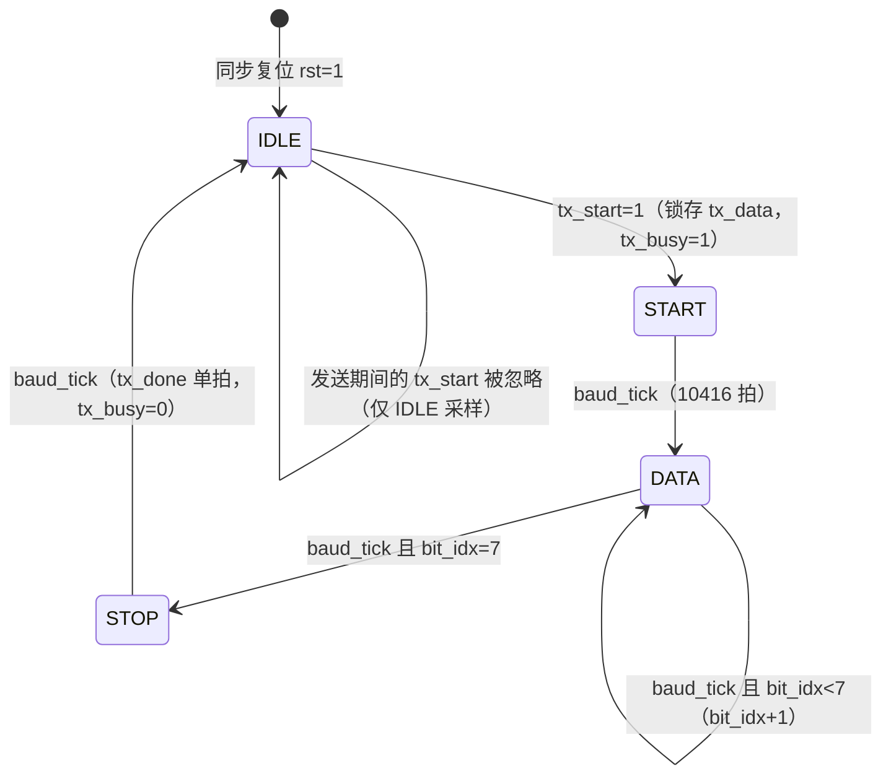
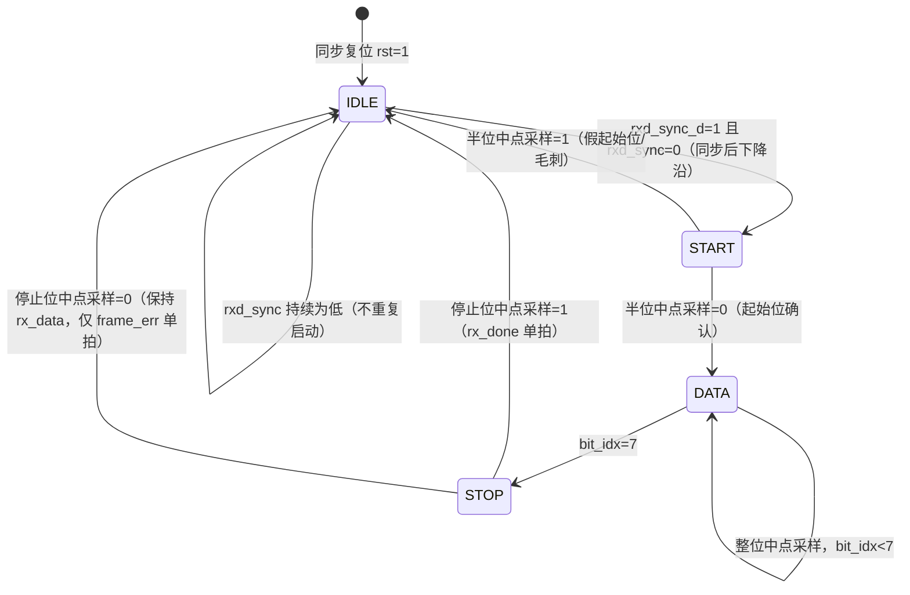

# UART 收发器 详细设计说明

| 属性 | 内容 |
|---|---|
| 文档编号 | UART-DOC-004 |
| 制品类型 | DETAILED_DESIGN（见 ARTIFACT-CONTRACTS §4.3） |
| 版本/状态 | v1.2 / candidate（未经人工批准） |
| 候选拟制 | Agent 辅助生成，已进行技术整改 |
| 待审核 | 验证、代码审查角色 |
| 待批准 | 设计负责人 |
| 修订日期 | 2026-08-26 |
| 上游 | UART-DOC-002/003 v1.2 candidate |
| 下游 | RTL 源码集（golden/uart/rtl/）、UART-DOC-006《追踪矩阵》 |

## 1. 范围

### 1.1 标识

- 设计对象：UART 收发器 PLDS（uart_top 及其子模块）
- 项目标识：GOLDEN-UART
- 本文档与 UART-DOC-003 同属 G3 阶段产物

### 1.2 文档概述

本文档给出候选详细设计：参数表、内部寄存器表、状态机定义、时序参数计算和异常处理语义。它与当前候选 RTL 逐项对齐，但尚未经过独立审查或批准；任何一侧变更都应使关联验证证据进入待复核/失效状态并触发回归。

## 2. 引用文件

同 UART-DOC-001 §2；候选设计输入为 UART-DOC-002/003 v1.2。

## 3. 参数表

| 参数 | 类型 | 默认值 | 含义 | 需求来源 |
|---|---|---|---|---|
| `CLK_FREQ` | parameter（各模块） | 100_000_000 | 系统时钟频率（Hz） | UART-SRS-CKR-001 |
| `BAUD_RATE` | parameter（各模块） | 9600 | 标称波特率（bit/s） | UART-SRS-TIM-001 |
| `CLKS_PER_BIT` | localparam（自动计算） | 10416 | 每位系统时钟数，`= CLK_FREQ / BAUD_RATE`（向下取整） | UART-SRS-TIM-001 |

派生常数（编码时由参数表达式生成，禁止手写魔法数）：

| 派生量 | 数值 | 说明 |
|---|---|---|
| 位时间 | 10416 clk = 104.16 µs | 10 位串行字段时间 = 1041.60 µs |
| 实际波特率 | 100×10⁶ / 10416 ≈ 9600.6144 bit/s | 相对误差约 +0.0064%，满足 ±0.5% |
| 半位终值 | (CLKS_PER_BIT−1)/2 = 5207 | RX START 计数器比较终值 |
| 计数器位宽 | `clog2(CLKS_PER_BIT)` = 14 bit | 参数化生成，覆盖 0～10415 |
| 连续起始间隔 | 当前接口控制实测 1,041,610 ns | 小于 960 byte/s 对应上限 1,041,666 ns |

## 4. 状态机设计

发送与接收状态机采用相同的 3 bit 状态编码：`IDLE=3'd0`、`START=3'd1`、`DATA=3'd2`、`STOP=3'd3`，保留 `3'd4`～`3'd7` 作为非法状态。状态寄存器标记 `fsm_encoding="none"`，要求 Vivado 保持用户编码而不把四态压回 2 bit；最终综合日志未再出现 FSM 重编码表。两者均为单 always 时序块实现，含完整 default 自恢复分支。

### 4.1 发送状态机（UART-DES-FSM-001，位于 uart_tx）

位时基准：`baud_gen` 在 `ce && counter==CLKS_PER_BIT-1` 时产生组合 baud_tick，发送状态机在同一上升沿消费；这避免注册 tick 造成额外一拍。tx_busy 在 IDLE 接受发送请求当拍置位，计数器随后从 0 开始。

| 状态 | 含义 | 行为（每拍） | 转移 |
|---|---|---|---|
| `IDLE` | 空闲 | txd←1；若 tx_start=1：data_reg←tx_data，tx_busy←1 | tx_start=1 → `START` |
| `START` | 起始位 | txd←0 | baud_tick=1 → `DATA` |
| `DATA` | 数据位 | txd←data_reg[bit_idx]（LSB 先发） | baud_tick=1 且 bit_idx<7 → bit_idx+1；baud_tick=1 且 bit_idx=7 → bit_idx←0，→ `STOP` |
| `STOP` | 停止位 | txd←1 | baud_tick=1 → tx_done←1，tx_busy←0，→ `IDLE` |
| default | 非法状态恢复 | state/bit_idx/data_reg 清零；txd←1、tx_busy←0、tx_done←0 | 下一拍 → `IDLE` |

tx_done 默认每拍拉低，仅 STOP 完成当拍为高（单拍脉冲）。

### 4.2 接收状态机（UART-DES-FSM-002，位于 uart_rx）

采样定时：`rxd_sync_d` 保存同步后输入的前一拍值，IDLE 只在 `rxd_sync_d=1 && rxd_sync=0` 时接受起始下降沿并启动内部 clk_cnt；START 状态在 `clk_cnt==5207` 时确认起始位；DATA/STOP 状态在 `clk_cnt==10415` 时采样。

| 状态 | 含义 | 行为（每拍） | 转移 |
|---|---|---|---|
| `IDLE` | 空闲监视 | clk_cnt←0，bit_idx←0 | rxd_sync_d=1 且 rxd_sync=0（同步后下降沿）→ `START`；持续低电平保持 IDLE |
| `START` | 起始位确认 | clk_cnt 计数至 5207 | 中点采样 rxd_sync=0 → clk_cnt←0，→ `DATA`；=1（假起始位）→ `IDLE` |
| `DATA` | 数据位采样 | clk_cnt 计数至 10415 | 中点采样 data_reg[bit_idx]←rxd_sync；bit_idx<7 → bit_idx+1；bit_idx=7 → bit_idx←0，→ `STOP` |
| `STOP` | 停止位校验 | clk_cnt 计数至 10415 | 中点采样为 1：rx_data←data_reg、rx_done←1；为 0：rx_data 保持、frame_err←1；两种情况均 → `IDLE` |
| default | 非法状态恢复 | state/clk_cnt/bit_idx/data_reg 清零；rx_done/frame_err←0 | 下一拍 → `IDLE` |

rx_done、frame_err 默认每拍拉低，仅 STOP 校验当拍二者之一可能为高（单拍互斥脉冲）：rx_done 只确认有效字节，frame_err 只报告被丢弃的错误帧。

### 4.3 状态机公共规则

1. 单 always 时序块：状态、计数器、数据寄存器、输出寄存器同块赋值，全部为寄存器输出，无组合毛刺路径到端口；
2. `default` 分支：任何非法编码下一拍回到 IDLE（UART-SRS-REL-001）；
3. 状态编码采用 localparam 显式定义，宽度 3 bit（IDLE/START/DATA/STOP = 3'd0/1/2/3），4～7 为保留非法码；
4. 脉冲输出（tx_done/rx_done/frame_err）在块首默认拉低，仅完成当拍置位，保证单拍语义。

## 5. 位时基准与采样对齐

- `baud_gen`（仅 uart_tx 使用）：ce=0 时计数器清零；ce=1 时计数 0～CLKS_PER_BIT−1，终值比较直接生成组合使能，状态机同拍消费并把计数器清零。帧内每位保持 10416 拍，不存在注册 tick 的额外周期。
- `uart_rx` 不复用 baud_gen：接收需相对同步后的起始事件半位偏移采样，故用内部 clk_cnt 自定时。两级同步和状态机观测引入数个系统时钟的相位偏移，相对 10416 拍位宽很小，但它仍应包含在端点动态验证而非只靠“可忽略”断言。

## 6. 内部寄存器表

本设计无总线映射寄存器；下表为数据通路内部寄存器（复位值列即 UART-SRS-CKR-002 的规定值），供编码、审查和仿真观察使用。

| 寄存器 | 位宽 | 所在模块 | 复位值 | 功能 | 副作用 |
|---|---|---|---|---|---|
| `state` | 3 | uart_tx / uart_rx | `IDLE` | 状态机状态；4～7 触发 default 恢复 | 无 |
| `bit_idx` | 3 | uart_tx / uart_rx | 0 | 数据位序号（0～7） | 无 |
| `data_reg` | 8 | uart_tx / uart_rx | `8'h00` | TX：发送数据锁存（按位索引输出）；RX：接收数据拼装 | 无 |
| `txd` | 1 | uart_tx | 1 | 串行发送输出寄存器 | 无 |
| `tx_busy` | 1 | uart_tx | 0 | 发送忙输出；兼作 baud_gen 的 ce | 无 |
| `tx_done` | 1 | uart_tx | 0 | 发送完成脉冲 | 单拍，不锁存 |
| `counter` | 14 | baud_gen | 0 | 位节拍计数（0～10415） | ce=0 或 tick 时清零 |
| `baud_tick` | 1 | baud_gen | 不适用（组合） | `ce && counter==CLKS_PER_BIT-1` | 同拍使能，不作为时钟 |
| `clk_cnt` | 14 | uart_rx | 0 | 位内/半位采样计数 | 状态转移时清零 |
| `rxd_meta` | 1 | uart_rx | 1 | 异步输入同步第一级，仅驱动 rxd_sync | 标记 ASYNC_REG |
| `rxd_sync` | 1 | uart_rx | 1 | 异步输入同步第二级，功能逻辑使用点 | 标记 ASYNC_REG |
| `rxd_sync_d` | 1 | uart_rx | 1 | 保存 rxd_sync 前一拍用于下降沿检测，不属于 CDC 同步级 | 无 |
| `rx_data` | 8 | uart_rx | `8'h00` | 最近一个合法接收字节输出寄存器 | 仅合法停止位当拍更新 |
| `rx_done` | 1 | uart_rx | 0 | 接收完成脉冲 | 单拍，不锁存 |
| `frame_err` | 1 | uart_rx | 0 | 帧错误脉冲 | 单拍，不锁存 |

非法访问行为：不适用（无地址映射接口）。非法状态行为：见 §4.3 第 2 条。

## 7. 时序参数与容差分析

### 7.1 发送精度

位时间 = CLKS_PER_BIT = 10416 clk；实际 9600.6144 bit/s，相对标称误差约 +0.0064%。向下取整相对于最近整数只增加极小波特率误差，却避免 10417 分频加接口周期开销时跌破 960 byte/s。当前 TB 在默认参数下观测相邻起始沿间隔 1,041,610 ns，对应约 960.05 byte/s；正式结论仍须绑定受控 XSim 运行证据。

### 7.2 接收容差（UART-SRS-TIM-003）

采样点在起始位前沿后 0.5 位（半位确认），随后每隔 1 位采样。最坏情况为停止位采样点，距起始位前沿 9.5 位：

- 中点采样允许对端总偏差 < ±0.5 位（采样点不越过位边界）；
- ±2% 波特率偏差时，9.5 位累积偏差为 0.19 位 < 0.5 位，余量 0.31 位；
- 叠加本机误差 +0.0064% 和两级同步/状态检测的数个 clk 相位偏移后，静态预算仍有余量；TB 必须分别施加 +2% 与 −2% 外部帧作为动态端点检查。

结论：±2% 对端偏差下可正确接收连续帧，设计裕度充分。

### 7.3 时序收敛评估（UART-SRS-TIM-004）

最长组合路径为"16 位计数器比较 + 状态译码 + 输出选择"级别（估计 ≤ 4 级 LUT），在 xc7k70tfbv676-1 上远低于 10 ns 周期预算；正式结论以 G6 STA 报告为准。

## 8. 异常处理设计

| 异常 | 检测 | 锁存/报告 | 恢复 | 验证 |
|---|---|---|---|---|
| 帧错误（停止位为低） | STOP 中点采样 | 仅 frame_err 单拍；rx_done 保持低且 rx_data 不更新 | 当拍回 IDLE；持续低不重触发，线路回高后可收下一下降沿 | TB 坏停止位 + 正常恢复帧 |
| 假起始位（线路毛刺） | START 半位确认为高 | 不报告 | 当拍回 IDLE | TB 1/4 位宽低毛刺 |
| 忙期发送请求 | tx_start 仅在 IDLE 被采样 | 忽略，不打断当前帧 | 无需恢复 | TB 当前帧逐位核对且仅一个 tx_done |
| 非法状态 | 状态寄存器为 3'd4～3'd7 | default 完整恢复内部状态和输出 | 下一拍回 IDLE | CASE-10 层级故障注入 + 恢复后功能帧 |
| 收发中复位 | rst=1（同步采样） | 下一拍全部寄存器回复位值，txd=1 | 复位释放后再次环回 | TB 发送中复位 + 恢复帧 |
| rxd 亚稳态 | rxd_meta/rxd_sync 两级同步 | 不提供运行时报告 | 降低传播概率，不宣称消除 | 结构审查；静态 CDC/MTBF 结论待补 |

## 9. 可测试性设计

- 参数化 `CLK_FREQ/BAUD_RATE` 允许适配其他时钟/波特率组合，CLKS_PER_BIT 自动重算（UART-SRS-TST-002）；
- txd/rxd 环回不依赖额外测试逻辑（UART-SRS-TST-001）；TB 经 `.rxd(txd)` 直连实现自检环回；
- 内部寄存器均可在仿真中经层级路径观察（调试用，非交付接口）；
- rx_done 在停止位中点产生、tx_done 在停止位结束产生，环回时 rx_done 先于 tx_done 约半位，TB 依次等待二者即可完整校验一帧。

## 10. 注释

无。
