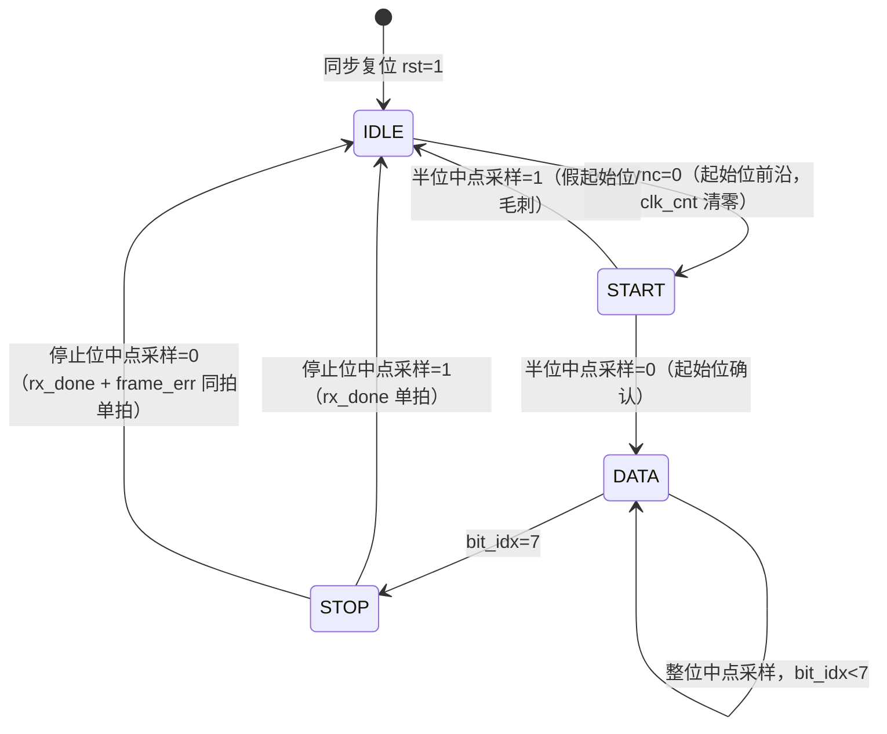

# UART 收发器 详细设计说明

| 属性 | 内容 |
|---|---|
| 文档编号 | UART-DOC-004 |
| 制品类型 | DETAILED_DESIGN（见 ARTIFACT-CONTRACTS §4.3） |
| 版本/状态 | v1.0 / 已批准（黄金模板设计输入基线 B1 成员） |
| 拟制 | PLDS 设计角色 |
| 审核 | 验证角色、代码审查角色 |
| 批准 | 设计负责人 |
| 批准日期 | 2026-08-13 |
| 上游 | UART-DOC-002《PLDS 需求规格说明》v1.0、UART-DOC-003《结构设计说明》v1.0 |
| 下游 | RTL 源码集（golden/uart/rtl/）、UART-DOC-006《追踪矩阵》 |

## 1. 范围

### 1.1 标识

- 设计对象：UART 收发器 PLDS（uart_top 及其子模块）
- 项目标识：GOLDEN-UART
- 本文档与 UART-DOC-003 同属 G3 阶段产物

### 1.2 文档概述

本文档给出可供无歧义编码的详细设计：参数表、内部寄存器表、状态机定义、时序参数计算和异常处理语义。本文档与 RTL 源码（rtl/uart_top.v、uart_tx.v、uart_rx.v、baud_gen.v）逐项一致；如发生变更，以批准的本文档修订与 RTL 新版本同时生效。

## 2. 引用文件

同 UART-DOC-001 §2；设计输入为 UART-DOC-002 v1.0、UART-DOC-003 v1.0。

## 3. 参数表

| 参数 | 类型 | 默认值 | 含义 | 需求来源 |
|---|---|---|---|---|
| `CLK_FREQ` | parameter（各模块） | 100_000_000 | 系统时钟频率（Hz） | UART-SRS-CKR-001 |
| `BAUD_RATE` | parameter（各模块） | 9600 | 标称波特率（bit/s） | UART-SRS-TIM-001 |
| `CLKS_PER_BIT` | localparam（自动计算） | 10417 | 每位系统时钟数，`= (CLK_FREQ + BAUD_RATE/2) / BAUD_RATE`（四舍五入到最近整数） | UART-SRS-TIM-001 |

派生常数（编码时由参数表达式生成，禁止手写魔法数）：

| 派生量 | 数值 | 说明 |
|---|---|---|
| 位时间 | 10417 clk = 104.17 µs | 每帧 10 位，帧时间 ≈ 1041.7 µs |
| 实际波特率 | 100×10⁶ / 10417 ≈ 9599.69 bit/s | 相对误差 ≈ −0.003%，满足 ±0.5%（UART-SRS-TIM-001） |
| 半位计数 | (CLKS_PER_BIT−1)/2 = 5208 | RX 起始位中点确认点 |
| 计数器位宽 | 16 bit | ≥ ⌈log₂(10417)⌉ = 14，取 16 对齐 |

## 4. 状态机设计

发送与接收状态机采用相同的状态名与编码：`IDLE=2'd0`、`START=2'd1`、`DATA=2'd2`、`STOP=2'd3`。两者均为单 always 时序块实现（状态、计数器、输出同块寄存器化），含 default 自恢复分支。

### 4.1 发送状态机（UART-DES-FSM-001，位于 uart_tx）

位时基准：`baud_gen`（ce=tx_busy）每 10417 拍产生 1 拍 baud_tick；tx_busy 在 IDLE 接受发送请求当拍置位，故起始位从完整位时间开始。

| 状态 | 含义 | 行为（每拍） | 转移 |
|---|---|---|---|
| `IDLE` | 空闲 | txd←1；若 tx_start=1：data_reg←tx_data，tx_busy←1 | tx_start=1 → `START` |
| `START` | 起始位 | txd←0 | baud_tick=1 → `DATA` |
| `DATA` | 数据位 | txd←data_reg[bit_idx]（LSB 先发） | baud_tick=1 且 bit_idx<7 → bit_idx+1；baud_tick=1 且 bit_idx=7 → bit_idx←0，→ `STOP` |
| `STOP` | 停止位 | txd←1 | baud_tick=1 → tx_done←1，tx_busy←0，→ `IDLE` |
| default | — | — | 下一拍 → `IDLE` |

tx_done 默认每拍拉低，仅 STOP 完成当拍为高（单拍脉冲）。

### 4.2 接收状态机（UART-DES-FSM-002，位于 uart_rx）

采样定时：内部 clk_cnt 从检测到的起始位前沿起计数；START 状态计至半位（clk_cnt==5208）在中点确认起始位；DATA/STOP 状态每隔整位（clk_cnt==10416）在中点采样。

| 状态 | 含义 | 行为（每拍） | 转移 |
|---|---|---|---|
| `IDLE` | 空闲监视 | clk_cnt←0，bit_idx←0 | rxd_sync=0（起始位前沿）→ `START` |
| `START` | 起始位确认 | clk_cnt 计数至 5208 | 中点采样 rxd_sync=0 → clk_cnt←0，→ `DATA`；=1（假起始位）→ `IDLE` |
| `DATA` | 数据位采样 | clk_cnt 计数至 10416 | 中点采样 data_reg[bit_idx]←rxd_sync；bit_idx<7 → bit_idx+1；bit_idx=7 → bit_idx←0，→ `STOP` |
| `STOP` | 停止位校验 | clk_cnt 计数至 10416 | 中点采样：rx_data←data_reg，rx_done←1，frame_err←~rxd_sync，→ `IDLE` |
| default | — | — | 下一拍 → `IDLE` |

rx_done、frame_err 默认每拍拉低，仅 STOP 完成当拍可能为高（单拍脉冲）；frame_err 与 rx_done 同拍产生、相互独立。

### 4.3 状态机公共规则

1. 单 always 时序块：状态、计数器、数据寄存器、输出寄存器同块赋值，全部为寄存器输出，无组合毛刺路径到端口；
2. `default` 分支：任何非法编码下一拍回到 IDLE（UART-SRS-REL-001）；
3. 状态编码采用 localparam 显式定义，宽度 2 bit（IDLE/START/DATA/STOP = 2'd0/1/2/3）；
4. 脉冲输出（tx_done/rx_done/frame_err）在块首默认拉低，仅完成当拍置位，保证单拍语义。

## 5. 位时基准与采样对齐

- `baud_gen`（仅 uart_tx 使用）：ce=0 时计数器清零、baud_tick=0；ce=1 时计数 0～CLKS_PER_BIT−1 循环，计满输出 1 拍 baud_tick。uart_tx 中 ce=tx_busy，发送请求被接受当拍 tx_busy 置位，计数器从 0 起计，故帧内每位严格 10417 拍、帧起点自动对齐（UART-SRS-TIM-002）。
- `uart_rx` 不复用 baud_gen：接收需相对起始位前沿半位偏移采样，故用内部 clk_cnt 自定时——IDLE 检测到低电平进入 START 并清零计数，半位（5208 拍）后确认起始位，随后每隔整位（10417 拍）采样。采样点相对起始位前沿偏差 ≤ 2 个 clk（同步寄存器 1 拍 + 检测 1 拍），约 0.0002 位，可忽略（UART-SRS-TIM-003 容差分析见 §7.2）。

## 6. 内部寄存器表

本设计无总线映射寄存器；下表为数据通路内部寄存器（复位值列即 UART-SRS-CKR-002 的规定值），供编码、审查和仿真观察使用。

| 寄存器 | 位宽 | 所在模块 | 复位值 | 功能 | 副作用 |
|---|---|---|---|---|---|
| `state` | 2 | uart_tx / uart_rx | `IDLE` | 状态机状态 | 无 |
| `bit_idx` | 3 | uart_tx / uart_rx | 0 | 数据位序号（0～7） | 无 |
| `data_reg` | 8 | uart_tx / uart_rx | `8'h00` | TX：发送数据锁存（按位索引输出）；RX：接收数据拼装 | 无 |
| `txd` | 1 | uart_tx | 1 | 串行发送输出寄存器 | 无 |
| `tx_busy` | 1 | uart_tx | 0 | 发送忙输出；兼作 baud_gen 的 ce | 无 |
| `tx_done` | 1 | uart_tx | 0 | 发送完成脉冲 | 单拍，不锁存 |
| `counter` | 16 | baud_gen | 0 | 位节拍计数（0～10416） | ce=0 时清零 |
| `baud_tick` | 1 | baud_gen | 0 | 位节拍脉冲输出 | 单拍 |
| `clk_cnt` | 16 | uart_rx | 0 | 位内/半位采样计数 | 状态转移时清零 |
| `rxd_sync` | 1 | uart_rx | 1 | rxd 单级同步寄存器（复位取线路空闲电平） | 无 |
| `rx_data` | 8 | uart_rx | `8'h00` | 接收字节输出寄存器 | 帧完成当拍更新 |
| `rx_done` | 1 | uart_rx | 0 | 接收完成脉冲 | 单拍，不锁存 |
| `frame_err` | 1 | uart_rx | 0 | 帧错误脉冲 | 单拍，不锁存 |

非法访问行为：不适用（无地址映射接口）。非法状态行为：见 §4.3 第 2 条。

## 7. 时序参数与容差分析

### 7.1 发送精度

位时间 = CLKS_PER_BIT = 10417 clk，与标称 104.166… µs 的偏差由分频取整产生（−0.003%），帧内各位由同一 baud_tick 节拍控制，无累积误差（UART-SRS-TIM-002）。

### 7.2 接收容差（UART-SRS-TIM-003）

采样点在起始位前沿后 0.5 位（半位确认），随后每隔 1 位采样。最坏情况为停止位采样点，距起始位前沿 9.5 位：

- 中点采样允许对端总偏差 < ±0.5 位（采样点不越过位边界）；
- ±2% 波特率偏差时，9.5 位累积偏差为 0.19 位 < 0.5 位，余量 0.31 位；
- 叠加本机误差 −0.003%、同步与检测延迟（≤ 2 clk ≈ 0.0002 位）后仍远小于余量。

结论：±2% 对端偏差下可正确接收连续帧，设计裕度充分。

### 7.3 时序收敛评估（UART-SRS-TIM-004）

最长组合路径为"16 位计数器比较 + 状态译码 + 输出选择"级别（估计 ≤ 4 级 LUT），在 xc7k70tfbv676-1 上远低于 10 ns 周期预算；正式结论以 G6 STA 报告为准。

## 8. 异常处理设计

| 异常 | 检测 | 锁存/报告 | 恢复 | 验证 |
|---|---|---|---|---|
| 帧错误（停止位为低） | STOP 中点采样 | frame_err 单拍脉冲（与 rx_done 同拍）；rx_data 仍更新，由外部据 frame_err 判定有效性 | 当拍自动回 IDLE 继续监视 | 审查（C-14）；TB 校验正常帧 frame_err=0（UART-TST-LB-001～004） |
| 假起始位（线路毛刺） | START 半位中点采样为高 | 不报告（视为噪声） | 当拍回 IDLE | 审查（C-14） |
| 忙期发送请求 | tx_start 仅在 IDLE 被采样 | 忽略，不打断当前帧 | 无需恢复 | 审查（C-02） |
| 非法状态 | 状态寄存器非常用编码 | default 分支 | 下一拍回 IDLE | 审查（C-05） |
| 收发中复位 | rst=1（同步采样） | 下一拍全部寄存器回复位值，txd=1 | 复位释放后正常收发 | 审查（C-07）+ 上电复位用例（UART-TST-RST-001） |
| rxd 亚稳态 | 单级同步寄存器 rxd_sync | — | 固有风险缓解；残余风险已评估接受（UART-ISS-005） | 审查（C-04） |

## 9. 可测试性设计

- 参数化 `CLK_FREQ/BAUD_RATE` 允许适配其他时钟/波特率组合，CLKS_PER_BIT 自动重算（UART-SRS-TST-002）；
- txd/rxd 环回不依赖额外测试逻辑（UART-SRS-TST-001）；TB 经 `.rxd(txd)` 直连实现自检环回；
- 内部寄存器均可在仿真中经层级路径观察（调试用，非交付接口）；
- rx_done 在停止位中点产生、tx_done 在停止位结束产生，环回时 rx_done 先于 tx_done 约半位，TB 依次等待二者即可完整校验一帧。

## 10. 注释

无。
