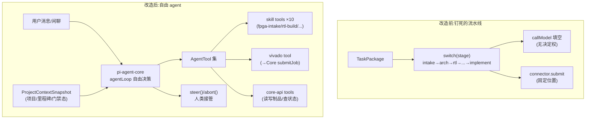

# Implementation Plan: Synthia 自由 Agent 模式改造

- **Branch**: `001-agent-freedom`
- **Spec**: [`spec.md`](./spec.md)
- **Date**: 2026-08-13
- **Status**: Draft

---

## Summary

将 `runtime/loop.ts` 中写死的 11 阶段 switch-case 状态机替换为 pi-agent-core 的自由 `agentLoop()`，把 10 个 FPGA skill 装配为模型可自主选择的 `AgentTool`，注入项目上下文快照到系统提示，并通过 `steer()` 接入 Web 对话通道。底座（pi-agent-core）已在用，不引入新框架；Core API / Connector / 门禁 / 权限 / 谱系全部保留不动。

**核心洞察**：当前"钉死"不是底层限制，而是 `loop.ts` 人为写死顺序。改造是"解锁"不是"重写"。

**基座修正（2026-08-13，开干前核实）**：`plan.md` 初稿假设"复用 pi-agent-core 底座（已在用）"——**经核对该前提不成立**：`pi-agent-core` 未安装（package.json 无引用、代码无 import、node_modules 无 @oh-my-pi）；ARC-005 仅把它列为选型决策，当前 runtime 实为自带 `ModelClient` + 手写顺序循环。且 `ModelClient` 是单发动作发射器（`emitAction` 每阶段一次、取 tool_calls[0]），非多轮自由 tool loop。

**因此改为**：在现有自带 `ModelClient` 上扩展一个对话式多轮 tool-calling 原语（`chat()`），自建 `FreeAgentSession` 自由循环。**不引入 pi-agent-core / dsh / Cordis**——零新依赖，符合 ARC-005 §2.3"不采用 omp 全栈"与 §12"omp 默认行为泄漏"约束，GJB 三层钩子自行实现并复用 `loop.ts` 现有审计/run-state 机制。共享契约固定于 `runtime/agent-types.ts`（所有 slice 面向它编程）。

## Technical Context

- **Language/Runtime**: TypeScript on Bun（runtime 已用 `Bun.serve`、`.test.ts` 用 `bun:test`）
- **Primary Dependencies**: `@oh-my-pi/pi-agent-core`（底座，提供 `Agent`/`agentLoop`/`steer`/`abort`/`beforeToolCall`/`afterToolCall`/`beforeModelCall`/`subscribe`）；OpenAI-compatible model client（`runtime/model-client.ts`，deepseek-v4-flash via vLLM）
- **Storage**: Core API（Postgres via `core/src/db`）为唯一事实源；`.runs/` 本地 run-state 持久化
- **Testing**: `bun test`（沿用现有 `core/tests/`、`runtime/*.test.ts`、`connector/*.test.ts` 约定）
- **Target Platform**: Linux 开发机 + Cloudflare Tunnel 公网入口 + worker 66 Vivado 主机
- **Project Type**: 平台后端（runtime）+ Web 前端（Vue3/Vite）
- **Constraints**: GJB 合规不变量不可破坏；fail-closed；不引入破坏 preview 框架的外部依赖

## Constitution Check（对照 Synthia 治理不变量）

改造必须满足以下不可协商约束（源自 GOV-003 / FLOW-004 / ARC-002 / ARC-005）。**全部通过方可实施。**

| 不变量 | 来源 | 本方案如何满足 | 判定 |
|---|---|---|---|
| Core 永不据 Agent 输出直接置 `approved`；Agent 只产 `candidate` | ARC-002 §6 不变量 1-2 | skill tool 的 execute 只写 `candidate` 状态制品；`approve`/`baseline` 不在 tool 集；skill 描述符禁止声明（复用 `skill-catalog.ts` 禁止集合） | ✅ 满足 |
| Agent 最高 P3；P4 批准 / P5 发布仅人类 | FLOW-004 §3/§4 | tool 集不含 P4/P5 能力；`beforeToolCall` 拦截越权 | ✅ 满足 |
| G1-G4 门禁需人工批准 | FLOW-003 §4 | agent 只能 `submitGateSubmission`（candidate），`approveGate` 为 P4 仅人类经审批界面触发 | ✅ 满足 |
| 权限双层强制（Runtime + Core RBAC） | ARC-005 §6.1 | `beforeToolCall` 拦截逻辑原样保留；Core API scope 兜底不变 | ✅ 满足 |
| Agent 不直连 Connector，经 Core API 提交 Job 意图 | ARC-005 §13 / FLOW-006 §2 | Vivado 作为 tool 时其 execute 只调 Core API `submitJob`，不持 MCP 连接 | ✅ 满足 |
| 谱系完整：先登记后执行，fail-closed | ARC-005 §9 | `afterToolCall`/`subscribe()` 事件写 Core 原样保留 | ✅ 满足 |
| 数据域过滤（beforeModelCall 越域拦截） | ARC-004 §7 | `beforeModelCall` 钩子原样保留 | ✅ 满足 |
| Agent 不读宿主文件系统，经 Core API/虚拟 URI | ARC-005 §7 | skill tool 经 Core API 读写制品，不暴露文件路径 | ✅ 满足 |

**Constitution Check 结论：通过。** 自由度提升全部发生在"模型自主决策调哪个 tool"，合规边界（权限/门禁/谱系/数据域）原样保留，无任何不变量被削弱。

## Architecture Design

### 改造前后对比



### 关键组件

**1. FreeAgentSession（新增，`runtime/free-agent.ts`）**
- 包装 pi-agent-core `Agent` 实例，绑定 projectId
- 持有装配的 tool 集、ProjectContextSnapshot、运行状态
- 暴露 `prompt(text)`（新指令/闲聊）与 `steer(text)`/`abort()`
- 复用现有 `.runs/` run-state 持久化做崩溃恢复

**2. SkillToolAssembler（新增，`runtime/skill-tools.ts`）**
- 读取 `skills/fpga/skill-pack.json`（`synthia.skill-pack.v1`）
- 每个 skill → 一个 `AgentTool`：name=skill_id，description=purpose，execute=前置校验+Core 登记
- 前置不满足返回结构化错误（含建议上游 skill），驱动模型自纠

**3. ProjectContextSnapshot（新增，`runtime/context-snapshot.ts`）**
- 从 Core API 拉取：当前项目、所处里程碑（G1-G4）、最近 GateSubmission 态、已批准制品、最近事件
- 注入系统提示，使模型免调 tool 即可回答状态类问题

**4. 三层钩子适配（复用 + 适配）**
- `beforeToolCall`：P0-P5 + capability 白名单 + 数据域（逻辑复用，挂到自由 agent）
- `afterToolCall`：谱系写 Core（复用）
- `beforeModelCall`：数据域预检（复用）

**5. Web 对话通道（`runtime/server.ts` + `web/`）**
- 新增 `POST /tasks/:runId/message`：把用户消息接入 `session.prompt()`/`steer()`
- 前端沿用 ui-redesign-v2 的 part 信息流渲染，新增对话输入框

## Project Structure（受影响文件）

```
runtime/
  loop.ts            ← 重写：删 switch，改为构造 FreeAgentSession（保留谱系/权限/恢复逻辑）
  model-client.ts    ← 适配：双协议保留，支持自由 tool-calling 返回
  free-agent.ts      ← 新增：FreeAgentSession 包装 pi-agent-core Agent
  skill-tools.ts     ← 新增：skill 描述符 → AgentTool 装配
  context-snapshot.ts← 新增：项目状态快照 → 系统提示
  server.ts          ← 新增：POST /tasks/:runId/message 对话通道
  types.ts           ← 扩展：FreeAgentSession / SkillTool 类型

web/src/
  views/TaskWorkbenchView.vue  ← 新增对话输入框
  api/client.ts                ← 新增 sendMessage 调用

core/src/skill-catalog.ts  ← 复用：skill 校验与禁止集合（不改逻辑）

skills/fpga/skill-pack.json ← 不动：已是 skill 描述符事实源

tests（新增）:
  runtime/free-agent.test.ts     ← 闲聊无 tool call / skill 自主选择 / 越权拦截
  runtime/skill-tools.test.ts    ← 10 个 skill 装配 + 前置校验
```

**不动的文件**（合规链）：`core/src/api/*`、`core/src/db/*`、`connector/*`、`core/src/policy.ts`、`core/src/envelope.ts`。

## Complexity Tracking

| 复杂度来源 | 决策 | 理由 |
|---|---|---|
| 不引入 Cordis/dsh/pi-agent-core | 自建自由循环于现有 ModelClient | pi-agent-core 未安装且 ARC-005 §2.3 明确不进 omp 全栈；自建零新依赖，GJB 钩子自控 |
| skill 前置校验放 tool 内 | tool execute 内 fail-fast 返回结构化错误 | 让模型据错误自纠，而非 Runtime 强制顺序 |
| 单 agent 实例（暂不多 Agent 协调） | 本特性不做 Task/Handoff DAG | 多 Agent 为 ARC-005 设计增量，先落地自由单 agent |

## Risk & Mitigation

| 风险 | 缓解 |
|---|---|
| 模型 tool-calling 不稳（自由模式下乱调/不调） | 双协议兜底（tools↔json），`probe-model.ts` 先验证 tool 支持；系统提示强约束 |
| 自由模式跑偏、偏离里程碑 | 系统提示注入目标 + `beforeModelCall` 数据域 + 用户 steer 纠偏 |
| 模型尝试越权 | 双层强制拦截 + 安全事件 + skill 禁止集合 |
| 谱系缺口 | `afterToolCall`/`subscribe()` 原样保留，fail-closed |
| 既有测试回归 | SC-7：core-invariants 等全量测试保持绿 |
