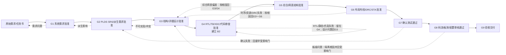

# Synthia FPGA 应用开发黄金流程规范

| 属性 | 内容 |
|---|---|
| 文档编号 | SYNTHIA-FLOW-001 |
| 版本/状态 | v0.2 / 讨论冻结候选，待正式评审 |
| 适用对象 | 所有由 Synthia 创建或接管的目标 PLDS 项目 |
| 临时标准依据 | GB/T 33781-2017 过程结构；正式 GJB 9432-2018 符合性待完整授权文本复核 |
| 权威方向输入 | SYNTHIA-GOV-003 v1.0、SYNTHIA-GOV-002 v1.0 |

## 1. 目的

本规范定义从原始需求到验收交付的唯一平台级黄金流程，包括阶段、状态、输入输出、Agent 活动、人类阶段门、失败回退、配置基线和证据要求。具体 FPGA 项目只能实例化或经批准裁剪本流程，不得因使用 AI 而跳过标准活动、工作产品或审核责任。

## 2. 流程边界

流程始于原始需求/任务书被登记并确定数据域，结束于批准产品基线、交付包和维护入口建立。它由两段连续活动组成：

1. **多 Agent 工程段**：需求分析、PLDS 需求、设计、RTL/TB/XDC 候选、静态检查和代码审查，止于 G4/B2；
2. **Vivado 工程段**：仿真、综合、布局布线、DRC、STA、码流、下载、ILA/VIO、板测和交付，止于 G9。

G4 是责任边界，不是标准过程或追踪链的终点。

## 3. 核心原则

1. Agent 输出默认状态为 `candidate`；Agent 无批准、拒绝、豁免或发布权；
2. 工具运行分为 `exploratory/gate_check/formal`：探索运行隔离，门禁检查绑定冻结提交快照，正式运行只消费批准输入；
3. 每个工作产品有唯一 ID、版本、状态、来源、生成者、哈希和配置归属；
4. 需求、设计、RTL、测试、工具运行和交付证据双向追踪；
5. 原始工具日志和报告不可由 Agent 摘要替代或覆写；
6. 失败、取消、超时、人工接管和重新运行均保留完整谱系；
7. 基线后变更先做影响分析，再决定回退门和回归范围；
8. 标准裁剪必须显式记录理由、风险、替代证据和人类批准。

## 4. 总体阶段流

## 5. 阶段定义

### 5.1 G0 项目建档与过程实例化

G0 是准备活动，不替代 G1。平台登记项目范围、数据域、适用标准、完整性等级状态、器件/工具/板卡候选、角色、重用项、分包方和裁剪提案，创建隔离工作区及初始风险/配置记录。

退出要求：项目负责人批准流程实例、角色和数据处理边界；未完成数据分级的资料按较高临时等级保护。

### 5.2 G1 系统需求批准

对应系统需求分析。多 Agent 提取和澄清原始需求，形成可行性/风险分析、开发技术要求、系统需求、接口/环境/安全可靠性/验收约束和开放问题。

退出要求：需求来源明确、唯一、无未处置冲突、可验证；派生到 PLDS 的边界清楚；关键风险有责任和措施。人类系统/项目角色批准系统需求基线 B0。

### 5.3 G2 PLDS SRS 和派生需求批准

需求 Agent 将系统要求分解为 PLDS 功能、性能、接口、算法、时钟复位、器件、资源、时序、可靠性、安全性、保密、重用、测试和维护需求。派生需求单独标识并反馈 G1 影响。

退出要求：每项 PLDS 需求有上游来源或派生理由、设计分配候选和验证方法；双向追踪无孤立项。人类 PLDS 设计负责人批准冻结的 G2 阶段结果，供 G3 精确引用；G2 不新增 B 编号。

### 5.4 G3 结构设计和详细设计批准

架构/设计 Agent 形成单元划分、接口、数据/控制流、状态机、寄存器、时钟复位、CDC/RDC、存储/IP、约束、安全关键机制、诊断和可测试性设计。验证 Agent 从需求独立审查可验证性。

退出要求：全部需求已分配，设计足以无歧义编码，关键异常和边界语义闭合，约束策略存在，设计变更和派生项已反馈。人类设计负责人批准设计基线 B1。

### 5.5 G4 RTL、TB、约束及代码审查批准

RTL Agent 只使用批准 B1 生成候选 Verilog、IP 封装和 XDC 草案；验证 Agent 生成独立 TB、参考模型、断言、覆盖和故障注入资产；保证 Agent 和确定性工具针对冻结 GateSubmission 快照执行编译、Lint、必要的 RTL/预综合 CDC/RDC、追踪和代码审查门禁。

退出要求：RTL/TB/XDC 与设计一致；需求—RTL—测试规划完整；按 G4 Gate Profile 规定的严重静态和关键 CDC/RDC 问题为 0；警告/豁免有处置；受控构建 manifest 完整；全部 `gate_check` 绑定同一冻结快照。人类代码/验证/配置角色批准建立 B2。快照变化必须重跑受影响检查。

### 5.6 G5 综合和网表结构批准

Connector 使用批准 B2、器件 part、Vivado 版本和 strategy 执行 `formal` 综合，保存原始日志、综合网表、DCP、资源、综合 DRC、综合后 CDC 复核和关键结构检查。探索性综合不得覆盖或计入正式运行。

退出要求：综合成功；关键安全/冗余/校验结构未被意外裁剪；资源和综合约束满足或偏差获批；运行可由 manifest 重现。人类 FPGA 设计/验证角色批准冻结的 G5 阶段结果，不建立候选基线。

### 5.7 G6 布局布线、DRC 和 STA 批准

Connector 对批准综合输入执行优化、布局、布线和实现后分析，保存各阶段检查点、DRC、STA、资源、功耗及适用的物理/时序报告。

退出要求：规定的 DRC、WNS/WHS、未约束路径、资源/功耗和余量门禁满足，或每项偏差具有影响分析和授权批准。人类实现/质量角色批准冻结的 G6 阶段结果，不建立候选基线。

### 5.8 G7 确认测试通过

验证团队在批准配置上执行需求驱动的静态、动态、覆盖、故障注入、回归及必要的门级/时序测试。测试失败不得通过修改期望值直接关闭。

退出要求：全部适用需求有通过证据；覆盖达到批准门禁；高严重度问题关闭；排除/未执行项单列并批准。人类验证负责人批准阶段结果并建立 B3 验证基线。

### 5.9 G8 码流、板测和配置审核通过

Vivado Connector 从批准 G6/G7 结果生成码流，执行哈希和输入一致性检查；Vivado Connector 与独立 Board/Lab Connector 在批准硬件环境协同执行器件下载、启动检查、ILA/VIO、接口/性能/长稳/异常测试。配置角色执行功能与物理配置审核。

退出要求：码流可追溯到批准源、约束、IP、工具和测试；板测满足判据；交付清单完整；残余问题/风险获有权角色接受。形成冻结的 G8 批准阶段结果，不建立候选基线。

### 5.10 G9 验收交付

需方/项目、质量和配置角色审核确认测试、配置、用户资料、研制总结、风险和交付物，签署验收与发布记录。

退出要求：形成不可变产品基线 B4、交付包、接收记录和运行维护入口；禁止以 Agent 结论代替验收方签署。

## 6. 基线体系

候选修订先冻结为不可变 `ConfigurationSnapshot`，由 `GateSubmission` 提交。每个门批准后形成 `ApprovedGateResult`；只有下表五个里程碑门建立 Baseline。不存在 candidate Baseline。

| 基线 | 建立门 | 最小内容 |
|---|---|---|
| B0 系统需求基线 | G1 | 原始输入、可行性/风险、系统需求和批准记录 |
| B1 设计输入基线 | G3 | B0、PLDS SRS、结构/详细设计、追踪和约束设计 |
| B2 RTL 基线 | G4 | B1、RTL、TB、XDC 草案、静态/审查证据和 manifest |
| B3 验证基线 | G7 | B2、综合/实现配置与结果、确认测试/覆盖/问题证据 |
| B4 产品基线 | G9 | B3、批准码流、板测、手册、总结、配置/质量和交付记录 |

G2、G5、G6、G8 的批准阶段结果同样保存精确成员、关系快照、门禁配置、清单哈希和批准记录，分别进入后续 B1、B3 或 B4。基线内容只能通过批准变更替换。重新生成必须创建新候选版本，不得覆盖人工修改或历史批准版本。

## 7. 失败、回退和恢复

| 事件 | 默认处理 |
|---|---|
| 需求冲突/不可验证 | 回退 G1/G2，登记问题并重新批准受影响需求 |
| 设计无法实现或验证 | 回退 G2/G3，执行派生需求和影响分析 |
| RTL/静态/仿真失败 | 留在 G4，修复后按影响范围回归 |
| 综合结构不一致 | 回退 G3/G4；不得只调整报告解释 |
| DRC/STA/资源失败 | 回退 G3～G6，由技术分析决定设计、约束或 strategy 变更 |
| 确认测试失败 | 关联根因阶段，修复后执行规定回归并重走受影响门 |
| 板测失败 | 隔离硬件、XDC、码流、设计和测试环境原因，保留现场证据 |
| 工具取消/超时/崩溃 | 标记非通过，保存部分产物；只有幂等条件满足时允许重试 |
| 人工接管 | 记录接管人、原因、修改、影响和后续批准，不擦除 Agent/工具历史 |

## 8. 变更影响与失效传播

批准对象变更后，平台沿追踪图计算受影响的下游需求、设计、RTL、测试、工具运行、报告、码流和交付物。尚待判断的关系进入 `review_required`；已不能支持新放行的批准结果进入 `invalidated`。只有影响分析确认无影响或规定回归通过并形成新批准事件后才能恢复有效使用。

影响完整性等级、标准裁剪、器件 part、Vivado 主版本、寄存器/外部接口、时钟复位、安全关键机制或 XDC 的变更，默认回退到相应人类阶段门并触发扩大回归。

## 9. 平台与 Connector 分工

| 控制平面/Core | Connector 执行层 |
|---|---|
| 项目/流程状态、Agent 编排、文档/追踪、差异审查、批准、风险/问题/配置 | Vivado 工具/part、仿真、综合、实现、报告、码流、下载、ILA/VIO；Board/Lab 串口、激励和仪器 |
| 通过厂商无关 Connector Port 决定哪些输入获准执行及哪些结果可进入门禁 | 经 MCP/HTTP/Queue Adapter 忠实执行授权任务并返回原始证据，不自行批准工程结论 |

MCP 只是可替换协议适配器。Connector 不拥有流程真相；Web/Core 不伪造或改写原始结果。

## 10. 项目实例化与裁剪

新项目从本规范创建流程实例，并绑定标准版本、完整性等级状态、数据域、工具链、目标器件、板卡、角色、门禁配置和交付范围。裁剪不能删除追踪、配置、问题和批准责任；确需省略技术活动时必须保存裁剪依据、风险、替代验证和批准。

## 11. RT-UART 参考实例

RT-UART 用于证明本流程能被实例化，不是本规范的来源真相。RT-UART 的 AXI、UART、TMR、FIFO、具体器件和测试阈值只在对应项目配置中有效；平台模板只提取其结构、关系、门禁和证据模式。

## 12. 当前限制

- 标准文本不完整，本流程只能作为临时工程过程；
- 平台软件、Agent 编排和 Connector 均尚未实现，本文档不构成运行完成证据；
- 当前 macOS 主机没有 Vivado，正式 EDA 活动需要受控 Linux/Windows 节点；
- 完整性等级、真实数据域、板卡和实际角色需要在项目 G0 实例化时确定。
