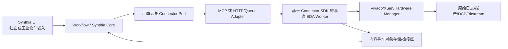
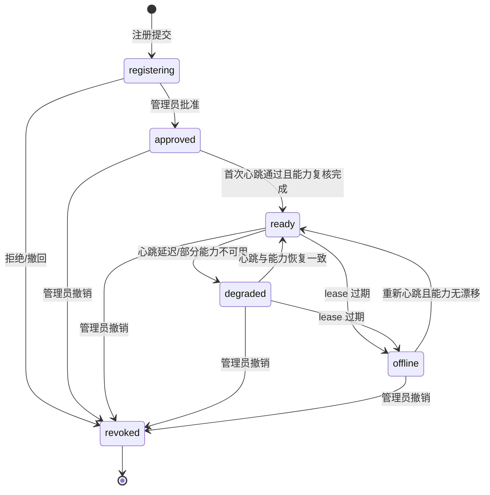

# Synthia Vivado Connector 契约

| 属性 | 内容 |
|---|---|
| 文档编号 | SYNTHIA-FLOW-006 |
| 版本/状态 | v0.3 / 讨论冻结候选，待正式评审（新增 §16 远程兼容模式） |
| 上游 | SYNTHIA-FLOW-001～005 v0.2、SYNTHIA-ARC-003、SYNTHIA-IF-001 |
| 部署边界 | 独立受控 Linux/Windows EDA 工作节点 |

## 1. 目的

Vivado Connector 把平台批准的工程任务转换为可审计、可取消、可重现的 Vivado 操作，并返回未篡改的原始证据和结构化结果。Connector 不负责生成工程需求、批准技术结论或决定发布。

“支持 Vivado 所有功能”通过可版本化的能力模型逐步实现，而不是在 MVP 中直接暴露任意 shell/Tcl。优先提供强类型能力；长尾功能通过受控 Tcl 扩展通道接入，并在验证后提升为正式能力。

## 2. 架构位置

Synthia Core 是流程、权限、批准和配置元数据事实源；Connector 是工具运行事实源；MCP 只是可替换协议 Adapter。工业软件集成只提供 Synthia UI 的上下文、页面和任务入口，不取得数据库或 Connector 直连权限；传统 Vivado 工作方式仍可独立运行。

## 3. 信任和责任边界

| 组件 | 可信职责 | 不可信/禁止假设 |
|---|---|---|
| Web/工作流 | 输入状态、批准、任务授权、基线和用户身份 | 不能自行制造 Vivado 成功结果 |
| Connector Port/Adapter | 厂商无关 Job 语义、协议转换和授权上下文传递 | 不运行 Vivado，不保存工程批准事实 |
| Connector | 验证任务、隔离执行、采集命令/返回码/原始产物 | 不判断需求满足或批准工程结果 |
| Vivado | 执行特定版本工具行为 | 工具无 Error 不代表设计/标准自动符合 |
| 解析器/Agent | 提取、诊断和建议 | 摘要不能替代原始报告，解析失败不能变通过 |

## 4. Connector 身份和能力发现

每个 Connector 节点注册：

- Connector ID、版本、构建哈希和服务身份；
- OS/架构、主机安全域和可用资源；
- Vivado 版本、补丁、安装路径和可用许可证特性；
- 已安装器件族/part、板卡文件和 IP Catalog 摘要；
- 支持的强类型操作、Tcl 命令策略版本和硬件能力；
- 并发、磁盘、队列、维护状态和健康检查；
- 数据域授权和允许的项目集合。

`GET /capabilities` 或等效接口必须返回机器可读 capability map；工作流不能只凭人工填写字符串假定 part 或功能存在。远程部署形态下的端点注册、身份、生命周期和能力漂移语义见 §16。

## 5. 作业契约

### 5.1 提交

`POST /jobs` 或等效操作至少接受：

| 字段 | 内容 |
|---|---|
| `job_id/idempotency_key` | 全局运行 ID 和幂等键 |
| `operation` | 批准的能力类型及版本 |
| `project_id/stage` | 项目与 G4～G8 阶段 |
| `input_package` | 不可变制品清单、版本、哈希、快照 ID 及适用时的批准阶段结果/基线 ID |
| `toolchain_profile` | Vivado/part/strategy/IP/许可证要求 |
| `parameters` | 通过 Schema 校验的操作参数 |
| `run_class` | `exploratory/gate_check/formal` |
| `approval_context` | GateSubmission 或批准阶段结果/基线、运行授权 ID、硬件授权信息 |
| `policy_profile` | 命令、资源、网络、路径和数据域策略 |
| `timeout/resource_limits` | 超时、CPU/内存/磁盘和并发限制 |
| `expected_outputs` | 应产生的报告/产物契约 |

Connector 必须验证清单和哈希、状态授权、part/工具能力、路径安全和资源条件，再进入队列。

### 5.2 状态

| 状态 | 含义 |
|---|---|
| `submitted` | 已接收、尚未验证 |
| `rejected` | Schema、授权、能力或策略检查失败，未执行 Vivado |
| `queued` | 等待受控 Worker |
| `preparing` | 校验/展开不可变输入、生成工作区和脚本 |
| `running` | Vivado/XSim/Hardware Manager 正在执行 |
| `cancelling` | 已请求取消，等待安全终止 |
| `succeeded` | 操作进程成功且必需输出存在；不等于工程门批准 |
| `failed` | 工具/脚本/解析/输出契约失败 |
| `cancelled` | 经请求停止，保留部分证据 |
| `timeout` | 超时终止，保留部分证据 |
| `lost` | Worker/通信失联且无法确认最终状态，需要人工恢复 |
| `unknown_effect` | 无法确认非幂等硬件操作的最终副作用，必须人工检查 |

状态转换和事件序号只能前进。`run_class` 与状态相互独立：`succeeded` 不等于工程门批准。客户端断线不能自动把运行标为失败或重新提交同一非幂等硬件操作。

### 5.3 结果

每个终态返回：状态、开始/结束时间、Worker/工具身份、完整命令/Tcl、环境摘要、输入校验、返回码、日志 URI/哈希、输出清单/哈希、解析结果、告警、人工干预和重现说明。部分结果也必须标记完整性，不能混入成功证据包。

## 6. 强类型能力模型

### 6.1 环境与项目

| 能力 | 主要输入 | 主要输出 |
|---|---|---|
| `discover_toolchain` | 节点 | Vivado/补丁/许可证/器件/IP 能力 |
| `query_parts` | part/family 模式 | 精确 part 列表和属性 |
| `validate_sources` | RTL/IP/XDC manifest | 文件/语言/top/IP/约束预检 |
| `create_project` | project config | `.xpr` 或非工程模式工作区及日志 |
| `open_checkpoint` | DCP | 只读检查上下文 |

### 6.2 仿真

| 能力 | 主要输出 |
|---|---|
| `compile_simulation` | xvlog/xvhdl/xelab 日志、库和编译结果 |
| `run_simulation` | xsim 状态、测试日志、断言、WDB/VCD 和种子 |
| `collect_coverage` | 工具支持时的覆盖数据库和原始报告 |

仿真正式结果必须绑定批准 RTL/TB 和测试清单；故障注入路径解析失败应使对应测试失败，不能静默跳过。

### 6.3 综合与结构检查

| 能力 | 主要输出 |
|---|---|
| `synthesize` | 综合日志、网表/DCP、利用率、综合时序/DRC |
| `report_cdc` | 原始 CDC 报告及解析摘要 |
| `inspect_netlist` | 指定层级/单元/属性/扇出/冗余结构查询结果 |
| `compare_structure` | RTL/设计关键结构期望与综合网表检查结果 |

### 6.4 工程实现与分析

| 能力 | 主要输出 |
|---|---|
| `optimize_design` | opt DCP/日志/报告 |
| `place_design` | placed DCP/日志/拥塞/时序摘要 |
| `route_design` | routed DCP/日志/路由状态 |
| `run_drc` | 规则集、违规、严重度和原始报告 |
| `run_sta` | timing summary、路径组、WNS/WHS、未约束对象和原始报告 |
| `report_utilization` | 层次/原语/资源报告 |
| `report_power` | 条件、活动率和功耗报告 |

### 6.5 码流与硬件

| 能力 | 额外授权 | 主要输出 |
|---|---|---|
| `generate_bitstream` | G6/G7 输入和运行批准 | `.bit/.bin`、日志、哈希、目标摘要 |
| `connect_hw_server` | 节点/目标授权 | server/target/device 发现结果 |
| `program_device` | 精确码流、目标器件/序列号、人工授权 | 下载日志、器件状态和校验 |
| `manage_ila` | probes/触发/采样授权 | ILA 配置、波形和导出数据 |
| `manage_vio` | 允许的 probe/值/时限、人工授权 | 写入前后状态和审计记录 |
| `read_device_status` | 只读授权 | 器件/启动/温度等可用状态 |

硬件写操作默认非幂等；断线、超时或不确定状态必须标记 `unknown_effect` 并要求人工检查，不能自动重试。

## 7. Tcl 扩展通道

未强类型化的 Vivado 功能可通过 `propose_tcl` → 策略检查 → 人工/策略授权 → `execute_approved_tcl` 流程使用。要求：

- Tcl 文本、变量、工作目录、输入输出和期望副作用全部进入任务哈希；
- 禁止或限制 `exec`、网络、任意文件删除/写系统目录、修改审计和不受控 `source`；
- 对文件/对象路径进行规范化和工作区边界检查；
- 高影响命令、码流、硬件写和 VIO 操作必须人类授权；
- 扩展运行经过重复验证后，才可提升为正式强类型能力。

## 8. 工作区和配置隔离

每个 Job 使用独立工作区，输入只读展开，输出写入运行专属目录。禁止不同项目共享可写 IP cache、临时文件或未标识全局配置。可复用缓存必须按工具/part/IP/输入哈希分区，并有污染检测和清除机制。

正式运行记录工作树洁净状态或完全使用不可变输入包；Connector 不接受“读取服务器上最新目录”作为正式输入。

## 9. 日志、事件和证据

- stdout/stderr/Vivado journal/log 实时分块传输并最终固化；
- 每个事件带运行 ID、单调序号、时间、阶段、严重度和来源；
- 原始文件先哈希再解析，结构化摘要关联解析器版本；
- 解析器未知格式、截断或字段缺失必须显式标记；
- Web 可以显示摘要，但原始证据始终可下载/审计；
- 失败运行和部分检查点按项目保留策略保存。

Worker 可先把大对象上传到检疫/临时命名空间，但不能直接写业务数据库或批准事实。Synthia Core/证据服务独立复算哈希并登记 EvidenceManifest；对象存在而元数据未登记时进入孤儿对账，元数据存在但对象缺失时相关证据标记损坏并触发失效。

## 10. 取消、重试和恢复

取消应先请求 Vivado 安全终止，超时后再终止进程树，并标记输出非正式。重试只允许：输入、工具配置和 operation 不变，且操作被声明幂等；每次重试产生独立 run ID 并关联前次失败。

Worker 重启后应从运行锁、进程和输出清单恢复状态。不能确认硬件副作用时进入 `lost/unknown_effect`，由人类处理。

## 11. 安全控制

- Connector 使用服务身份和双向认证，只接受授权控制平面；
- 项目/数据域/操作级 RBAC 和最小权限；
- 凭据/许可证信息不进入 Agent 提示和普通日志；
- 输入在检疫区完成来源、哈希和恶意代码检查；
- EDA Worker 默认无非必要外网，工具/补丁/IP 来源受控；
- 码流、原理图、XDC、ILA 数据按项目数据域保护；
- 所有命令、授权、下载目标和 VIO 写入不可抵赖审计。

## 12. 工业软件集成边界

未来工业软件宿主可承载 Synthia UI 小窗/WebView，提供项目 ID、身份凭据和导航上下文；正式命令、审批、查询和证据仍经版本化 Core API。嵌入形态不得直连数据库、Agent Runtime、Connector 或本地未登记文件，不形成独立批准事实，不绕过阶段门，也不得未经授权读取、修改、重跑或影响传统 Vivado 工程。

## 13. 版本兼容和能力扩展

每个 Vivado 版本维护 capability map、命令/报告兼容测试和已知限制。升级触发 Connector 回归、解析器兼容、part/IP 差异和黄金项目重跑。平台应允许多个 Connector 节点并存，为历史基线保留可重现工具环境。

## 14. MVP 强制能力

首个 Connector 切片至少实现 Connector SDK、一个 MCP Adapter、环境/许可证/part 发现、Manifest/哈希、源码预检、XSim 编译/仿真、综合、DRC、STA、资源、异步 Job、原始日志和 EvidenceManifest。MVP 后续再扩展 opt/place/route、码流、器件下载和 ILA 基本采集。VIO 写操作、复杂 IP Integrator、Block Design、HLS、PR/DFX 等可后续扩展，但必须在 capability map 中明确为不支持，不能静默降级。

## 15. Connector 验收要点

1. 同一不可变输入可重现命令、报告和配置身份；
2. 错误 part、缺源、非法 XDC、时序失败和许可证失败被准确区分；
3. 取消/超时/Worker 崩溃不被标为成功；
4. 原始报告与结构化摘要可相互核对；
5. 候选输入只能进入 exploratory 或绑定提交快照的 gate_check，不能进入 formal Job；
6. 任意 Tcl/越权路径/硬件目标请求被拒绝并审计；
7. 码流能反向追溯至 B2、实现运行、工具/part 和批准；
8. 工业软件嵌入 UI 不在线时，独立 Synthia UI/Core/Connector 主流程仍完整可用；
9. 远程兼容模式端点未经批准、lease 过期或能力漂移时，formal/gate_check 提交被拒绝并审计（§16.4、§16.5）；
10. 远程兼容模式的验证证据只来自 FakeConnector 与注入 transport 的 HTTP 契约测试；在用户提供真实 Vivado 主机完成 §16.8 步骤前，不得声称完成真实 Vivado PoC。

## 16. 远程兼容模式（Remote Compatibility Mode）

本节定义在用户自有的任意 Linux/Windows 主机（已安装 licensed Vivado）上部署 Vivado Connector Worker 的兼容模式。远程模式不改变 §3 信任边界、§5 作业契约和 §5.2 状态机，只增加端点注册、传输安全和生命周期语义；接口字段的权威定义见 SYNTHIA-IF-001 §9，部署结构见 SYNTHIA-ARC-003 §10。

### 16.1 适用场景与本地事实

- 远程主机不在平台托管边界内：平台不得假定其补丁、磁盘、网络和时间可信，只接受注册和心跳上报的本地事实；
- Worker 启动后按 §4 上报本地事实：OS/架构、Vivado 版本/补丁/安装路径/许可证特性、器件族/part、IP Catalog 摘要、强类型能力和资源；
- 上报事实在平台完成 `discover_toolchain`/`query_parts` 复核前视为候选事实，不得作为 formal 运行依据。

### 16.2 端点注册与凭据

- 每个远程 Worker 对应一条版本化 ConnectorEndpoint/ConnectorRegistration 记录（字段见 SYNTHIA-IF-001 §9.1），注册状态初始为 `registering`；
- 配置只存证书和信任的引用（`tls_trust_ref`、`tls_client_cert_ref`），不存任何 secret 值；本轮实现仅接受 `auth_mode=mtls`。bootstrap token 仅为后续一次性、短期引导机制预留，当前未实现；真实 PoC 前必须补齐安全引导或由部署侧完成等价的受控引导，且 token 不进入端点记录和普通日志；
- 端点记录必须携带 `project_scope`、`data_classification_scope`、`allowed_capability_ids`、`toolchain_profile_hash` 和 `audited_by`，注册和批准本身是可审计命令。

### 16.3 传输与安全

- 首个实现只支持 `transport_mode=direct_https`：Core 经 HTTPS 直连 Worker，请求/响应使用版本化 JSON envelope（`schema_version=connector.remote.v1`，字段见 SYNTHIA-IF-001 §9.2）；本轮认证仅支持 mTLS；
- `outbound_tunnel`（Worker 反向出站长连接）仅作为 typed reserved 枚举保留，未实现；capability map 和文档必须显式标注不支持，禁止以其他配置隐式启用；bootstrap token 仅为后续一次性短期引导预留，当前未实现；
- 通道安全：双向 mTLS 认证 + 服务端/客户端 allowlist；真实 PoC 前必须补齐 bootstrap token 安全引导（或明确部署侧等价引导）并完成轮换/撤销验证；重放防护依赖 envelope 的 `idempotency_key`、单调序号和时间窗；
- 失败关闭（fail-closed）：证书、身份、allowlist、分类（`classification`）、schema 版本或序号校验任一失败即拒绝请求且不执行任何 Vivado 操作，拒绝事件进入审计。

### 16.4 生命周期

- Worker 按 `heartbeat_interval_seconds` 心跳，租约由 `lease_seconds` 界定；lease 过期端点进入 `offline`，心跳恢复且能力无漂移才回到 `ready`；
- 只有 `ready` 状态接受 formal/gate_check 提交；`degraded` 只允许已排队作业继续和 exploratory 诊断，不得新提交 formal；
- `revoked` 为终态，立即 fail-closed：拒绝全部请求、释放硬件锁并保留历史审计。

### 16.5 能力漂移与兼容拒绝

- 每次心跳携带 capability map 摘要；与注册时 `toolchain_profile_hash`/capability map 不一致即产生 capability drift 事件；
- 漂移或协议/capability 版本不兼容（compatibility rejection）必须阻断 formal 与 gate_check 提交，错误归入 `capability_unavailable`/`compatibility_rejected`（SYNTHIA-IF-001 §7/§9.5），并提示重新复核与批准；exploratory 也不得在漂移未确认时静默继续。

### 16.6 作业与证据语义继承

- formal/candidate 边界不变：远程 exploratory 结果同样不得进入正式覆盖、通过率或发布（§5.1 `run_class`、SYNTHIA-ARC-003 §5）；
- 取消、超时、`lost`、`unknown_effect` 语义同 §5.2 与 §10：远程链路断开按失联处理，非幂等硬件操作禁止自动重试；
- 证据清单（EvidenceManifest）经 envelope 返回描述符，大型对象仍走对象存储/检疫区；Worker 初算哈希、Core/证据服务独立复算并登记，孤儿与损坏对账同 §9。

### 16.7 验证边界（无真实 Vivado PoC 声明）

截至本版，远程兼容模式未在真实 Vivado 主机上完成 PoC；实现与本文档的验证证据仅包括 FakeConnector 单元测试和注入 transport/fetch 的 HTTP 契约测试。任何报告不得声称远程模式已通过真实 Vivado 验证。

### 16.8 真实 Vivado 主机接入步骤（未来）

1. 用户提供授权的 Linux/Windows 主机，安装 licensed Vivado 和 Connector Worker；
2. 为 Worker 生成服务身份与证书（CSR），平台侧登记信任引用；
3. 管理员创建 ConnectorEndpoint 记录并批准（`registering`→`approved`）；
4. Worker 使用 mTLS 建立 direct_https 通道并进入心跳（→`ready`）；bootstrap token 引导尚未实现，真实 PoC 前必须补齐或由部署侧提供等价受控引导；
5. 平台执行 `discover_toolchain`/`query_parts` 复核 capability map 与 `toolchain_profile_hash`；
6. 在该主机完成黄金项目回归并保留原始证据后，才允许向其提交 formal Job。
