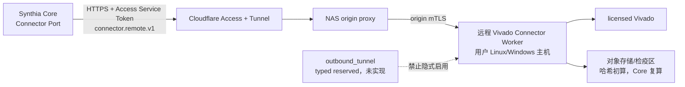

# Synthia Connector 与 Worker 架构

| 属性 | 内容 |
|---|---|
| 文档编号 | SYNTHIA-ARC-003 |
| 版本/状态 | v0.2 / 讨论冻结候选，待正式评审（新增 §10 远程兼容模式部署） |
| 日期 | 2026-07-30 |
| 上游 | SYNTHIA-GOV-003、SYNTHIA-FLOW-006 |

## 1. 定位

Connector 是 Synthia 调用工业软件和实验资源的执行子系统。Synthia Core 通过厂商无关 Connector Port 提交任务；协议 Adapter 负责传输；Worker 执行厂商专用强类型能力。MCP 是可替换协议，不是业务模型，也不是 Worker 的唯一内部架构。

```text
Synthia Core
→ Connector Port
→ MCP Adapter / HTTP Adapter / Queue Adapter
→ Connector Worker（基于 Connector SDK）
→ Vivado Tcl/API 或 Board/Lab Driver
```

## 2. Connector SDK

SDK 统一以下概念：

- Connector/Worker 注册、版本、构建哈希、健康状态和能力发现；
- Capability Schema、兼容版本和策略约束；
- JobRequest、JobEvent、JobStatus、取消、超时、恢复和幂等键；
- InputManifest、ConfigurationSnapshot 和哈希验证；
- 独立工作区、只读输入、缓存分区和污染检测；
- ArtifactDescriptor、EvidenceManifest、URI、SHA-256、大小和媒体类型；
- 用户/服务身份、运行授权、硬件资源锁和数据域；
- 通用错误类别、重试能力和未知副作用；
- 日志、审计事件、Worker 重启恢复和孤儿证据对账。

SDK 不统一 Vivado strategy、DCP、STA/CDC/DRC 报告语义或其他厂商的专用参数。

## 3. Adapter 边界

MCP、HTTP 和 Queue Adapter 均实现同一 Connector Port 语义。Adapter：

- 校验协议层 Schema 和授权上下文；
- 把请求转换为 JobRequest；
- 提交后立即返回 `job_id`；
- 暴露状态、事件和 EvidenceManifest 查询；
- 不执行 Vivado、不解析工程通过结论、不写批准和基线；
- 不在正文中传输大型二进制对象。

长任务可通过轮询、事件订阅或回调获取进展。任何回调都必须使用事件序号和幂等消费，不能因网络断线重复执行非幂等硬件操作。

## 4. Worker 类型

### 4.1 Vivado Connector Worker

首期强类型能力包括：

- `discover_toolchain`、`query_parts`、`validate_sources`；
- `compile_simulation`、`run_simulation`、`collect_coverage`；
- `synthesize`、`report_cdc`、`inspect_netlist`、`compare_structure`；
- `opt_design`、`place_design`、`route_design`；
- `report_drc`、`report_timing`、`report_utilization`、`report_power`；
- `generate_bitstream`；
- `program_device`、`capture_ila`、`manage_vio`、`read_device_status`。

### 4.2 Board/Lab Connector Worker

独立负责串口、外部激励、电源、示波器/逻辑分析仪、板卡与仪器资源锁、环境记录和外部夹具结果。它与 Vivado Worker 可由同一上层 Job 编排，但不得共享未登记的可写状态。

### 4.3 External Evidence Import

外部人工或夹具证据必须记录来源、操作者、可信时间、环境、原始文件哈希、采集方法、目标硬件和关联测试。导入仅建立候选 Evidence，不自动形成通过结论。

## 5. 运行分类

| 类别 | 输入 | 允许用途 |
|---|---|---|
| `exploratory` | 候选或批准输入 | 调试和方案探索；不得进入正式门禁/覆盖/发布 |
| `gate_check` | 冻结 GateSubmission 快照 | 当前阶段准入检查；快照变化即失效 |
| `formal` | 批准且有效的输入 | 正式工程活动、验证和后续门禁证据 |

G4 可通过 `gate_check` 执行编译、Lint 和必要的预综合 CDC；G5 使用 B2 执行正式综合和综合后 CDC 复核。

## 6. Job 状态

Job 状态使用 SYNTHIA-ARC-002 的 ToolRun 状态机。`succeeded` 要求进程返回成功且必需输出存在，但不表示 DRC、时序、CDC、需求或阶段门通过。结构化解析结果必须链接原始报告和解析器版本。

## 7. 证据返回

大型 DCP、WDB/VCD、覆盖数据库和码流不进入 MCP/HTTP 正文。EvidenceDescriptor 至少返回：

```text
artifact_id
uri
sha256
size
media_type
tool_run_id
input_snapshot_id
producer_worker_id
created_at
completeness
```

Worker 计算初始哈希，Core/证据服务独立复算。部分输出必须标记不完整，不能混入成功证据包。

## 8. 自定义 Tcl

不提供 `execute_tcl(any_string)`。受控流程为：

```text
propose_tcl
→ 命令/路径/变量/副作用静态检查
→ 策略或人工授权
→ execute_approved_tcl
```

Tcl 正文、变量、工作目录、输入输出、环境和预计副作用进入任务哈希。硬件写命令默认不可自动重试。

## 9. 首个实现切片

优先实现 Connector 注册与能力发现、Vivado 版本/许可证/part 发现、InputManifest/哈希、编译/仿真、综合、DRC/STA/资源报告、异步 Job、原始日志、EvidenceManifest、一个 MCP Adapter 和 RT-UART 回归。工业软件嵌入形态、任意 Tcl、复杂调度、完整 ILA/VIO 自动化和其他厂商 Connector 后置。

## 10. 远程兼容模式部署

远程兼容模式是 §4.1 Vivado Connector Worker 的一种部署形态：Worker 运行在用户自有的任意 Linux/Windows 主机（已安装 licensed Vivado），通过版本化 HTTPS 通道接入 Core。它不改变 §2 SDK 概念、§3 Adapter 边界和 §5 运行分类；端点字段与信封的权威定义见 SYNTHIA-IF-001 §9，生命周期与能力漂移语义见 SYNTHIA-FLOW-006 §16。



- 端点与注册：Core 保存版本化 ConnectorEndpoint/ConnectorRegistration；配置只存证书/信任引用和 Service Token 引用，不存 secret 值；bootstrap token 仍为 typed reserved，未实现；
- 传输：协议层仍为 `direct_https`；当前公网部署通过 Cloudflare Access/Tunnel 和 NAS origin proxy 转发，Core→Cloudflare 使用 Service Token，NAS proxy→Worker 使用 origin mTLS；不得把该代理链路表述为 Core→Worker 端到端 mTLS；
- `outbound_tunnel`（Worker 自建反向出站长连接）仍为 typed reserved 枚举，未实现且禁止以其他配置隐式启用；
- 安全：公网 HTTPS + Access Service Auth + origin mTLS + hostname/project/classification/capability allowlist；任何校验失败 fail-closed，不执行 Vivado 操作；
- 生命周期：`registering→approved→ready→degraded→offline→revoked`，心跳 `heartbeat_interval_seconds`、租约 `lease_seconds`；仅 `ready` 接受 formal/gate_check；
- 能力漂移：心跳携带 capability map 摘要，与注册 `toolchain_profile_hash` 不一致即漂移，阻断 formal 并要求重新复核批准；
- 验证边界：真实 `vivado-66-xc7k70t` Worker/Vivado 能力已验证；公网 IPv4/TLS 与无 Token `403` 已验证，但现有 Service Token 仍被 Access `403` 拒绝。公网生命周期闭环前 endpoint 不得进入正式 `ready`。
