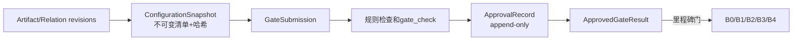

# Synthia 领域对象与状态模型

| 属性 | 内容 |
|---|---|
| 文档编号 | SYNTHIA-ARC-002 |
| 版本/状态 | v0.1 / 讨论冻结候选，待正式评审 |
| 日期 | 2026-07-30 |
| 上游 | SYNTHIA-GOV-003、SYNTHIA-FLOW-002/003/005 |

## 1. 建模原则

不同实体使用独立状态机，不建立一张适用于所有对象的“统一七态表”。内容修订、门禁提交、人类决定、基线、工具运行、关系、问题和任务具有不同生命周期。批准、撤销、豁免和基线建立均为不可变事件；查询界面可从事件计算当前有效状态，但不得覆盖历史。

## 2. 领域对象族

| 对象族 | 主要实体 | 说明 |
|---|---|---|
| 项目与流程 | Project、ProcessInstance、GateProfile、RoleAssignment | 项目边界、流程模板、门禁和角色 |
| 内容 | Artifact、ArtifactRevision、Requirement、DesignElement、ImplementationItem、VerificationItem | 容器和细粒度工程条目 |
| 配置 | ConfigurationSnapshot、SnapshotMember、Baseline、ApprovedGateResult | 不可变配置视图和里程碑 |
| 治理 | GateSubmission、ApprovalRecord、Waiver、Decision、Issue、Risk、Task、Handoff | 人类决定和过程记录 |
| 执行 | Connector、Worker、ToolRun、Evidence、EvidenceManifest | Agent/工具/硬件运行及原始证据 |
| 追踪与知识 | TraceRelation、ImpactAssessment、KnowledgeEntry | 双向追踪、影响和检索隔离 |

## 3. 容器和成员粒度

文档或源码集合是 `Artifact` 容器；每次内容变化产生不可变 `ArtifactRevision`。Requirement、DesignElement、ImplementationItem、VerificationItem 是可独立追踪和修订的成员实体。容器与成员都具有稳定 ID、修订 ID、内容哈希和来源关系。单条需求变化只把相关下游关系和批准结论置为待复核，不默认作废整份文档；若容器生成规则导致整体哈希变化，仍保留精确影响范围。

## 4. 快照、提交、批准和基线



- `ConfigurationSnapshot` 不以 candidate/approved 描述内容真伪，只表示不可变配置；
- `GateSubmission` 表示某快照被提交给某个门；
- `ApprovalRecord` 表示人类对精确对象、版本和哈希作出的决定；
- `ApprovedGateResult` 是每个门批准后的阶段结果；
- `Baseline` 只能由批准决定创建，不存在 candidate baseline；
- G2、G5、G6、G8 使用 ApprovedGateResult，不新增 B 编号。

## 5. 分实体状态机

### 5.1 ArtifactRevision

```text
candidate → in_review → approved
                     ↘ rejected
approved → superseded
approved → invalidated
```

进入 `in_review` 后内容冻结。拒绝后通过创建新修订继续，不原地改写被拒绝修订。`invalidated` 表示该批准修订当前不能继续用于新的正式放行；恢复使用必须有新的影响分析/回归和批准事件。

### 5.2 GateSubmission

```text
preparing → submitted → checking → in_review → approved
                                      ↘ rejected
preparing/submitted/in_review → withdrawn
```

硬门禁失败时保持可审计的检查结果并进入 `rejected`，不得删除提交快照。`approved` 和 `rejected` 由 ApprovalRecord 投影得到。

### 5.3 Baseline

```text
批准事件创建 active
active → superseded | invalidated | retired
```

Baseline 没有 candidate 状态。新批准版本替代旧版本时旧基线进入 `superseded`，但历史查询仍可重现。

### 5.4 ApprovalRecord

ApprovalRecord 是 append-only 事件，不使用可变业务状态。决定类型至少包括 `approve`、`reject`、`approve_with_actions`、`revoke`、`confirm_no_impact`、`accept_waiver`。撤销通过新事件引用原批准记录完成。

### 5.5 ToolRun

```text
submitted → rejected
submitted → queued → preparing → running → succeeded
                                      ↘ failed
                                      ↘ cancelling → cancelled
                                      ↘ timeout
                                      ↘ lost
                                      ↘ unknown_effect
```

运行状态只描述执行，不描述需求或工程门是否通过。`run_class` 独立取值 `exploratory/gate_check/formal`。

### 5.6 TraceRelation

```text
candidate → in_review → approved | rejected
approved → review_required → approved | superseded | invalidated
```

`review_required` 表示端点或依据变化，需要重新判断；`invalidated` 表示当前关系不能支持新的正式结论；`superseded` 表示被新的批准关系替代。

Issue、Risk、Task、Waiver 使用独立工作流，不复用上述内容状态。

## 6. 核心不变量

1. Agent 只能创建候选修订、关系、任务和建议；
2. 只有授权自然人可以产生工程批准、拒绝、豁免、基线或验收事件；
3. 任何提交、批准、运行和基线都引用精确快照和清单哈希；
4. 正式 ToolRun 的输入必须来自批准且有效的阶段结果或基线；
5. `gate_check` 只能服务于其绑定的提交快照，内容变化立即失效；
6. ToolRun `succeeded` 不能自动产生 ApprovalRecord；
7. Bitstream 必须追溯到 B2、批准 G5/G6/G7 结果、part、工具/strategy、生成运行和硬件目标；
8. 删除界面操作只能软删除非受控工作对象，受控记录保留历史；
9. 跨项目引用默认禁止，重用必须复制为有来源和许可证的项目配置项；
10. 查询“当前状态”必须指定项目配置视图，不能混合最新工作区与历史批准版本。

## 7. 并发与版本

候选工作区采用乐观并发控制。创建修订时记录父修订和预期版本；提交快照后禁止追加成员。并发分支通过显式合并产生新候选修订，不能让“最后写入者”静默覆盖批准或评审中的内容。
