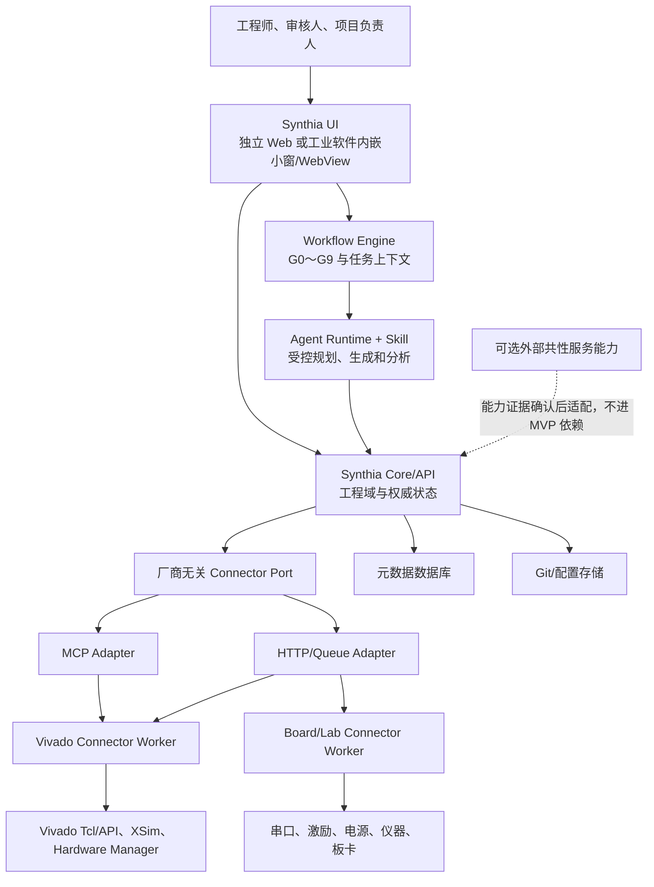

# Synthia 平台总体架构

| 属性 | 内容 |
|---|---|
| 文档编号 | SYNTHIA-ARC-001 |
| 版本/状态 | v0.1 / 讨论冻结候选，待正式评审 |
| 日期 | 2026-07-30 |
| 上游 | SYNTHIA-GOV-003、SYNTHIA-REQ-001、SYNTHIA-FLOW-001～007 |
| 适用对象 | Synthia 平台软件，不是具体目标 PLDS 架构 |

## 1. 架构目标

平台应把 Agent 的需求理解、设计辅助、制品生成、工程分析和用户授权的 Vivado 操作连接成可追踪的工程系统，但不复制或替代 Vivado/工业软件的原生 GUI 和工程业务逻辑。架构优先保证：Synthia 权威状态唯一、人工决定可归责、候选与批准隔离、工具证据不可伪造、Connector 可复用、长任务可恢复、历史结果可重现，以及用户直接使用传统工业软件时不受 Synthia 未授权干预。

## 2. 系统上下文

## 3. 逻辑层次

| 层 | 核心责任 | 明确不承担 |
|---|---|---|
| Synthia UI | 展示项目、差异、追踪、任务、报告和人工操作；可独立运行或嵌入工业软件 | 不直接访问数据库、Vivado 或 Connector；不越权修改传统工程 |
| Workflow Engine | 解释流程模板、管理任务上下文、推进 G0～G9 和影响分析 | 不生成专业工程结论 |
| Agent Runtime + Skill | 执行冻结任务包，生成候选、规划 Vivado 操作和分析结果 | 不持有流程真相，不批准，不直接发布；Skill 不绕过授权执行任意 Tcl |
| Synthia Core/API | 持久化工程域对象、权限判定、快照、批准、基线、追踪和运行登记 | 不复制 Vivado GUI 或把 Vivado 命令细节变成业务事实 |
| Connector Port | 提供厂商无关的能力发现和异步 Job 语义 | 不抹平厂商专用参数和证据 |
| Adapter | 在 MCP、HTTP、Queue 等协议与 Connector Port 之间转换 | 不直接执行工业软件，不保存批准事实 |
| Connector Worker | 隔离执行强类型工具操作、受控 Tcl、采集原始证据 | 不判断需求满足或工程门通过 |
| 传统工业软件 | 保留原生工程编辑、工具运行和调试体验 | 不因 Synthia 集成而失去独立使用能力 |
| 数据层 | 保存元数据、配置内容和大对象证据 | 不以“服务器最新目录”代替不可变配置 |

## 4. 两条配置空间

`PlatformConfiguration` 保存平台版本、流程模板、策略、Agent Profile、Connector SDK、Schema 和解析器。`ProjectConfiguration` 保存目标 PLDS 的需求、设计、RTL、工具配置、运行、验证和交付。两者使用不同 ID 空间和发布记录；平台升级通过兼容性声明或显式迁移影响已有项目。

## 5. 关键控制流

### 5.1 候选生成和门禁

1. Workflow Engine 根据批准上游创建不可变 TaskPackage；
2. Agent 在隔离工作区生成候选 ArtifactRevision 和 TraceRelation；
3. 提交者冻结 ConfigurationSnapshot 并建立 GateSubmission；
4. 确定性规则与 `gate_check` ToolRun 检查同一快照；
5. 人类查看差异、原始证据、问题、风险和谱系；
6. ApprovalRecord 以 append-only 方式记录决定；
7. 批准形成 ApprovedGateResult，里程碑门建立 B0～B4。

### 5.2 工具运行

1. Core 根据权限、输入状态和项目策略构造 JobRequest；
2. Connector Port 选择可用 Adapter 和 Worker；
3. Worker 验证 manifest、哈希、part、工具能力和资源锁；
4. Worker 在独立工作区执行并持续上报事件；
5. 原始对象先上传内容寻址存储；
6. Core 复算哈希、登记 EvidenceManifest 并更新 ToolRun 投影；
7. 工程结论仍由相应 GateSubmission 和人类批准产生。

## 6. 组件部署

MVP 可采用模块化单体 Core + 独立 Worker：Web、Workflow、工程域 API 和元数据数据库部署在受控服务节点；Agent Runtime 作为受控执行池；Vivado Worker 位于具有合法工具、许可证和器件访问的 Linux/Windows EDA 节点；Board/Lab Worker 位于实验室网络。逻辑边界从第一版固定，但不要求过早拆成大量微服务。

## 7. 安全与信任边界

- 用户操作使用个人身份；Agent、Core、Adapter、Worker 使用独立服务身份；
- 人类批准、硬件写操作和自定义 Tcl 使用目的绑定的授权记录；
- Worker 不直接写批准表、基线表或业务状态；
- Agent 不读取凭据、不共享跨项目可写目录、不删除失败证据；
- UI 无论独立还是嵌入都只能调用版本化 Core API，不直接连接数据库、Agent Runtime 或 Connector；
- 传统 Vivado/工业软件可独立运行，Synthia 只能在用户或策略明确授权后读取、修改或执行关联工程任务；
- 数据域标签沿 TaskPackage、JobRequest、Artifact 和 Evidence 继承；
- 未知硬件副作用进入 `unknown_effect`，禁止自动重试。

## 8. 可扩展性边界

可复用部分是 Project/Artifact/Snapshot/Gate/Approval/Trace/ToolRun/Evidence，以及 Connector SDK 的 Job、Worker、Artifact、Evidence、授权、锁、幂等和错误模型。不可强行通用化的部分是 Vivado 综合策略、DCP、STA/CDC/DRC、ILA/VIO，或其他厂商工具的专有模型。新增 Quartus、Questa、MATLAB/Simulink 时，应复用通用外壳并提供独立强类型能力契约。

## 9. 暂不进入首个切片

工业软件嵌入形态、任意 Tcl、完整 IP Integrator/HLS/DFX、全自动 ILA/VIO、复杂分布式调度、多厂商支持和亿门级性能优化不作为首个实现切片；是否进入后续版本由范围决策单独批准。
